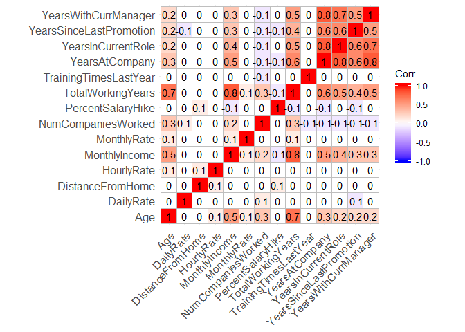
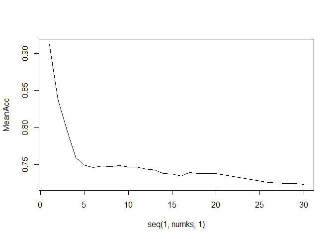
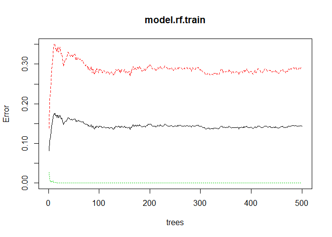
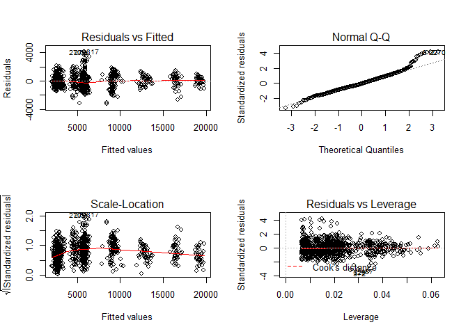
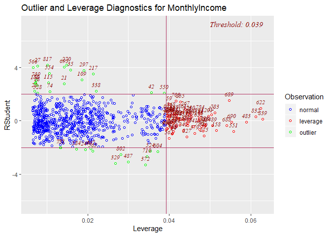

Exploratory Data Analysis
================
Chance Robinson
11/25/2019

  - [Exploratory Data Analysis](#exploratory-data-analysis)
      - [Library Imports](#library-imports)
      - [Load the CSV Data](#load-the-csv-data)
      - [Default Output](#default-output)
          - [Identify Dimensions](#identify-dimensions)
          - [Data Columns](#data-columns)
          - [Convert Integers to Strings](#convert-integers-to-strings)
          - [Convert Integers to Factors](#convert-integers-to-factors)
          - [Describe the Data Types](#describe-the-data-types)
          - [Numeric Columns](#numeric-columns)
          - [Non-Numeric Columns](#non-numeric-columns)
          - [Correlation matrix for quantitative
            data](#correlation-matrix-for-quantitative-data)
  - [Analysis Question I](#analysis-question-i)
      - [Logistic Regression](#logistic-regression)
          - [Naive Bayes](#naive-bayes)
          - [Random Forrest](#random-forrest)
      - [salary](#salary)
          - [Linear Regression](#linear-regression)
      - [Comparing Competing Models](#comparing-competing-models)

# Exploratory Data Analysis

## Library Imports

``` r
library(tidyverse)
```

    ## -- Attaching packages ---------------------------------------------------------------------------------- tidyverse 1.2.1 --

    ## v ggplot2 3.2.1     v purrr   0.3.3
    ## v tibble  2.1.3     v dplyr   0.8.3
    ## v tidyr   1.0.0     v stringr 1.4.0
    ## v readr   1.3.1     v forcats 0.4.0

    ## -- Conflicts ------------------------------------------------------------------------------------- tidyverse_conflicts() --
    ## x dplyr::filter() masks stats::filter()
    ## x dplyr::lag()    masks stats::lag()

``` r
library(knitr)
library(kableExtra)
```

    ## 
    ## Attaching package: 'kableExtra'

    ## The following object is masked from 'package:dplyr':
    ## 
    ##     group_rows

``` r
# Correlation Matrix
library(ggcorrplot)
library(Hmisc)
```

    ## Loading required package: lattice

    ## Loading required package: survival

    ## Loading required package: Formula

    ## 
    ## Attaching package: 'Hmisc'

    ## The following objects are masked from 'package:dplyr':
    ## 
    ##     src, summarize

    ## The following objects are masked from 'package:base':
    ## 
    ##     format.pval, units

``` r
#Lasso
library(glmnet)
```

    ## Loading required package: Matrix

    ## 
    ## Attaching package: 'Matrix'

    ## The following objects are masked from 'package:tidyr':
    ## 
    ##     expand, pack, unpack

    ## Loaded glmnet 3.0

``` r
# Resampling
library(caret)
```

    ## 
    ## Attaching package: 'caret'

    ## The following object is masked from 'package:survival':
    ## 
    ##     cluster

    ## The following object is masked from 'package:purrr':
    ## 
    ##     lift

``` r
library(DMwR)
```

    ## Loading required package: grid

    ## Registered S3 method overwritten by 'xts':
    ##   method     from
    ##   as.zoo.xts zoo

    ## Registered S3 method overwritten by 'quantmod':
    ##   method            from
    ##   as.zoo.data.frame zoo

``` r
# KNN
library(class)
# Random Forrest
library(randomForest)  
```

    ## randomForest 4.6-14

    ## Type rfNews() to see new features/changes/bug fixes.

    ## 
    ## Attaching package: 'randomForest'

    ## The following object is masked from 'package:dplyr':
    ## 
    ##     combine

    ## The following object is masked from 'package:ggplot2':
    ## 
    ##     margin

``` r
library(e1071)  
```

    ## 
    ## Attaching package: 'e1071'

    ## The following object is masked from 'package:Hmisc':
    ## 
    ##     impute

## Load the CSV Data

``` r
data <- read.csv("../../data/CaseStudy2-data.csv", stringsAsFactors=TRUE, header = TRUE)
```

## Default Output

``` r
head(data)
```

    ##   ID Age Attrition    BusinessTravel DailyRate             Department
    ## 1  1  32        No     Travel_Rarely       117                  Sales
    ## 2  2  40        No     Travel_Rarely      1308 Research & Development
    ## 3  3  35        No Travel_Frequently       200 Research & Development
    ## 4  4  32        No     Travel_Rarely       801                  Sales
    ## 5  5  24        No Travel_Frequently       567 Research & Development
    ## 6  6  27        No Travel_Frequently       294 Research & Development
    ##   DistanceFromHome Education   EducationField EmployeeCount EmployeeNumber
    ## 1               13         4    Life Sciences             1            859
    ## 2               14         3          Medical             1           1128
    ## 3               18         2    Life Sciences             1           1412
    ## 4                1         4        Marketing             1           2016
    ## 5                2         1 Technical Degree             1           1646
    ## 6               10         2    Life Sciences             1            733
    ##   EnvironmentSatisfaction Gender HourlyRate JobInvolvement JobLevel
    ## 1                       2   Male         73              3        2
    ## 2                       3   Male         44              2        5
    ## 3                       3   Male         60              3        3
    ## 4                       3 Female         48              3        3
    ## 5                       1 Female         32              3        1
    ## 6                       4   Male         32              3        3
    ##                  JobRole JobSatisfaction MaritalStatus MonthlyIncome
    ## 1        Sales Executive               4      Divorced          4403
    ## 2      Research Director               3        Single         19626
    ## 3 Manufacturing Director               4        Single          9362
    ## 4        Sales Executive               4       Married         10422
    ## 5     Research Scientist               4        Single          3760
    ## 6 Manufacturing Director               1      Divorced          8793
    ##   MonthlyRate NumCompaniesWorked Over18 OverTime PercentSalaryHike
    ## 1        9250                  2      Y       No                11
    ## 2       17544                  1      Y       No                14
    ## 3       19944                  2      Y       No                11
    ## 4       24032                  1      Y       No                19
    ## 5       17218                  1      Y      Yes                13
    ## 6        4809                  1      Y       No                21
    ##   PerformanceRating RelationshipSatisfaction StandardHours StockOptionLevel
    ## 1                 3                        3            80                1
    ## 2                 3                        1            80                0
    ## 3                 3                        3            80                0
    ## 4                 3                        3            80                2
    ## 5                 3                        3            80                0
    ## 6                 4                        3            80                2
    ##   TotalWorkingYears TrainingTimesLastYear WorkLifeBalance YearsAtCompany
    ## 1                 8                     3               2              5
    ## 2                21                     2               4             20
    ## 3                10                     2               3              2
    ## 4                14                     3               3             14
    ## 5                 6                     2               3              6
    ## 6                 9                     4               2              9
    ##   YearsInCurrentRole YearsSinceLastPromotion YearsWithCurrManager
    ## 1                  2                       0                    3
    ## 2                  7                       4                    9
    ## 3                  2                       2                    2
    ## 4                 10                       5                    7
    ## 5                  3                       1                    3
    ## 6                  7                       1                    7

### Identify Dimensions

``` r
dim(data)
```

    ## [1] 870  36

### Data Columns

``` r
colnames(data)
```

    ##  [1] "ID"                       "Age"                     
    ##  [3] "Attrition"                "BusinessTravel"          
    ##  [5] "DailyRate"                "Department"              
    ##  [7] "DistanceFromHome"         "Education"               
    ##  [9] "EducationField"           "EmployeeCount"           
    ## [11] "EmployeeNumber"           "EnvironmentSatisfaction" 
    ## [13] "Gender"                   "HourlyRate"              
    ## [15] "JobInvolvement"           "JobLevel"                
    ## [17] "JobRole"                  "JobSatisfaction"         
    ## [19] "MaritalStatus"            "MonthlyIncome"           
    ## [21] "MonthlyRate"              "NumCompaniesWorked"      
    ## [23] "Over18"                   "OverTime"                
    ## [25] "PercentSalaryHike"        "PerformanceRating"       
    ## [27] "RelationshipSatisfaction" "StandardHours"           
    ## [29] "StockOptionLevel"         "TotalWorkingYears"       
    ## [31] "TrainingTimesLastYear"    "WorkLifeBalance"         
    ## [33] "YearsAtCompany"           "YearsInCurrentRole"      
    ## [35] "YearsSinceLastPromotion"  "YearsWithCurrManager"

### Convert Integers to Strings

  - These numeric columns will be converted into strings

<!-- end list -->

``` r
data$ID <- as.character(data$ID)
data$EmployeeNumber <- as.character(data$EmployeeNumber)
data$EmployeeCount <- as.character(data$EmployeeCount)
data$StandardHours <- as.character(data$StandardHours)
data$Over18 <- as.character(data$Over18)
```

### Convert Integers to Factors

``` r
data$JobInvolvement <- factor(data$JobInvolvement, ordered = TRUE, 
                              levels = c(1, 2, 3, 4),
                              labels = c("Low", "Medium", "High", "Very High"))

data$JobSatisfaction <- factor(data$JobSatisfaction, ordered = TRUE, 
                              levels = c(1, 2, 3, 4),
                              labels = c("Low", "Medium", "High", "Very High"))

data$PerformanceRating <- factor(data$PerformanceRating, ordered = TRUE, 
                              levels = c(1, 2, 3, 4),
                              labels = c("Low", "Good", "Excellent", "Outstanding"))

data$RelationshipSatisfaction <- factor(data$RelationshipSatisfaction, ordered = TRUE, 
                              levels = c(1, 2, 3, 4),
                              labels = c("Low", "Medium", "High", "Very High"))

data$WorkLifeBalance <- factor(data$WorkLifeBalance, ordered = TRUE, 
                              levels = c(1, 2, 3, 4),
                              labels = c("Bad", "Better", "Good", "Best"))

### THIS WAS NOT ACTUALLY PROVIDED ON THE WALL
data$EnvironmentSatisfaction <- factor(data$EnvironmentSatisfaction, ordered = TRUE, 
                              levels = c(1, 2, 3, 4),
                              labels = c("Low", "Medium", "High", "Very High"))

data$StockOptionLevel <- factor(data$StockOptionLevel, ordered = TRUE, 
                              levels = c(0, 1, 2, 3),
                              labels = c("Zero", "One", "Two", "Three"))

data$JobLevel <- factor(data$JobLevel, ordered = TRUE, 
                              levels = c(1, 2, 3, 4, 5),
                              labels = c("One", "Two", "Three", "Four", "Five"))

data$Education <- factor(data$Education, ordered = FALSE, 
                              levels = c(1, 2, 3, 4, 5),
                              labels = c("One", "Two", "Three", "Four", "Five"))
```

### Describe the Data Types

``` r
str(data)
```

    ## 'data.frame':    870 obs. of  36 variables:
    ##  $ ID                      : chr  "1" "2" "3" "4" ...
    ##  $ Age                     : int  32 40 35 32 24 27 41 37 34 34 ...
    ##  $ Attrition               : Factor w/ 2 levels "No","Yes": 1 1 1 1 1 1 1 1 1 1 ...
    ##  $ BusinessTravel          : Factor w/ 3 levels "Non-Travel","Travel_Frequently",..: 3 3 2 3 2 2 3 3 3 2 ...
    ##  $ DailyRate               : int  117 1308 200 801 567 294 1283 309 1333 653 ...
    ##  $ Department              : Factor w/ 3 levels "Human Resources",..: 3 2 2 3 2 2 2 3 3 2 ...
    ##  $ DistanceFromHome        : int  13 14 18 1 2 10 5 10 10 10 ...
    ##  $ Education               : Factor w/ 5 levels "One","Two","Three",..: 4 3 2 4 1 2 5 4 4 4 ...
    ##  $ EducationField          : Factor w/ 6 levels "Human Resources",..: 2 4 2 3 6 2 4 2 2 6 ...
    ##  $ EmployeeCount           : chr  "1" "1" "1" "1" ...
    ##  $ EmployeeNumber          : chr  "859" "1128" "1412" "2016" ...
    ##  $ EnvironmentSatisfaction : Ord.factor w/ 4 levels "Low"<"Medium"<..: 2 3 3 3 1 4 2 4 3 4 ...
    ##  $ Gender                  : Factor w/ 2 levels "Female","Male": 2 2 2 1 1 2 2 1 1 2 ...
    ##  $ HourlyRate              : int  73 44 60 48 32 32 90 88 87 92 ...
    ##  $ JobInvolvement          : Ord.factor w/ 4 levels "Low"<"Medium"<..: 3 2 3 3 3 3 4 2 3 2 ...
    ##  $ JobLevel                : Ord.factor w/ 5 levels "One"<"Two"<"Three"<..: 2 5 3 3 1 3 1 2 1 2 ...
    ##  $ JobRole                 : Factor w/ 9 levels "Healthcare Representative",..: 8 6 5 8 7 5 7 8 9 1 ...
    ##  $ JobSatisfaction         : Ord.factor w/ 4 levels "Low"<"Medium"<..: 4 3 4 4 4 1 3 4 3 3 ...
    ##  $ MaritalStatus           : Factor w/ 3 levels "Divorced","Married",..: 1 3 3 2 3 1 2 1 2 2 ...
    ##  $ MonthlyIncome           : int  4403 19626 9362 10422 3760 8793 2127 6694 2220 5063 ...
    ##  $ MonthlyRate             : int  9250 17544 19944 24032 17218 4809 5561 24223 18410 15332 ...
    ##  $ NumCompaniesWorked      : int  2 1 2 1 1 1 2 2 1 1 ...
    ##  $ Over18                  : chr  "Y" "Y" "Y" "Y" ...
    ##  $ OverTime                : Factor w/ 2 levels "No","Yes": 1 1 1 1 2 1 2 2 2 1 ...
    ##  $ PercentSalaryHike       : int  11 14 11 19 13 21 12 14 19 14 ...
    ##  $ PerformanceRating       : Ord.factor w/ 4 levels "Low"<"Good"<"Excellent"<..: 3 3 3 3 3 4 3 3 3 3 ...
    ##  $ RelationshipSatisfaction: Ord.factor w/ 4 levels "Low"<"Medium"<..: 3 1 3 3 3 3 1 3 4 2 ...
    ##  $ StandardHours           : chr  "80" "80" "80" "80" ...
    ##  $ StockOptionLevel        : Ord.factor w/ 4 levels "Zero"<"One"<"Two"<..: 2 1 1 3 1 3 1 4 2 2 ...
    ##  $ TotalWorkingYears       : int  8 21 10 14 6 9 7 8 1 8 ...
    ##  $ TrainingTimesLastYear   : int  3 2 2 3 2 4 5 5 2 3 ...
    ##  $ WorkLifeBalance         : Ord.factor w/ 4 levels "Bad"<"Better"<..: 2 4 3 3 3 2 2 3 3 2 ...
    ##  $ YearsAtCompany          : int  5 20 2 14 6 9 4 1 1 8 ...
    ##  $ YearsInCurrentRole      : int  2 7 2 10 3 7 2 0 1 2 ...
    ##  $ YearsSinceLastPromotion : int  0 4 2 5 1 1 0 0 0 7 ...
    ##  $ YearsWithCurrManager    : int  3 9 2 7 3 7 3 0 0 7 ...

### Numeric Columns

#### Column Names

``` r
data.numeric <- data %>%
  select_if(is.numeric)
```

#### Summary Tables

``` r
summary(data.numeric)
```

    ##       Age          DailyRate      DistanceFromHome   HourlyRate    
    ##  Min.   :18.00   Min.   : 103.0   Min.   : 1.000   Min.   : 30.00  
    ##  1st Qu.:30.00   1st Qu.: 472.5   1st Qu.: 2.000   1st Qu.: 48.00  
    ##  Median :35.00   Median : 817.5   Median : 7.000   Median : 66.00  
    ##  Mean   :36.83   Mean   : 815.2   Mean   : 9.339   Mean   : 65.61  
    ##  3rd Qu.:43.00   3rd Qu.:1165.8   3rd Qu.:14.000   3rd Qu.: 83.00  
    ##  Max.   :60.00   Max.   :1499.0   Max.   :29.000   Max.   :100.00  
    ##  MonthlyIncome    MonthlyRate    NumCompaniesWorked PercentSalaryHike
    ##  Min.   : 1081   Min.   : 2094   Min.   :0.000      Min.   :11.0     
    ##  1st Qu.: 2840   1st Qu.: 8092   1st Qu.:1.000      1st Qu.:12.0     
    ##  Median : 4946   Median :14074   Median :2.000      Median :14.0     
    ##  Mean   : 6390   Mean   :14326   Mean   :2.728      Mean   :15.2     
    ##  3rd Qu.: 8182   3rd Qu.:20456   3rd Qu.:4.000      3rd Qu.:18.0     
    ##  Max.   :19999   Max.   :26997   Max.   :9.000      Max.   :25.0     
    ##  TotalWorkingYears TrainingTimesLastYear YearsAtCompany   YearsInCurrentRole
    ##  Min.   : 0.00     Min.   :0.000         Min.   : 0.000   Min.   : 0.000    
    ##  1st Qu.: 6.00     1st Qu.:2.000         1st Qu.: 3.000   1st Qu.: 2.000    
    ##  Median :10.00     Median :3.000         Median : 5.000   Median : 3.000    
    ##  Mean   :11.05     Mean   :2.832         Mean   : 6.962   Mean   : 4.205    
    ##  3rd Qu.:15.00     3rd Qu.:3.000         3rd Qu.:10.000   3rd Qu.: 7.000    
    ##  Max.   :40.00     Max.   :6.000         Max.   :40.000   Max.   :18.000    
    ##  YearsSinceLastPromotion YearsWithCurrManager
    ##  Min.   : 0.000          Min.   : 0.00       
    ##  1st Qu.: 0.000          1st Qu.: 2.00       
    ##  Median : 1.000          Median : 3.00       
    ##  Mean   : 2.169          Mean   : 4.14       
    ##  3rd Qu.: 3.000          3rd Qu.: 7.00       
    ##  Max.   :15.000          Max.   :17.00

### Non-Numeric Columns

#### Column Names

``` r
data.non.numeric <- data %>%
  select_if(is.factor)

colnames(data.non.numeric)
```

    ##  [1] "Attrition"                "BusinessTravel"          
    ##  [3] "Department"               "Education"               
    ##  [5] "EducationField"           "EnvironmentSatisfaction" 
    ##  [7] "Gender"                   "JobInvolvement"          
    ##  [9] "JobLevel"                 "JobRole"                 
    ## [11] "JobSatisfaction"          "MaritalStatus"           
    ## [13] "OverTime"                 "PerformanceRating"       
    ## [15] "RelationshipSatisfaction" "StockOptionLevel"        
    ## [17] "WorkLifeBalance"

``` r
data.non.numeric %>%
  count(Attrition, sort = TRUE)
```

    ## # A tibble: 2 x 2
    ##   Attrition     n
    ##   <fct>     <int>
    ## 1 No          730
    ## 2 Yes         140

``` r
data %>%
  count(BusinessTravel, sort = TRUE)
```

    ## # A tibble: 3 x 2
    ##   BusinessTravel        n
    ##   <fct>             <int>
    ## 1 Travel_Rarely       618
    ## 2 Travel_Frequently   158
    ## 3 Non-Travel           94

``` r
data.non.numeric %>%
  count(Department, sort = TRUE)
```

    ## # A tibble: 3 x 2
    ##   Department                 n
    ##   <fct>                  <int>
    ## 1 Research & Development   562
    ## 2 Sales                    273
    ## 3 Human Resources           35

``` r
data.non.numeric %>%
  count(EducationField, sort = TRUE)
```

    ## # A tibble: 6 x 2
    ##   EducationField       n
    ##   <fct>            <int>
    ## 1 Life Sciences      358
    ## 2 Medical            270
    ## 3 Marketing          100
    ## 4 Technical Degree    75
    ## 5 Other               52
    ## 6 Human Resources     15

``` r
data.non.numeric %>%
  count(Gender, sort = TRUE)
```

    ## # A tibble: 2 x 2
    ##   Gender     n
    ##   <fct>  <int>
    ## 1 Male     516
    ## 2 Female   354

``` r
data.non.numeric %>%
  count(JobRole, sort = TRUE)
```

    ## # A tibble: 9 x 2
    ##   JobRole                       n
    ##   <fct>                     <int>
    ## 1 Sales Executive             200
    ## 2 Research Scientist          172
    ## 3 Laboratory Technician       153
    ## 4 Manufacturing Director       87
    ## 5 Healthcare Representative    76
    ## 6 Sales Representative         53
    ## 7 Manager                      51
    ## 8 Research Director            51
    ## 9 Human Resources              27

``` r
data.non.numeric %>%
  count(MaritalStatus, sort = TRUE)
```

    ## # A tibble: 3 x 2
    ##   MaritalStatus     n
    ##   <fct>         <int>
    ## 1 Married         410
    ## 2 Single          269
    ## 3 Divorced        191

``` r
data.non.numeric %>%
  count(OverTime, sort = TRUE)
```

    ## # A tibble: 2 x 2
    ##   OverTime     n
    ##   <fct>    <int>
    ## 1 No         618
    ## 2 Yes        252

``` r
data %>%
  count(StandardHours, sort = TRUE)
```

    ## # A tibble: 1 x 2
    ##   StandardHours     n
    ##   <chr>         <int>
    ## 1 80              870

### Correlation matrix for quantitative data

``` r
# function for flattening and ordering the correlation matrix
flattenCorrMatrix <- function(cormat, pmat) {
  ut <- upper.tri(cormat)
  data.frame(
    row = rownames(cormat)[row(cormat)[ut]],
    column = rownames(cormat)[col(cormat)[ut]],
    cor  =(cormat)[ut],
    p = pmat[ut]
    )
}
# See what variables are correlated with each other, p-values
correlation.matrix <- rcorr(as.matrix(data.numeric))
corDF <- data.frame(flattenCorrMatrix(correlation.matrix$r, correlation.matrix$P))
# Order the correlation matrix to show the highest correlated
# data.frame(corDF[order(-corDF$cor),])

quantDataModel <- corDF[which(corDF$cor >= 0.5),]
data.frame(quantDataModel[order(-quantDataModel$cor),])
```

    ##                        row                  column       cor p
    ## 33           MonthlyIncome       TotalWorkingYears 0.7785112 0
    ## 66          YearsAtCompany      YearsInCurrentRole 0.7761164 0
    ## 89          YearsAtCompany    YearsWithCurrManager 0.7652262 0
    ## 90      YearsInCurrentRole    YearsWithCurrManager 0.7094612 0
    ## 29                     Age       TotalWorkingYears 0.6526131 0
    ## 77          YearsAtCompany YearsSinceLastPromotion 0.6440298 0
    ## 54       TotalWorkingYears          YearsAtCompany 0.6360836 0
    ## 78      YearsInCurrentRole YearsSinceLastPromotion 0.5537100 0
    ## 91 YearsSinceLastPromotion    YearsWithCurrManager 0.5089354 0

``` r
corr <- round(cor(data.numeric), 1)
ggcorrplot(corr, method = "square", type = "full", lab = TRUE)
```

<!-- -->

# Analysis Question I

  - Attrition

## Logistic Regression

``` r
cols_to_remove <- c("ID", "EmployeeNumber", "EmployeeCount", "StandardHours", "Over18")

data.mod <- data %>%
  select(-cols_to_remove)


# data.mod.ds <- downSample(data.mod, data.mod$Attrition, list = FALSE)

data.mod.us <- upSample(data.mod, data.mod$Attrition, list = FALSE)


data.mod.us$Class <- NULL


model.full <- glm(Attrition~., data = data.mod, family = binomial("logit"))
summary(model.full)
```

    ## 
    ## Call:
    ## glm(formula = Attrition ~ ., family = binomial("logit"), data = data.mod)
    ## 
    ## Deviance Residuals: 
    ##     Min       1Q   Median       3Q      Max  
    ## -1.8576  -0.3824  -0.1344  -0.0247   3.4651  
    ## 
    ## Coefficients:
    ##                                    Estimate Std. Error z value Pr(>|z|)    
    ## (Intercept)                      -1.568e+01  6.856e+02  -0.023 0.981757    
    ## Age                              -3.743e-02  2.097e-02  -1.785 0.074332 .  
    ## BusinessTravelTravel_Frequently   1.895e+00  5.848e-01   3.240 0.001194 ** 
    ## BusinessTravelTravel_Rarely       9.675e-01  5.204e-01   1.859 0.063006 .  
    ## DailyRate                        -4.438e-04  3.521e-04  -1.261 0.207488    
    ## DepartmentResearch & Development  1.527e+01  6.856e+02   0.022 0.982228    
    ## DepartmentSales                   1.543e+01  6.856e+02   0.023 0.982039    
    ## DistanceFromHome                  7.322e-02  1.744e-02   4.198 2.69e-05 ***
    ## EducationTwo                      3.682e-01  4.852e-01   0.759 0.447884    
    ## EducationThree                    2.176e-01  4.502e-01   0.483 0.628902    
    ## EducationFour                     2.003e-01  4.935e-01   0.406 0.684824    
    ## EducationFive                     3.717e-01  8.988e-01   0.414 0.679181    
    ## EducationFieldLife Sciences      -1.634e+00  1.392e+00  -1.174 0.240493    
    ## EducationFieldMarketing          -1.699e+00  1.453e+00  -1.170 0.242142    
    ## EducationFieldMedical            -1.675e+00  1.381e+00  -1.213 0.225055    
    ## EducationFieldOther              -1.413e+00  1.485e+00  -0.952 0.341221    
    ## EducationFieldTechnical Degree   -8.823e-01  1.416e+00  -0.623 0.533155    
    ## EnvironmentSatisfaction.L        -8.829e-01  2.811e-01  -3.141 0.001685 ** 
    ## EnvironmentSatisfaction.Q         8.309e-01  2.839e-01   2.927 0.003423 ** 
    ## EnvironmentSatisfaction.C        -5.508e-01  2.970e-01  -1.855 0.063647 .  
    ## GenderMale                        1.671e-01  2.754e-01   0.607 0.544035    
    ## HourlyRate                        1.586e-02  7.210e-03   2.199 0.027854 *  
    ## JobInvolvement.L                 -1.946e+00  4.776e-01  -4.074 4.63e-05 ***
    ## JobInvolvement.Q                  7.625e-01  3.860e-01   1.976 0.048201 *  
    ## JobInvolvement.C                 -1.718e-01  2.657e-01  -0.646 0.518012    
    ## JobLevel.L                        2.598e+00  1.904e+00   1.365 0.172393    
    ## JobLevel.Q                        2.854e+00  9.030e-01   3.161 0.001575 ** 
    ## JobLevel.C                        7.813e-01  7.319e-01   1.067 0.285750    
    ## JobLevel^4                        1.748e+00  5.674e-01   3.080 0.002071 ** 
    ## JobRoleHuman Resources            1.481e+01  6.856e+02   0.022 0.982770    
    ## JobRoleLaboratory Technician     -4.241e-02  8.404e-01  -0.050 0.959753    
    ## JobRoleManager                   -1.748e+00  1.660e+00  -1.053 0.292416    
    ## JobRoleManufacturing Director    -1.349e+00  9.442e-01  -1.428 0.153177    
    ## JobRoleResearch Director         -4.029e+00  1.721e+00  -2.342 0.019200 *  
    ## JobRoleResearch Scientist        -1.054e+00  8.647e-01  -1.219 0.222691    
    ## JobRoleSales Executive            7.575e-01  1.645e+00   0.460 0.645279    
    ## JobRoleSales Representative       9.741e-01  1.793e+00   0.543 0.587037    
    ## JobSatisfaction.L                -1.048e+00  2.895e-01  -3.621 0.000293 ***
    ## JobSatisfaction.Q                -2.202e-01  2.800e-01  -0.786 0.431659    
    ## JobSatisfaction.C                -5.088e-01  2.820e-01  -1.804 0.071167 .  
    ## MaritalStatusMarried              1.010e+00  4.822e-01   2.095 0.036185 *  
    ## MaritalStatusSingle               1.139e+00  6.242e-01   1.824 0.068093 .  
    ## MonthlyIncome                    -6.373e-05  1.465e-04  -0.435 0.663579    
    ## MonthlyRate                      -9.983e-06  2.011e-05  -0.496 0.619546    
    ## NumCompaniesWorked                2.473e-01  6.081e-02   4.066 4.78e-05 ***
    ## OverTimeYes                       2.503e+00  3.123e-01   8.013 1.12e-15 ***
    ## PercentSalaryHike                -1.919e-02  5.930e-02  -0.324 0.746228    
    ## PerformanceRating.L               3.392e-01  4.406e-01   0.770 0.441382    
    ## RelationshipSatisfaction.L       -6.796e-01  2.711e-01  -2.507 0.012184 *  
    ## RelationshipSatisfaction.Q        6.050e-01  2.976e-01   2.033 0.042067 *  
    ## RelationshipSatisfaction.C       -2.355e-01  3.143e-01  -0.749 0.453718    
    ## StockOptionLevel.L                1.304e-01  4.602e-01   0.283 0.776890    
    ## StockOptionLevel.Q                1.749e+00  4.764e-01   3.672 0.000241 ***
    ## StockOptionLevel.C                2.241e-01  5.190e-01   0.432 0.665818    
    ## TotalWorkingYears                -8.684e-02  4.604e-02  -1.886 0.059296 .  
    ## TrainingTimesLastYear            -3.152e-01  1.135e-01  -2.778 0.005466 ** 
    ## WorkLifeBalance.L                -1.681e+00  4.585e-01  -3.666 0.000246 ***
    ## WorkLifeBalance.Q                 5.191e-01  3.542e-01   1.466 0.142764    
    ## WorkLifeBalance.C                -4.325e-02  2.674e-01  -0.162 0.871502    
    ## YearsAtCompany                    9.963e-02  6.127e-02   1.626 0.103924    
    ## YearsInCurrentRole               -1.269e-01  7.518e-02  -1.688 0.091403 .  
    ## YearsSinceLastPromotion           2.717e-01  7.348e-02   3.697 0.000218 ***
    ## YearsWithCurrManager             -2.066e-01  7.687e-02  -2.688 0.007189 ** 
    ## ---
    ## Signif. codes:  0 '***' 0.001 '**' 0.01 '*' 0.05 '.' 0.1 ' ' 1
    ## 
    ## (Dispersion parameter for binomial family taken to be 1)
    ## 
    ##     Null deviance: 767.67  on 869  degrees of freedom
    ## Residual deviance: 396.46  on 807  degrees of freedom
    ## AIC: 522.46
    ## 
    ## Number of Fisher Scoring iterations: 15

``` r
model.reduced.upsampled <- glm(Attrition~DistanceFromHome+JobInvolvement+OverTime+BusinessTravel+NumCompaniesWorked+WorkLifeBalance+EnvironmentSatisfaction+YearsSinceLastPromotion+YearsWithCurrManager+TrainingTimesLastYear, data = data.mod.us, family = binomial("logit"))
summary(model.reduced.upsampled)
```

    ## 
    ## Call:
    ## glm(formula = Attrition ~ DistanceFromHome + JobInvolvement + 
    ##     OverTime + BusinessTravel + NumCompaniesWorked + WorkLifeBalance + 
    ##     EnvironmentSatisfaction + YearsSinceLastPromotion + YearsWithCurrManager + 
    ##     TrainingTimesLastYear, family = binomial("logit"), data = data.mod.us)
    ## 
    ## Deviance Residuals: 
    ##      Min        1Q    Median        3Q       Max  
    ## -2.71651  -0.84572   0.01434   0.86260   2.29721  
    ## 
    ## Coefficients:
    ##                                  Estimate Std. Error z value Pr(>|z|)    
    ## (Intercept)                     -0.377773   0.304909  -1.239 0.215356    
    ## DistanceFromHome                 0.026328   0.007602   3.463 0.000533 ***
    ## JobInvolvement.L                -1.520214   0.227559  -6.681 2.38e-11 ***
    ## JobInvolvement.Q                 0.651863   0.187253   3.481 0.000499 ***
    ## JobInvolvement.C                -0.070809   0.122586  -0.578 0.563517    
    ## OverTimeYes                      1.685722   0.130772  12.891  < 2e-16 ***
    ## BusinessTravelTravel_Frequently  1.076179   0.257761   4.175 2.98e-05 ***
    ## BusinessTravelTravel_Rarely      0.580684   0.230524   2.519 0.011770 *  
    ## NumCompaniesWorked               0.070530   0.023687   2.978 0.002906 ** 
    ## WorkLifeBalance.L               -0.971678   0.210415  -4.618 3.88e-06 ***
    ## WorkLifeBalance.Q                0.568797   0.174749   3.255 0.001134 ** 
    ## WorkLifeBalance.C               -0.288340   0.126102  -2.287 0.022221 *  
    ## EnvironmentSatisfaction.L       -0.422056   0.125153  -3.372 0.000745 ***
    ## EnvironmentSatisfaction.Q        0.521686   0.129162   4.039 5.37e-05 ***
    ## EnvironmentSatisfaction.C       -0.348067   0.136227  -2.555 0.010617 *  
    ## YearsSinceLastPromotion          0.142227   0.025263   5.630 1.80e-08 ***
    ## YearsWithCurrManager            -0.225528   0.025078  -8.993  < 2e-16 ***
    ## TrainingTimesLastYear           -0.153764   0.049697  -3.094 0.001975 ** 
    ## ---
    ## Signif. codes:  0 '***' 0.001 '**' 0.01 '*' 0.05 '.' 0.1 ' ' 1
    ## 
    ## (Dispersion parameter for binomial family taken to be 1)
    ## 
    ##     Null deviance: 2024.0  on 1459  degrees of freedom
    ## Residual deviance: 1540.4  on 1442  degrees of freedom
    ## AIC: 1576.4
    ## 
    ## Number of Fisher Scoring iterations: 4

``` r
table(data.mod$Attrition)
```

    ## 
    ##  No Yes 
    ## 730 140

``` r
print (140 / (140 + 727))
```

    ## [1] 0.1614764

``` r
data.mod$predict <- as.factor(ifelse(model.full$fitted.values >0.5, "Yes", "No"))

data.mod.us$predict <- as.factor(ifelse(model.reduced.upsampled$fitted.values >0.6, "Yes", "No"))

mytable <- table(data.mod.us$Attrition, data.mod.us$predict)
rownames(mytable) <- c("Obs (No)", "Obs (Yes)")
colnames(mytable) <- c("Pred (No)","Pred (Yes)")
mytable
```

    ##            
    ##             Pred (No) Pred (Yes)
    ##   Obs (No)        596        134
    ##   Obs (Yes)       244        486

``` r
# Confusion matrix
confusionMatrix(data.mod$Attrition, data.mod$predict, "Yes")
```

    ## Confusion Matrix and Statistics
    ## 
    ##           Reference
    ## Prediction  No Yes
    ##        No  709  21
    ##        Yes  57  83
    ##                                           
    ##                Accuracy : 0.9103          
    ##                  95% CI : (0.8894, 0.9285)
    ##     No Information Rate : 0.8805          
    ##     P-Value [Acc > NIR] : 0.00292         
    ##                                           
    ##                   Kappa : 0.6295          
    ##                                           
    ##  Mcnemar's Test P-Value : 7.402e-05       
    ##                                           
    ##             Sensitivity : 0.7981          
    ##             Specificity : 0.9256          
    ##          Pos Pred Value : 0.5929          
    ##          Neg Pred Value : 0.9712          
    ##              Prevalence : 0.1195          
    ##          Detection Rate : 0.0954          
    ##    Detection Prevalence : 0.1609          
    ##       Balanced Accuracy : 0.8618          
    ##                                           
    ##        'Positive' Class : Yes             
    ## 

``` r
# Confusion matrix
confusionMatrix(data.mod.us$Attrition, data.mod.us$predict, "Yes")
```

    ## Confusion Matrix and Statistics
    ## 
    ##           Reference
    ## Prediction  No Yes
    ##        No  596 134
    ##        Yes 244 486
    ##                                           
    ##                Accuracy : 0.7411          
    ##                  95% CI : (0.7178, 0.7634)
    ##     No Information Rate : 0.5753          
    ##     P-Value [Acc > NIR] : < 2.2e-16       
    ##                                           
    ##                   Kappa : 0.4822          
    ##                                           
    ##  Mcnemar's Test P-Value : 2.066e-08       
    ##                                           
    ##             Sensitivity : 0.7839          
    ##             Specificity : 0.7095          
    ##          Pos Pred Value : 0.6658          
    ##          Neg Pred Value : 0.8164          
    ##              Prevalence : 0.4247          
    ##          Detection Rate : 0.3329          
    ##    Detection Prevalence : 0.5000          
    ##       Balanced Accuracy : 0.7467          
    ##                                           
    ##        'Positive' Class : Yes             
    ## 

``` r
set.seed(1234)
split.perc = .70


# DistanceFromHome+JobInvolvement+OverTime+BusinessTravel+NumCompaniesWorked+WorkLifeBalance+EnvironmentSatisfaction+YearsSinceLastPromotion+YearsWithCurrManager+TrainingTimesLastYear

# cols_to_keep = c("DistanceFromHome", "JobInvolvement", "OverTime", "BusinessTravel", "NumCompaniesWorked", "WorkLifeBalance", "EnvironmentSatisfaction", "YearsSinceLastPromotion", "YearsWithCurrManager", "TrainingTimesLastYear", "Attrition")

cols_to_keep = c("YearsSinceLastPromotion", "YearsWithCurrManager", "TrainingTimesLastYear", "DistanceFromHome", "NumCompaniesWorked", "YearsInCurrentRole", "TotalWorkingYears", "JobInvolvement", "OverTime", "BusinessTravel", "Attrition")


data.mod.us$predict <- NULL

# data.mod.us


df_classify <- data.mod.us %>%
  select(cols_to_keep) %>%
  mutate(JobInvolvement = as.integer(JobInvolvement)) %>%
  mutate(OverTime = as.integer(OverTime)) %>%
  mutate(BusinessTravel = as.integer(BusinessTravel))


summary(df_classify)
```

    ##  YearsSinceLastPromotion YearsWithCurrManager TrainingTimesLastYear
    ##  Min.   : 0.000          Min.   : 0.000       Min.   :0.000        
    ##  1st Qu.: 0.000          1st Qu.: 0.000       1st Qu.:2.000        
    ##  Median : 1.000          Median : 2.000       Median :3.000        
    ##  Mean   : 2.114          Mean   : 3.601       Mean   :2.764        
    ##  3rd Qu.: 2.000          3rd Qu.: 7.000       3rd Qu.:3.000        
    ##  Max.   :15.000          Max.   :17.000       Max.   :6.000        
    ##  DistanceFromHome NumCompaniesWorked YearsInCurrentRole TotalWorkingYears
    ##  Min.   : 1.000   Min.   :0.000      Min.   : 0.000     Min.   : 0.000   
    ##  1st Qu.: 2.000   1st Qu.:1.000      1st Qu.: 1.000     1st Qu.: 5.000   
    ##  Median : 8.000   Median :2.000      Median : 2.000     Median : 8.000   
    ##  Mean   : 9.805   Mean   :2.992      Mean   : 3.666     Mean   : 9.865   
    ##  3rd Qu.:16.000   3rd Qu.:5.000      3rd Qu.: 7.000     3rd Qu.:13.000   
    ##  Max.   :29.000   Max.   :9.000      Max.   :18.000     Max.   :40.000   
    ##  JobInvolvement     OverTime     BusinessTravel  Attrition
    ##  Min.   :1.000   Min.   :1.000   Min.   :1.000   No :730  
    ##  1st Qu.:2.000   1st Qu.:1.000   1st Qu.:2.000   Yes:730  
    ##  Median :3.000   Median :1.000   Median :3.000            
    ##  Mean   :2.614   Mean   :1.414   Mean   :2.603            
    ##  3rd Qu.:3.000   3rd Qu.:2.000   3rd Qu.:3.000            
    ##  Max.   :4.000   Max.   :2.000   Max.   :3.000

``` r
# standardize values
df_classify$YearsSinceLastPromotion = scale(df_classify$YearsSinceLastPromotion)
df_classify$YearsWithCurrManager = scale(df_classify$YearsWithCurrManager)
df_classify$TrainingTimesLastYear = scale(df_classify$TrainingTimesLastYear)
df_classify$DistanceFromHome = scale(df_classify$DistanceFromHome)
df_classify$NumCompaniesWorked = scale(df_classify$NumCompaniesWorked)
df_classify$JobInvolvement = scale(df_classify$JobInvolvement)
df_classify$OverTime = scale(df_classify$OverTime)
df_classify$BusinessTravel = scale(df_classify$BusinessTravel)
df_classify$YearsInCurrentRole = scale(df_classify$YearsInCurrentRole)
df_classify$TotalWorkingYears = scale(df_classify$TotalWorkingYears)


train.indices = sample(1:dim(df_classify)[1],round(split.perc * dim(df_classify)[1]))

train = df_classify[train.indices,]
test = df_classify[-train.indices,]

dim(df_classify) # 939
```

    ## [1] 1460   11

``` r
dim(train) # 939
```

    ## [1] 1022   11

``` r
dim(test) # 939
```

    ## [1] 438  11

``` r
# original scale
classifications = knn(train[,c(1:10)],test[,c(1:10)], train$Attrition, prob = TRUE, k = 1)
confusionMatrix(table(test$Attrition,classifications), "Yes")
```

    ## Confusion Matrix and Statistics
    ## 
    ##      classifications
    ##        No Yes
    ##   No  180  36
    ##   Yes   9 213
    ##                                           
    ##                Accuracy : 0.8973          
    ##                  95% CI : (0.8649, 0.9241)
    ##     No Information Rate : 0.5685          
    ##     P-Value [Acc > NIR] : < 2.2e-16       
    ##                                           
    ##                   Kappa : 0.7941          
    ##                                           
    ##  Mcnemar's Test P-Value : 0.0001063       
    ##                                           
    ##             Sensitivity : 0.8554          
    ##             Specificity : 0.9524          
    ##          Pos Pred Value : 0.9595          
    ##          Neg Pred Value : 0.8333          
    ##              Prevalence : 0.5685          
    ##          Detection Rate : 0.4863          
    ##    Detection Prevalence : 0.5068          
    ##       Balanced Accuracy : 0.9039          
    ##                                           
    ##        'Positive' Class : Yes             
    ## 

``` r
iterations = 100
numks = 30


masterAcc = matrix(nrow = iterations, ncol = numks)

for(j in 1:iterations)
{
  train.indices = sample(1:dim(df_classify)[1],round(split.perc * dim(df_classify)[1]))
  train = df_classify[train.indices,]
  test = df_classify[-train.indices,]
  for(i in 1:numks)
  {
    classifications = knn(train[,c(1:10)],test[,c(1:10)], train$Attrition, prob = TRUE, k = i)
    table(test$Attrition,classifications)
    CM = confusionMatrix(table(test$Attrition,classifications), "Yes")
    masterAcc[j,i] = CM$overall[1]
  }
  
}

MeanAcc = colMeans(masterAcc)

plot(seq(1,numks,1),MeanAcc, type = "l")
```

<!-- -->

### Naive Bayes

``` r
library(naivebayes)
```

    ## naivebayes 0.9.6 loaded

``` r
data.mod.nb <- data %>%
  select(-cols_to_remove)


set.seed(1234)
split.perc = .70

train.indices = sample(1:dim(data.mod.nb)[1],round(split.perc * dim(data.mod.nb)[1]))

train = data.mod.nb[train.indices,]
test = data.mod.nb[-train.indices,]


train <- upSample(train, train$Attrition, list = FALSE)
train$Class <- NULL


model.nb.train <- naive_bayes(Attrition ~ ., data = train, laplace = TRUE, usekernel = TRUE)

# p <- predict(model.nb, train, type = 'prob')
# cbind(p, train)

p1 <- predict(model.nb.train, train)
```

    ## Warning: predict.naive_bayes(): More features in the newdata are provided as
    ## there are probability tables in the object. Calculation is performed based on
    ## features to be found in the tables.

    ## Warning in if (class(V) == "logical") V <- as.character(V): the condition has
    ## length > 1 and only the first element will be used
    
    ## Warning in if (class(V) == "logical") V <- as.character(V): the condition has
    ## length > 1 and only the first element will be used
    
    ## Warning in if (class(V) == "logical") V <- as.character(V): the condition has
    ## length > 1 and only the first element will be used
    
    ## Warning in if (class(V) == "logical") V <- as.character(V): the condition has
    ## length > 1 and only the first element will be used
    
    ## Warning in if (class(V) == "logical") V <- as.character(V): the condition has
    ## length > 1 and only the first element will be used
    
    ## Warning in if (class(V) == "logical") V <- as.character(V): the condition has
    ## length > 1 and only the first element will be used
    
    ## Warning in if (class(V) == "logical") V <- as.character(V): the condition has
    ## length > 1 and only the first element will be used
    
    ## Warning in if (class(V) == "logical") V <- as.character(V): the condition has
    ## length > 1 and only the first element will be used

``` r
p2 <- predict(model.nb.train, test)
```

    ## Warning: predict.naive_bayes(): More features in the newdata are provided as
    ## there are probability tables in the object. Calculation is performed based on
    ## features to be found in the tables.
    
    ## Warning: the condition has length > 1 and only the first element will be used
    
    ## Warning: the condition has length > 1 and only the first element will be used
    
    ## Warning: the condition has length > 1 and only the first element will be used
    
    ## Warning: the condition has length > 1 and only the first element will be used
    
    ## Warning: the condition has length > 1 and only the first element will be used
    
    ## Warning: the condition has length > 1 and only the first element will be used
    
    ## Warning: the condition has length > 1 and only the first element will be used
    
    ## Warning: the condition has length > 1 and only the first element will be used

``` r
# (tab1 <- table(p1, data.mod.nb$Attrition))


confusionMatrix(data=p1,  
                reference=train$Attrition, "Yes")
```

    ## Confusion Matrix and Statistics
    ## 
    ##           Reference
    ## Prediction  No Yes
    ##        No  419  70
    ##        Yes  98 447
    ##                                           
    ##                Accuracy : 0.8375          
    ##                  95% CI : (0.8136, 0.8595)
    ##     No Information Rate : 0.5             
    ##     P-Value [Acc > NIR] : < 2e-16         
    ##                                           
    ##                   Kappa : 0.675           
    ##                                           
    ##  Mcnemar's Test P-Value : 0.03724         
    ##                                           
    ##             Sensitivity : 0.8646          
    ##             Specificity : 0.8104          
    ##          Pos Pred Value : 0.8202          
    ##          Neg Pred Value : 0.8569          
    ##              Prevalence : 0.5000          
    ##          Detection Rate : 0.4323          
    ##    Detection Prevalence : 0.5271          
    ##       Balanced Accuracy : 0.8375          
    ##                                           
    ##        'Positive' Class : Yes             
    ## 

``` r
confusionMatrix(data=p2,  
                reference=test$Attrition, "Yes")
```

    ## Confusion Matrix and Statistics
    ## 
    ##           Reference
    ## Prediction  No Yes
    ##        No  159  16
    ##        Yes  54  32
    ##                                           
    ##                Accuracy : 0.7318          
    ##                  95% CI : (0.6737, 0.7846)
    ##     No Information Rate : 0.8161          
    ##     P-Value [Acc > NIR] : 0.9997          
    ##                                           
    ##                   Kappa : 0.3162          
    ##                                           
    ##  Mcnemar's Test P-Value : 9.764e-06       
    ##                                           
    ##             Sensitivity : 0.6667          
    ##             Specificity : 0.7465          
    ##          Pos Pred Value : 0.3721          
    ##          Neg Pred Value : 0.9086          
    ##              Prevalence : 0.1839          
    ##          Detection Rate : 0.1226          
    ##    Detection Prevalence : 0.3295          
    ##       Balanced Accuracy : 0.7066          
    ##                                           
    ##        'Positive' Class : Yes             
    ## 

### Random Forrest

``` r
data.mod.rf <- data %>%
  select(-cols_to_remove)

set.seed(1234)
split.perc = .70

train.indices = sample(1:dim(data.mod.rf)[1],round(split.perc * dim(data.mod.rf)[1]))

train = data.mod.rf[train.indices,]
test = data.mod.rf[-train.indices,]


train <- upSample(train, train$Attrition, list = FALSE)
train$Class <- NULL


model.rf.train <- randomForest(Attrition~.,  
                   ntree = 500,
                   data = train,
                   mtry = 5,
                   cutoff = c(0.80,1-0.80)
                  )

print(model.rf.train)
```

    ## 
    ## Call:
    ##  randomForest(formula = Attrition ~ ., data = train, ntree = 500,      mtry = 5, cutoff = c(0.8, 1 - 0.8)) 
    ##                Type of random forest: classification
    ##                      Number of trees: 500
    ## No. of variables tried at each split: 5
    ## 
    ##         OOB estimate of  error rate: 14.41%
    ## Confusion matrix:
    ##      No Yes class.error
    ## No  368 149   0.2882012
    ## Yes   0 517   0.0000000

``` r
plot(model.rf.train) 
```

<!-- -->

``` r
varImp(model.rf.train)
```

    ##                            Overall
    ## Age                      24.387626
    ## BusinessTravel            5.186170
    ## DailyRate                27.845231
    ## Department                6.660597
    ## DistanceFromHome         22.668188
    ## Education                12.538472
    ## EducationField           19.265359
    ## EnvironmentSatisfaction   8.902200
    ## Gender                    2.690054
    ## HourlyRate               20.721211
    ## JobInvolvement           11.558019
    ## JobLevel                 10.758458
    ## JobRole                  37.360328
    ## JobSatisfaction          11.960721
    ## MaritalStatus            17.459822
    ## MonthlyIncome            29.316201
    ## MonthlyRate              21.536082
    ## NumCompaniesWorked       14.337696
    ## OverTime                 46.897976
    ## PercentSalaryHike        14.886311
    ## PerformanceRating         2.294936
    ## RelationshipSatisfaction  9.668330
    ## StockOptionLevel         38.442552
    ## TotalWorkingYears        18.835577
    ## TrainingTimesLastYear    13.199714
    ## WorkLifeBalance           9.595348
    ## YearsAtCompany           19.975904
    ## YearsInCurrentRole       12.557280
    ## YearsSinceLastPromotion  13.287332
    ## YearsWithCurrManager     11.619381

``` r
p1.rf <- predict(model.rf.train, train)
p2.rf <- predict(model.rf.train, test)


# table(p2)
# table(test$Attrition)
# 
# head(p2)
# head(test$Attrition)

confusionMatrix(data=p1.rf,  
                reference=train$Attrition, "Yes")
```

    ## Confusion Matrix and Statistics
    ## 
    ##           Reference
    ## Prediction  No Yes
    ##        No  508   0
    ##        Yes   9 517
    ##                                          
    ##                Accuracy : 0.9913         
    ##                  95% CI : (0.9835, 0.996)
    ##     No Information Rate : 0.5            
    ##     P-Value [Acc > NIR] : < 2.2e-16      
    ##                                          
    ##                   Kappa : 0.9826         
    ##                                          
    ##  Mcnemar's Test P-Value : 0.007661       
    ##                                          
    ##             Sensitivity : 1.0000         
    ##             Specificity : 0.9826         
    ##          Pos Pred Value : 0.9829         
    ##          Neg Pred Value : 1.0000         
    ##              Prevalence : 0.5000         
    ##          Detection Rate : 0.5000         
    ##    Detection Prevalence : 0.5087         
    ##       Balanced Accuracy : 0.9913         
    ##                                          
    ##        'Positive' Class : Yes            
    ## 

``` r
confusionMatrix(data=p2.rf,  
                reference=test$Attrition, "Yes")
```

    ## Confusion Matrix and Statistics
    ## 
    ##           Reference
    ## Prediction  No Yes
    ##        No  151   9
    ##        Yes  62  39
    ##                                          
    ##                Accuracy : 0.728          
    ##                  95% CI : (0.6697, 0.781)
    ##     No Information Rate : 0.8161         
    ##     P-Value [Acc > NIR] : 0.9998         
    ##                                          
    ##                   Kappa : 0.3652         
    ##                                          
    ##  Mcnemar's Test P-Value : 6.775e-10      
    ##                                          
    ##             Sensitivity : 0.8125         
    ##             Specificity : 0.7089         
    ##          Pos Pred Value : 0.3861         
    ##          Neg Pred Value : 0.9438         
    ##              Prevalence : 0.1839         
    ##          Detection Rate : 0.1494         
    ##    Detection Prevalence : 0.3870         
    ##       Balanced Accuracy : 0.7607         
    ##                                          
    ##        'Positive' Class : Yes            
    ## 

## salary

### Linear Regression

``` r
cols_to_remove <- c("ID", "EmployeeNumber", "EmployeeCount", "StandardHours", "Over18")

data.mod <- data %>%
  select(-cols_to_remove) %>%
  filter(!row_number() %in% c(753L, 376L, 350L))

## Outliers
# data[753, ]
# data[376, ]
# data[350, ]

lm.model.full <- lm(MonthlyIncome~., data = data.mod)
summary(lm.model.full)
```

    ## 
    ## Call:
    ## lm(formula = MonthlyIncome ~ ., data = data.mod)
    ## 
    ## Residuals:
    ##     Min      1Q  Median      3Q     Max 
    ## -3272.7  -599.2   -72.6   560.0  4316.7 
    ## 
    ## Coefficients:
    ##                                    Estimate Std. Error t value Pr(>|t|)    
    ## (Intercept)                       7.853e+03  6.312e+02  12.440  < 2e-16 ***
    ## Age                              -1.616e+00  5.453e+00  -0.296 0.767103    
    ## AttritionYes                     -5.071e+01  1.149e+02  -0.441 0.659039    
    ## BusinessTravelTravel_Frequently   2.304e+02  1.358e+02   1.696 0.090266 .  
    ## BusinessTravelTravel_Rarely       3.383e+02  1.150e+02   2.941 0.003364 ** 
    ## DailyRate                         1.822e-01  8.779e-02   2.076 0.038224 *  
    ## DepartmentResearch & Development  2.186e+02  4.613e+02   0.474 0.635739    
    ## DepartmentSales                  -3.377e+02  4.757e+02  -0.710 0.477937    
    ## DistanceFromHome                 -4.508e+00  4.406e+00  -1.023 0.306572    
    ## EducationTwo                     -8.664e+00  1.309e+02  -0.066 0.947261    
    ## EducationThree                   -8.525e+01  1.202e+02  -0.709 0.478537    
    ## EducationFour                     6.762e+01  1.297e+02   0.521 0.602396    
    ## EducationFive                    -3.194e+02  2.410e+02  -1.326 0.185378    
    ## EducationFieldLife Sciences      -6.036e+00  3.535e+02  -0.017 0.986383    
    ## EducationFieldMarketing          -3.005e+00  3.755e+02  -0.008 0.993617    
    ## EducationFieldMedical            -5.698e+01  3.542e+02  -0.161 0.872235    
    ## EducationFieldOther              -5.958e+01  3.792e+02  -0.157 0.875174    
    ## EducationFieldTechnical Degree   -6.638e+01  3.679e+02  -0.180 0.856865    
    ## EnvironmentSatisfaction.L        -2.111e+01  7.265e+01  -0.291 0.771440    
    ## EnvironmentSatisfaction.Q        -2.116e+01  7.155e+01  -0.296 0.767505    
    ## EnvironmentSatisfaction.C        -2.614e+01  7.191e+01  -0.364 0.716254    
    ## GenderMale                        9.896e+01  7.169e+01   1.380 0.167845    
    ## HourlyRate                        1.291e-01  1.754e+00   0.074 0.941332    
    ## JobInvolvement.L                 -1.046e+02  1.325e+02  -0.789 0.430355    
    ## JobInvolvement.Q                  1.480e+02  1.054e+02   1.405 0.160403    
    ## JobInvolvement.C                 -3.491e+01  6.931e+01  -0.504 0.614637    
    ## JobLevel.L                        9.076e+03  2.718e+02  33.387  < 2e-16 ***
    ## JobLevel.Q                        5.081e+02  1.458e+02   3.485 0.000518 ***
    ## JobLevel.C                       -7.663e+02  1.195e+02  -6.413 2.43e-10 ***
    ## JobLevel^4                        2.033e+01  1.038e+02   0.196 0.844817    
    ## JobRoleHuman Resources           -8.526e+02  5.004e+02  -1.704 0.088764 .  
    ## JobRoleLaboratory Technician     -1.245e+03  1.818e+02  -6.851 1.46e-11 ***
    ## JobRoleManager                    3.512e+03  2.913e+02  12.059  < 2e-16 ***
    ## JobRoleManufacturing Director     1.077e+02  1.648e+02   0.653 0.513663    
    ## JobRoleResearch Director          3.527e+03  2.272e+02  15.524  < 2e-16 ***
    ## JobRoleResearch Scientist        -1.046e+03  1.844e+02  -5.673 1.95e-08 ***
    ## JobRoleSales Executive            4.838e+02  3.453e+02   1.401 0.161494    
    ## JobRoleSales Representative      -7.399e+02  3.893e+02  -1.901 0.057676 .  
    ## JobSatisfaction.L                 4.059e+01  7.175e+01   0.566 0.571701    
    ## JobSatisfaction.Q                 7.234e+01  7.225e+01   1.001 0.317037    
    ## JobSatisfaction.C                -1.269e+01  7.284e+01  -0.174 0.861771    
    ## MaritalStatusMarried              9.344e+01  9.645e+01   0.969 0.332941    
    ## MaritalStatusSingle               1.236e+02  1.517e+02   0.815 0.415277    
    ## MonthlyRate                      -3.260e-03  4.995e-03  -0.653 0.514162    
    ## NumCompaniesWorked                1.344e+01  1.621e+01   0.829 0.407399    
    ## OverTimeYes                       3.398e+01  8.138e+01   0.418 0.676389    
    ## PercentSalaryHike                 1.509e+01  1.524e+01   0.990 0.322276    
    ## PerformanceRating.L              -1.717e+02  1.097e+02  -1.565 0.118059    
    ## RelationshipSatisfaction.L       -7.749e-01  7.141e+01  -0.011 0.991344    
    ## RelationshipSatisfaction.Q       -2.421e+01  7.283e+01  -0.332 0.739681    
    ## RelationshipSatisfaction.C        8.362e+01  7.177e+01   1.165 0.244270    
    ## StockOptionLevel.L               -2.277e+01  1.243e+02  -0.183 0.854628    
    ## StockOptionLevel.Q               -7.618e+01  1.086e+02  -0.702 0.483130    
    ## StockOptionLevel.C                4.748e+01  9.488e+01   0.500 0.616954    
    ## TotalWorkingYears                 4.343e+01  1.089e+01   3.987 7.31e-05 ***
    ## TrainingTimesLastYear             1.804e+01  2.790e+01   0.647 0.518049    
    ## WorkLifeBalance.L                -3.126e+01  1.250e+02  -0.250 0.802566    
    ## WorkLifeBalance.Q                -1.039e+02  1.016e+02  -1.022 0.306958    
    ## WorkLifeBalance.C                -2.667e+01  7.128e+01  -0.374 0.708359    
    ## YearsAtCompany                   -2.501e+00  1.342e+01  -0.186 0.852135    
    ## YearsInCurrentRole                1.189e+01  1.675e+01   0.710 0.478052    
    ## YearsSinceLastPromotion           1.754e+01  1.494e+01   1.174 0.240849    
    ## YearsWithCurrManager             -1.258e+01  1.627e+01  -0.773 0.439474    
    ## ---
    ## Signif. codes:  0 '***' 0.001 '**' 0.01 '*' 0.05 '.' 0.1 ' ' 1
    ## 
    ## Residual standard error: 1004 on 804 degrees of freedom
    ## Multiple R-squared:  0.9556, Adjusted R-squared:  0.9522 
    ## F-statistic: 279.2 on 62 and 804 DF,  p-value: < 2.2e-16

``` r
lm.model.reduced <- lm(MonthlyIncome~BusinessTravel+DailyRate+JobLevel+JobRole+TotalWorkingYears, data = data.mod)
summary(lm.model.reduced)
```

    ## 
    ## Call:
    ## lm(formula = MonthlyIncome ~ BusinessTravel + DailyRate + JobLevel + 
    ##     JobRole + TotalWorkingYears, data = data.mod)
    ## 
    ## Residuals:
    ##     Min      1Q  Median      3Q     Max 
    ## -3224.9  -623.7   -86.6   579.0  4116.4 
    ## 
    ## Coefficients:
    ##                                   Estimate Std. Error t value Pr(>|t|)    
    ## (Intercept)                      8.420e+03  2.252e+02  37.392  < 2e-16 ***
    ## BusinessTravelTravel_Frequently  2.138e+02  1.311e+02   1.631  0.10330    
    ## BusinessTravelTravel_Rarely      3.352e+02  1.109e+02   3.024  0.00257 ** 
    ## DailyRate                        1.782e-01  8.468e-02   2.105  0.03558 *  
    ## JobLevel.L                       9.059e+03  2.581e+02  35.101  < 2e-16 ***
    ## JobLevel.Q                       5.501e+02  1.347e+02   4.084 4.85e-05 ***
    ## JobLevel.C                      -7.615e+02  1.120e+02  -6.799 1.98e-11 ***
    ## JobLevel^4                       1.971e+01  9.917e+01   0.199  0.84249    
    ## JobRoleHuman Resources          -1.163e+03  2.498e+02  -4.656 3.74e-06 ***
    ## JobRoleLaboratory Technician    -1.283e+03  1.739e+02  -7.379 3.80e-13 ***
    ## JobRoleManager                   3.218e+03  2.401e+02  13.405  < 2e-16 ***
    ## JobRoleManufacturing Director    5.721e+01  1.577e+02   0.363  0.71683    
    ## JobRoleResearch Director         3.427e+03  2.129e+02  16.094  < 2e-16 ***
    ## JobRoleResearch Scientist       -1.080e+03  1.771e+02  -6.096 1.64e-09 ***
    ## JobRoleSales Executive          -6.314e+01  1.360e+02  -0.464  0.64259    
    ## JobRoleSales Representative     -1.296e+03  2.192e+02  -5.911 4.91e-09 ***
    ## TotalWorkingYears                4.755e+01  7.684e+00   6.188 9.44e-10 ***
    ## ---
    ## Signif. codes:  0 '***' 0.001 '**' 0.01 '*' 0.05 '.' 0.1 ' ' 1
    ## 
    ## Residual standard error: 993.2 on 850 degrees of freedom
    ## Multiple R-squared:  0.9541, Adjusted R-squared:  0.9532 
    ## F-statistic:  1104 on 16 and 850 DF,  p-value: < 2.2e-16

``` r
par(mfrow=c(2,2))
plot(lm.model.reduced)
```

<!-- -->

``` r
library(olsrr)
```

    ## 
    ## Attaching package: 'olsrr'

    ## The following object is masked from 'package:datasets':
    ## 
    ##     rivers

``` r
ols_plot_resid_lev(lm.model.reduced)
```

<!-- -->

## Comparing Competing Models

The two models were trained and validated on the training dataset using
10-fold cross validation. The table below summarized the performance of
the models with RMSE, adjusted \(R^2\), and MAE. These results show that
the reduced model produces the best performance.

``` r
## cross validate the full model
# Set up k-fold cross-validation
train.control <- trainControl(method = "cv", number = 10)


model.full.formula <- MonthlyIncome ~ .
model.reduced.formula <- MonthlyIncome ~ BusinessTravel+DailyRate+JobLevel+JobRole+TotalWorkingYears


# Train the full model
model.full.cv <- train(model.full.formula, 
                    data = data.mod,
                    method = 'lm',
                    trControl = train.control)
```

    ## Warning in predict.lm(modelFit, newdata): prediction from a rank-deficient fit
    ## may be misleading
    
    ## Warning in predict.lm(modelFit, newdata): prediction from a rank-deficient fit
    ## may be misleading
    
    ## Warning in predict.lm(modelFit, newdata): prediction from a rank-deficient fit
    ## may be misleading
    
    ## Warning in predict.lm(modelFit, newdata): prediction from a rank-deficient fit
    ## may be misleading
    
    ## Warning in predict.lm(modelFit, newdata): prediction from a rank-deficient fit
    ## may be misleading
    
    ## Warning in predict.lm(modelFit, newdata): prediction from a rank-deficient fit
    ## may be misleading
    
    ## Warning in predict.lm(modelFit, newdata): prediction from a rank-deficient fit
    ## may be misleading
    
    ## Warning in predict.lm(modelFit, newdata): prediction from a rank-deficient fit
    ## may be misleading
    
    ## Warning in predict.lm(modelFit, newdata): prediction from a rank-deficient fit
    ## may be misleading
    
    ## Warning in predict.lm(modelFit, newdata): prediction from a rank-deficient fit
    ## may be misleading

``` r
# print model summary
model.full.cv
```

    ## Linear Regression 
    ## 
    ## 867 samples
    ##  30 predictor
    ## 
    ## No pre-processing
    ## Resampling: Cross-Validated (10 fold) 
    ## Summary of sample sizes: 780, 780, 781, 780, 781, 780, ... 
    ## Resampling results:
    ## 
    ##   RMSE      Rsquared   MAE     
    ##   1031.594  0.9473624  791.2552
    ## 
    ## Tuning parameter 'intercept' was held constant at a value of TRUE

``` r
## cross validate the reduced model
# Set up k-fold cross-validation
train.control <- trainControl(method = "cv", number = 10)
# Train the model
model.reduced.cv <- train(model.reduced.formula, 
                    data = data.mod,
                    method = 'lm',
                    trControl = train.control)

# print model summary
model.reduced.cv
```

    ## Linear Regression 
    ## 
    ## 867 samples
    ##   5 predictor
    ## 
    ## No pre-processing
    ## Resampling: Cross-Validated (10 fold) 
    ## Summary of sample sizes: 780, 781, 781, 779, 779, 781, ... 
    ## Resampling results:
    ## 
    ##   RMSE      Rsquared   MAE     
    ##   1000.178  0.9517444  765.9634
    ## 
    ## Tuning parameter 'intercept' was held constant at a value of TRUE
