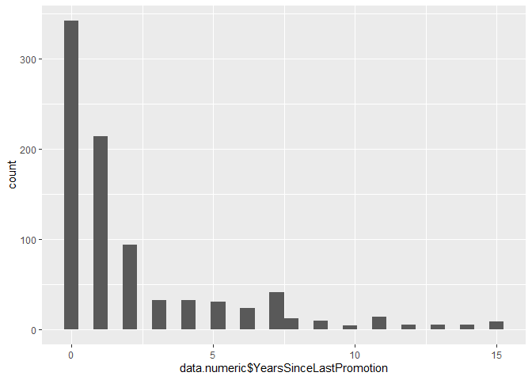
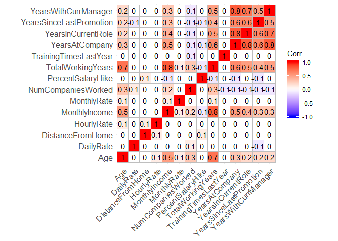

Exploratory Data Analysis
================
Chance Robinson
11/25/2019

  - [Exploratory Data Analysis](#exploratory-data-analysis)
      - [Library Imports](#library-imports)
      - [Load the CSV Data](#load-the-csv-data)
      - [Default Output](#default-output)
          - [Identify Dimensions](#identify-dimensions)
          - [Data Columns](#data-columns)
          - [Convert Integers to Strings](#convert-integers-to-strings)
          - [Convert Integers to Factors](#convert-integers-to-factors)
          - [Describe the Data Types](#describe-the-data-types)
          - [Numeric Columns](#numeric-columns)
          - [Non-Numeric Columns](#non-numeric-columns)
          - [Correlation matrix for quantitative
            data](#correlation-matrix-for-quantitative-data)

# Exploratory Data Analysis

## Library Imports

``` r
library(tidyverse)
```

    ## -- Attaching packages ----------------------------------------------------------------------------------------------------------- tidyverse 1.2.1 --

    ## v ggplot2 3.2.1     v purrr   0.3.3
    ## v tibble  2.1.3     v dplyr   0.8.3
    ## v tidyr   1.0.0     v stringr 1.4.0
    ## v readr   1.3.1     v forcats 0.4.0

    ## -- Conflicts -------------------------------------------------------------------------------------------------------------- tidyverse_conflicts() --
    ## x dplyr::filter() masks stats::filter()
    ## x dplyr::lag()    masks stats::lag()

``` r
library(knitr)
library(kableExtra)
```

    ## 
    ## Attaching package: 'kableExtra'

    ## The following object is masked from 'package:dplyr':
    ## 
    ##     group_rows

``` r
# Correlation Matrix
library(ggcorrplot)
library(Hmisc)
```

    ## Loading required package: lattice

    ## Loading required package: survival

    ## Loading required package: Formula

    ## 
    ## Attaching package: 'Hmisc'

    ## The following objects are masked from 'package:dplyr':
    ## 
    ##     src, summarize

    ## The following objects are masked from 'package:base':
    ## 
    ##     format.pval, units

## Load the CSV Data

``` r
data <- read.csv("../../data/CaseStudy2-data.csv", stringsAsFactors=TRUE, header = TRUE)
```

## Default Output

``` r
head(data)
```

    ##   ID Age Attrition    BusinessTravel DailyRate             Department
    ## 1  1  32        No     Travel_Rarely       117                  Sales
    ## 2  2  40        No     Travel_Rarely      1308 Research & Development
    ## 3  3  35        No Travel_Frequently       200 Research & Development
    ## 4  4  32        No     Travel_Rarely       801                  Sales
    ## 5  5  24        No Travel_Frequently       567 Research & Development
    ## 6  6  27        No Travel_Frequently       294 Research & Development
    ##   DistanceFromHome Education   EducationField EmployeeCount EmployeeNumber
    ## 1               13         4    Life Sciences             1            859
    ## 2               14         3          Medical             1           1128
    ## 3               18         2    Life Sciences             1           1412
    ## 4                1         4        Marketing             1           2016
    ## 5                2         1 Technical Degree             1           1646
    ## 6               10         2    Life Sciences             1            733
    ##   EnvironmentSatisfaction Gender HourlyRate JobInvolvement JobLevel
    ## 1                       2   Male         73              3        2
    ## 2                       3   Male         44              2        5
    ## 3                       3   Male         60              3        3
    ## 4                       3 Female         48              3        3
    ## 5                       1 Female         32              3        1
    ## 6                       4   Male         32              3        3
    ##                  JobRole JobSatisfaction MaritalStatus MonthlyIncome
    ## 1        Sales Executive               4      Divorced          4403
    ## 2      Research Director               3        Single         19626
    ## 3 Manufacturing Director               4        Single          9362
    ## 4        Sales Executive               4       Married         10422
    ## 5     Research Scientist               4        Single          3760
    ## 6 Manufacturing Director               1      Divorced          8793
    ##   MonthlyRate NumCompaniesWorked Over18 OverTime PercentSalaryHike
    ## 1        9250                  2      Y       No                11
    ## 2       17544                  1      Y       No                14
    ## 3       19944                  2      Y       No                11
    ## 4       24032                  1      Y       No                19
    ## 5       17218                  1      Y      Yes                13
    ## 6        4809                  1      Y       No                21
    ##   PerformanceRating RelationshipSatisfaction StandardHours StockOptionLevel
    ## 1                 3                        3            80                1
    ## 2                 3                        1            80                0
    ## 3                 3                        3            80                0
    ## 4                 3                        3            80                2
    ## 5                 3                        3            80                0
    ## 6                 4                        3            80                2
    ##   TotalWorkingYears TrainingTimesLastYear WorkLifeBalance YearsAtCompany
    ## 1                 8                     3               2              5
    ## 2                21                     2               4             20
    ## 3                10                     2               3              2
    ## 4                14                     3               3             14
    ## 5                 6                     2               3              6
    ## 6                 9                     4               2              9
    ##   YearsInCurrentRole YearsSinceLastPromotion YearsWithCurrManager
    ## 1                  2                       0                    3
    ## 2                  7                       4                    9
    ## 3                  2                       2                    2
    ## 4                 10                       5                    7
    ## 5                  3                       1                    3
    ## 6                  7                       1                    7

### Identify Dimensions

``` r
dim(data)
```

    ## [1] 870  36

### Data Columns

``` r
colnames(data)
```

    ##  [1] "ID"                       "Age"                     
    ##  [3] "Attrition"                "BusinessTravel"          
    ##  [5] "DailyRate"                "Department"              
    ##  [7] "DistanceFromHome"         "Education"               
    ##  [9] "EducationField"           "EmployeeCount"           
    ## [11] "EmployeeNumber"           "EnvironmentSatisfaction" 
    ## [13] "Gender"                   "HourlyRate"              
    ## [15] "JobInvolvement"           "JobLevel"                
    ## [17] "JobRole"                  "JobSatisfaction"         
    ## [19] "MaritalStatus"            "MonthlyIncome"           
    ## [21] "MonthlyRate"              "NumCompaniesWorked"      
    ## [23] "Over18"                   "OverTime"                
    ## [25] "PercentSalaryHike"        "PerformanceRating"       
    ## [27] "RelationshipSatisfaction" "StandardHours"           
    ## [29] "StockOptionLevel"         "TotalWorkingYears"       
    ## [31] "TrainingTimesLastYear"    "WorkLifeBalance"         
    ## [33] "YearsAtCompany"           "YearsInCurrentRole"      
    ## [35] "YearsSinceLastPromotion"  "YearsWithCurrManager"

### Convert Integers to Strings

  - These numeric columns will be converted into strings

<!-- end list -->

``` r
data$ID <- as.character(data$ID)
data$EmployeeNumber <- as.character(data$EmployeeNumber)
data$EmployeeCount <- as.character(data$EmployeeCount)
data$StandardHours <- as.character(data$StandardHours)
data$Over18 <- as.character(data$Over18)
```

### Convert Integers to Factors

``` r
data$JobInvolvement <- factor(data$JobInvolvement, ordered = TRUE, 
                              levels = c(1, 2, 3, 4),
                              labels = c("Low", "Medium", "High", "Very High"))

data$JobSatisfaction <- factor(data$JobSatisfaction, ordered = TRUE, 
                              levels = c(1, 2, 3, 4),
                              labels = c("Low", "Medium", "High", "Very High"))

data$PerformanceRating <- factor(data$PerformanceRating, ordered = TRUE, 
                              levels = c(1, 2, 3, 4),
                              labels = c("Low", "Good", "Excellent", "Outstanding"))

data$RelationshipSatisfaction <- factor(data$RelationshipSatisfaction, ordered = TRUE, 
                              levels = c(1, 2, 3, 4),
                              labels = c("Low", "Medium", "High", "Very High"))

data$WorkLifeBalance <- factor(data$WorkLifeBalance, ordered = TRUE, 
                              levels = c(1, 2, 3, 4),
                              labels = c("Bad", "Better", "Good", "Best"))

### THIS WAS NOT ACTUALLY PROVIDED ON THE WALL
data$EnvironmentSatisfaction <- factor(data$EnvironmentSatisfaction, ordered = TRUE, 
                              levels = c(1, 2, 3, 4),
                              labels = c("Low", "Medium", "High", "Very High"))

data$StockOptionLevel <- factor(data$StockOptionLevel, ordered = TRUE, 
                              levels = c(0, 1, 2, 3),
                              labels = c("Zero", "One", "Two", "Three"))

data$JobLevel <- factor(data$JobLevel, ordered = TRUE, 
                              levels = c(1, 2, 3, 4, 5),
                              labels = c("One", "Two", "Three", "Four", "Five"))

data$Education <- factor(data$Education, ordered = FALSE, 
                              levels = c(1, 2, 3, 4, 5),
                              labels = c("One", "Two", "Three", "Four", "Five"))
```

### Describe the Data Types

``` r
str(data)
```

    ## 'data.frame':    870 obs. of  36 variables:
    ##  $ ID                      : chr  "1" "2" "3" "4" ...
    ##  $ Age                     : int  32 40 35 32 24 27 41 37 34 34 ...
    ##  $ Attrition               : Factor w/ 2 levels "No","Yes": 1 1 1 1 1 1 1 1 1 1 ...
    ##  $ BusinessTravel          : Factor w/ 3 levels "Non-Travel","Travel_Frequently",..: 3 3 2 3 2 2 3 3 3 2 ...
    ##  $ DailyRate               : int  117 1308 200 801 567 294 1283 309 1333 653 ...
    ##  $ Department              : Factor w/ 3 levels "Human Resources",..: 3 2 2 3 2 2 2 3 3 2 ...
    ##  $ DistanceFromHome        : int  13 14 18 1 2 10 5 10 10 10 ...
    ##  $ Education               : Factor w/ 5 levels "One","Two","Three",..: 4 3 2 4 1 2 5 4 4 4 ...
    ##  $ EducationField          : Factor w/ 6 levels "Human Resources",..: 2 4 2 3 6 2 4 2 2 6 ...
    ##  $ EmployeeCount           : chr  "1" "1" "1" "1" ...
    ##  $ EmployeeNumber          : chr  "859" "1128" "1412" "2016" ...
    ##  $ EnvironmentSatisfaction : Ord.factor w/ 4 levels "Low"<"Medium"<..: 2 3 3 3 1 4 2 4 3 4 ...
    ##  $ Gender                  : Factor w/ 2 levels "Female","Male": 2 2 2 1 1 2 2 1 1 2 ...
    ##  $ HourlyRate              : int  73 44 60 48 32 32 90 88 87 92 ...
    ##  $ JobInvolvement          : Ord.factor w/ 4 levels "Low"<"Medium"<..: 3 2 3 3 3 3 4 2 3 2 ...
    ##  $ JobLevel                : Ord.factor w/ 5 levels "One"<"Two"<"Three"<..: 2 5 3 3 1 3 1 2 1 2 ...
    ##  $ JobRole                 : Factor w/ 9 levels "Healthcare Representative",..: 8 6 5 8 7 5 7 8 9 1 ...
    ##  $ JobSatisfaction         : Ord.factor w/ 4 levels "Low"<"Medium"<..: 4 3 4 4 4 1 3 4 3 3 ...
    ##  $ MaritalStatus           : Factor w/ 3 levels "Divorced","Married",..: 1 3 3 2 3 1 2 1 2 2 ...
    ##  $ MonthlyIncome           : int  4403 19626 9362 10422 3760 8793 2127 6694 2220 5063 ...
    ##  $ MonthlyRate             : int  9250 17544 19944 24032 17218 4809 5561 24223 18410 15332 ...
    ##  $ NumCompaniesWorked      : int  2 1 2 1 1 1 2 2 1 1 ...
    ##  $ Over18                  : chr  "Y" "Y" "Y" "Y" ...
    ##  $ OverTime                : Factor w/ 2 levels "No","Yes": 1 1 1 1 2 1 2 2 2 1 ...
    ##  $ PercentSalaryHike       : int  11 14 11 19 13 21 12 14 19 14 ...
    ##  $ PerformanceRating       : Ord.factor w/ 4 levels "Low"<"Good"<"Excellent"<..: 3 3 3 3 3 4 3 3 3 3 ...
    ##  $ RelationshipSatisfaction: Ord.factor w/ 4 levels "Low"<"Medium"<..: 3 1 3 3 3 3 1 3 4 2 ...
    ##  $ StandardHours           : chr  "80" "80" "80" "80" ...
    ##  $ StockOptionLevel        : Ord.factor w/ 4 levels "Zero"<"One"<"Two"<..: 2 1 1 3 1 3 1 4 2 2 ...
    ##  $ TotalWorkingYears       : int  8 21 10 14 6 9 7 8 1 8 ...
    ##  $ TrainingTimesLastYear   : int  3 2 2 3 2 4 5 5 2 3 ...
    ##  $ WorkLifeBalance         : Ord.factor w/ 4 levels "Bad"<"Better"<..: 2 4 3 3 3 2 2 3 3 2 ...
    ##  $ YearsAtCompany          : int  5 20 2 14 6 9 4 1 1 8 ...
    ##  $ YearsInCurrentRole      : int  2 7 2 10 3 7 2 0 1 2 ...
    ##  $ YearsSinceLastPromotion : int  0 4 2 5 1 1 0 0 0 7 ...
    ##  $ YearsWithCurrManager    : int  3 9 2 7 3 7 3 0 0 7 ...

### Numeric Columns

#### Column Names

``` r
data.numeric <- data %>%
  select_if(is.numeric)
```

#### Summary Tables

``` r
summary(data.numeric)
```

    ##       Age          DailyRate      DistanceFromHome   HourlyRate    
    ##  Min.   :18.00   Min.   : 103.0   Min.   : 1.000   Min.   : 30.00  
    ##  1st Qu.:30.00   1st Qu.: 472.5   1st Qu.: 2.000   1st Qu.: 48.00  
    ##  Median :35.00   Median : 817.5   Median : 7.000   Median : 66.00  
    ##  Mean   :36.83   Mean   : 815.2   Mean   : 9.339   Mean   : 65.61  
    ##  3rd Qu.:43.00   3rd Qu.:1165.8   3rd Qu.:14.000   3rd Qu.: 83.00  
    ##  Max.   :60.00   Max.   :1499.0   Max.   :29.000   Max.   :100.00  
    ##  MonthlyIncome    MonthlyRate    NumCompaniesWorked PercentSalaryHike
    ##  Min.   : 1081   Min.   : 2094   Min.   :0.000      Min.   :11.0     
    ##  1st Qu.: 2840   1st Qu.: 8092   1st Qu.:1.000      1st Qu.:12.0     
    ##  Median : 4946   Median :14074   Median :2.000      Median :14.0     
    ##  Mean   : 6390   Mean   :14326   Mean   :2.728      Mean   :15.2     
    ##  3rd Qu.: 8182   3rd Qu.:20456   3rd Qu.:4.000      3rd Qu.:18.0     
    ##  Max.   :19999   Max.   :26997   Max.   :9.000      Max.   :25.0     
    ##  TotalWorkingYears TrainingTimesLastYear YearsAtCompany   YearsInCurrentRole
    ##  Min.   : 0.00     Min.   :0.000         Min.   : 0.000   Min.   : 0.000    
    ##  1st Qu.: 6.00     1st Qu.:2.000         1st Qu.: 3.000   1st Qu.: 2.000    
    ##  Median :10.00     Median :3.000         Median : 5.000   Median : 3.000    
    ##  Mean   :11.05     Mean   :2.832         Mean   : 6.962   Mean   : 4.205    
    ##  3rd Qu.:15.00     3rd Qu.:3.000         3rd Qu.:10.000   3rd Qu.: 7.000    
    ##  Max.   :40.00     Max.   :6.000         Max.   :40.000   Max.   :18.000    
    ##  YearsSinceLastPromotion YearsWithCurrManager
    ##  Min.   : 0.000          Min.   : 0.00       
    ##  1st Qu.: 0.000          1st Qu.: 2.00       
    ##  Median : 1.000          Median : 3.00       
    ##  Mean   : 2.169          Mean   : 4.14       
    ##  3rd Qu.: 3.000          3rd Qu.: 7.00       
    ##  Max.   :15.000          Max.   :17.00

``` r
# DistanceFromHome
# NumCompaniesWorked
# TotalWorkingYears
# TrainingTimesLastYear
# YearsAtCompany

ggplot(data=data.numeric, aes(data.numeric$YearsSinceLastPromotion)) + 
  geom_histogram()
```

    ## `stat_bin()` using `bins = 30`. Pick better value with `binwidth`.

<!-- -->

### Non-Numeric Columns

#### Column Names

``` r
data.non.numeric <- data %>%
  select_if(is.factor)

colnames(data.non.numeric)
```

    ##  [1] "Attrition"                "BusinessTravel"          
    ##  [3] "Department"               "Education"               
    ##  [5] "EducationField"           "EnvironmentSatisfaction" 
    ##  [7] "Gender"                   "JobInvolvement"          
    ##  [9] "JobLevel"                 "JobRole"                 
    ## [11] "JobSatisfaction"          "MaritalStatus"           
    ## [13] "OverTime"                 "PerformanceRating"       
    ## [15] "RelationshipSatisfaction" "StockOptionLevel"        
    ## [17] "WorkLifeBalance"

``` r
gather(data.non.numeric, "Column", "Value") %>%
  count(Column, Value) %>%
  group_by(Column) %>%             
  mutate(Percentage = prop.table(n)) %>%
  rename(Count = n)
```

    ## Warning: attributes are not identical across measure variables;
    ## they will be dropped

    ## # A tibble: 66 x 4
    ## # Groups:   Column [17]
    ##    Column         Value                  Count Percentage
    ##    <chr>          <chr>                  <int>      <dbl>
    ##  1 Attrition      No                       730     0.839 
    ##  2 Attrition      Yes                      140     0.161 
    ##  3 BusinessTravel Non-Travel                94     0.108 
    ##  4 BusinessTravel Travel_Frequently        158     0.182 
    ##  5 BusinessTravel Travel_Rarely            618     0.710 
    ##  6 Department     Human Resources           35     0.0402
    ##  7 Department     Research & Development   562     0.646 
    ##  8 Department     Sales                    273     0.314 
    ##  9 Education      Five                      26     0.0299
    ## 10 Education      Four                     240     0.276 
    ## # ... with 56 more rows

``` r
data %>%
  count(Attrition, sort = TRUE)
```

    ## # A tibble: 2 x 2
    ##   Attrition     n
    ##   <fct>     <int>
    ## 1 No          730
    ## 2 Yes         140

``` r
data %>%
  count(BusinessTravel, sort = TRUE)
```

    ## # A tibble: 3 x 2
    ##   BusinessTravel        n
    ##   <fct>             <int>
    ## 1 Travel_Rarely       618
    ## 2 Travel_Frequently   158
    ## 3 Non-Travel           94

``` r
data.non.numeric %>%
  count(Department, sort = TRUE)
```

    ## # A tibble: 3 x 2
    ##   Department                 n
    ##   <fct>                  <int>
    ## 1 Research & Development   562
    ## 2 Sales                    273
    ## 3 Human Resources           35

``` r
data.non.numeric %>%
  count(Education, sort = TRUE)
```

    ## # A tibble: 5 x 2
    ##   Education     n
    ##   <fct>     <int>
    ## 1 Three       324
    ## 2 Four        240
    ## 3 Two         182
    ## 4 One          98
    ## 5 Five         26

``` r
data.non.numeric %>%
  count(EducationField, sort = TRUE)
```

    ## # A tibble: 6 x 2
    ##   EducationField       n
    ##   <fct>            <int>
    ## 1 Life Sciences      358
    ## 2 Medical            270
    ## 3 Marketing          100
    ## 4 Technical Degree    75
    ## 5 Other               52
    ## 6 Human Resources     15

``` r
data.non.numeric %>%
  count(Gender, sort = TRUE)
```

    ## # A tibble: 2 x 2
    ##   Gender     n
    ##   <fct>  <int>
    ## 1 Male     516
    ## 2 Female   354

``` r
data.non.numeric %>%
  count(JobRole, sort = TRUE)
```

    ## # A tibble: 9 x 2
    ##   JobRole                       n
    ##   <fct>                     <int>
    ## 1 Sales Executive             200
    ## 2 Research Scientist          172
    ## 3 Laboratory Technician       153
    ## 4 Manufacturing Director       87
    ## 5 Healthcare Representative    76
    ## 6 Sales Representative         53
    ## 7 Manager                      51
    ## 8 Research Director            51
    ## 9 Human Resources              27

``` r
data.non.numeric %>%
  count(MaritalStatus, sort = TRUE)
```

    ## # A tibble: 3 x 2
    ##   MaritalStatus     n
    ##   <fct>         <int>
    ## 1 Married         410
    ## 2 Single          269
    ## 3 Divorced        191

``` r
data.non.numeric %>%
  count(OverTime, sort = TRUE)
```

    ## # A tibble: 2 x 2
    ##   OverTime     n
    ##   <fct>    <int>
    ## 1 No         618
    ## 2 Yes        252

``` r
data %>%
  count(StandardHours, sort = TRUE)
```

    ## # A tibble: 1 x 2
    ##   StandardHours     n
    ##   <chr>         <int>
    ## 1 80              870

### Correlation matrix for quantitative data

``` r
# function for flattening and ordering the correlation matrix
flattenCorrMatrix <- function(cormat, pmat) {
  ut <- upper.tri(cormat)
  data.frame(
    row = rownames(cormat)[row(cormat)[ut]],
    column = rownames(cormat)[col(cormat)[ut]],
    correlation  =(cormat)[ut],
    p.value = pmat[ut]
    )
}
# See what variables are correlated with each other, p-values
correlation.matrix <- rcorr(as.matrix(data.numeric))
corDF <- data.frame(flattenCorrMatrix(correlation.matrix$r, correlation.matrix$P))
# Order the correlation matrix to show the highest correlated
# data.frame(corDF[order(-corDF$cor),])

quantDataModel <- corDF[which(abs(corDF$correlation) >= 0.5),]
data.frame(quantDataModel[order(-abs(quantDataModel$cor)),])
```

    ##                        row                  column correlation p.value
    ## 33           MonthlyIncome       TotalWorkingYears   0.7785112       0
    ## 66          YearsAtCompany      YearsInCurrentRole   0.7761164       0
    ## 89          YearsAtCompany    YearsWithCurrManager   0.7652262       0
    ## 90      YearsInCurrentRole    YearsWithCurrManager   0.7094612       0
    ## 29                     Age       TotalWorkingYears   0.6526131       0
    ## 77          YearsAtCompany YearsSinceLastPromotion   0.6440298       0
    ## 54       TotalWorkingYears          YearsAtCompany   0.6360836       0
    ## 78      YearsInCurrentRole YearsSinceLastPromotion   0.5537100       0
    ## 91 YearsSinceLastPromotion    YearsWithCurrManager   0.5089354       0

``` r
correlation.plot <- round(cor(data.numeric), 1)
ggcorrplot(correlation.plot, method = "square", type = "full", lab = TRUE)
```

<!-- -->
