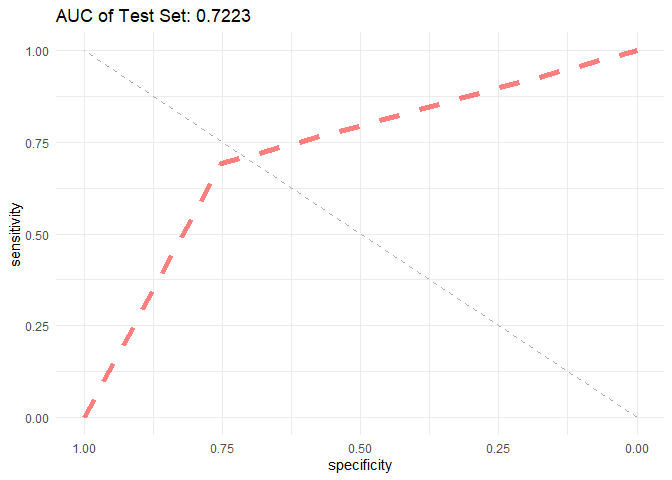

Support Vector Machines
================
Chance Robinson
12/04/2019

  - [Exploratory Data Analysis](#exploratory-data-analysis)
      - [Library Imports](#library-imports)
      - [Load the CSV Data](#load-the-csv-data)
          - [Convert Integers to Strings](#convert-integers-to-strings)
          - [Convert Integers to Factors](#convert-integers-to-factors)
      - [Prepare Dataframe](#prepare-dataframe)
      - [KNN](#knn)
      - [Train / Test Split](#train-test-split)
          - [Test](#test)
          - [Area Under the Curve](#area-under-the-curve)

# Exploratory Data Analysis

## Library Imports

``` r
library(tidyverse)
```

    ## -- Attaching packages ----------------------------------------------------------------------------------------------------------- tidyverse 1.2.1 --

    ## v ggplot2 3.2.1     v purrr   0.3.3
    ## v tibble  2.1.3     v dplyr   0.8.3
    ## v tidyr   1.0.0     v stringr 1.4.0
    ## v readr   1.3.1     v forcats 0.4.0

    ## -- Conflicts -------------------------------------------------------------------------------------------------------------- tidyverse_conflicts() --
    ## x dplyr::filter() masks stats::filter()
    ## x dplyr::lag()    masks stats::lag()

``` r
# KNN
library(class)
# downSample
library(caret)
```

    ## Loading required package: lattice

    ## 
    ## Attaching package: 'caret'

    ## The following object is masked from 'package:purrr':
    ## 
    ##     lift

``` r
# ROC Curves
library(ROCR)
```

    ## Loading required package: gplots

    ## 
    ## Attaching package: 'gplots'

    ## The following object is masked from 'package:stats':
    ## 
    ##     lowess

``` r
library(pROC)
```

    ## Type 'citation("pROC")' for a citation.

    ## 
    ## Attaching package: 'pROC'

    ## The following objects are masked from 'package:stats':
    ## 
    ##     cov, smooth, var

## Load the CSV Data

``` r
data <- read.csv("../../data/CaseStudy2-data.csv", stringsAsFactors=TRUE, header = TRUE)
```

``` r
head(data)
```

    ##   ID Age Attrition    BusinessTravel DailyRate             Department
    ## 1  1  32        No     Travel_Rarely       117                  Sales
    ## 2  2  40        No     Travel_Rarely      1308 Research & Development
    ## 3  3  35        No Travel_Frequently       200 Research & Development
    ## 4  4  32        No     Travel_Rarely       801                  Sales
    ## 5  5  24        No Travel_Frequently       567 Research & Development
    ## 6  6  27        No Travel_Frequently       294 Research & Development
    ##   DistanceFromHome Education   EducationField EmployeeCount EmployeeNumber
    ## 1               13         4    Life Sciences             1            859
    ## 2               14         3          Medical             1           1128
    ## 3               18         2    Life Sciences             1           1412
    ## 4                1         4        Marketing             1           2016
    ## 5                2         1 Technical Degree             1           1646
    ## 6               10         2    Life Sciences             1            733
    ##   EnvironmentSatisfaction Gender HourlyRate JobInvolvement JobLevel
    ## 1                       2   Male         73              3        2
    ## 2                       3   Male         44              2        5
    ## 3                       3   Male         60              3        3
    ## 4                       3 Female         48              3        3
    ## 5                       1 Female         32              3        1
    ## 6                       4   Male         32              3        3
    ##                  JobRole JobSatisfaction MaritalStatus MonthlyIncome
    ## 1        Sales Executive               4      Divorced          4403
    ## 2      Research Director               3        Single         19626
    ## 3 Manufacturing Director               4        Single          9362
    ## 4        Sales Executive               4       Married         10422
    ## 5     Research Scientist               4        Single          3760
    ## 6 Manufacturing Director               1      Divorced          8793
    ##   MonthlyRate NumCompaniesWorked Over18 OverTime PercentSalaryHike
    ## 1        9250                  2      Y       No                11
    ## 2       17544                  1      Y       No                14
    ## 3       19944                  2      Y       No                11
    ## 4       24032                  1      Y       No                19
    ## 5       17218                  1      Y      Yes                13
    ## 6        4809                  1      Y       No                21
    ##   PerformanceRating RelationshipSatisfaction StandardHours StockOptionLevel
    ## 1                 3                        3            80                1
    ## 2                 3                        1            80                0
    ## 3                 3                        3            80                0
    ## 4                 3                        3            80                2
    ## 5                 3                        3            80                0
    ## 6                 4                        3            80                2
    ##   TotalWorkingYears TrainingTimesLastYear WorkLifeBalance YearsAtCompany
    ## 1                 8                     3               2              5
    ## 2                21                     2               4             20
    ## 3                10                     2               3              2
    ## 4                14                     3               3             14
    ## 5                 6                     2               3              6
    ## 6                 9                     4               2              9
    ##   YearsInCurrentRole YearsSinceLastPromotion YearsWithCurrManager
    ## 1                  2                       0                    3
    ## 2                  7                       4                    9
    ## 3                  2                       2                    2
    ## 4                 10                       5                    7
    ## 5                  3                       1                    3
    ## 6                  7                       1                    7

### Convert Integers to Strings

  - These numeric columns will be converted into strings

<!-- end list -->

``` r
data$ID <- as.character(data$ID)
data$EmployeeNumber <- as.character(data$EmployeeNumber)
data$EmployeeCount <- as.character(data$EmployeeCount)
data$StandardHours <- as.character(data$StandardHours)
data$Over18 <- as.character(data$Over18)
```

### Convert Integers to Factors

``` r
data$JobInvolvement <- factor(data$JobInvolvement, ordered = TRUE,
                              levels = c(1, 2, 3, 4),
                              labels = c("Low", "Medium", "High", "Very High"))

data$JobSatisfaction <- factor(data$JobSatisfaction, ordered = TRUE,
                              levels = c(1, 2, 3, 4),
                              labels = c("Low", "Medium", "High", "Very High"))

data$PerformanceRating <- factor(data$PerformanceRating, ordered = TRUE,
                              levels = c(1, 2, 3, 4),
                              labels = c("Low", "Good", "Excellent", "Outstanding"))

data$RelationshipSatisfaction <- factor(data$RelationshipSatisfaction, ordered = TRUE,
                              levels = c(1, 2, 3, 4),
                              labels = c("Low", "Medium", "High", "Very High"))

data$WorkLifeBalance <- factor(data$WorkLifeBalance, ordered = TRUE,
                              levels = c(1, 2, 3, 4),
                              labels = c("Bad", "Better", "Good", "Best"))

### THIS WAS NOT ACTUALLY PROVIDED ON THE WALL
data$EnvironmentSatisfaction <- factor(data$EnvironmentSatisfaction, ordered = TRUE,
                              levels = c(1, 2, 3, 4),
                              labels = c("Low", "Medium", "High", "Very High"))

data$StockOptionLevel <- factor(data$StockOptionLevel, ordered = TRUE,
                              levels = c(0, 1, 2, 3),
                              labels = c("Zero", "One", "Two", "Three"))

data$JobLevel <- factor(data$JobLevel, ordered = TRUE,
                              levels = c(1, 2, 3, 4, 5),
                              labels = c("One", "Two", "Three", "Four", "Five"))

data$Education <- factor(data$Education, ordered = FALSE,
                              levels = c(1, 2, 3, 4, 5),
                              labels = c("One", "Two", "Three", "Four", "Five"))
```

## Prepare Dataframe

``` r
cols_to_keep = c("YearsSinceLastPromotion", "YearsWithCurrManager", "TrainingTimesLastYear", "DistanceFromHome", "NumCompaniesWorked", "YearsInCurrentRole", "TotalWorkingYears", "JobInvolvement", "OverTime", "BusinessTravel", "Attrition")

cols_to_remove <- c("ID", "EmployeeNumber", "EmployeeCount", "StandardHours", "Over18")

data.mod <- data %>%
  select(cols_to_keep)

head(data.mod)
```

    ##   YearsSinceLastPromotion YearsWithCurrManager TrainingTimesLastYear
    ## 1                       0                    3                     3
    ## 2                       4                    9                     2
    ## 3                       2                    2                     2
    ## 4                       5                    7                     3
    ## 5                       1                    3                     2
    ## 6                       1                    7                     4
    ##   DistanceFromHome NumCompaniesWorked YearsInCurrentRole TotalWorkingYears
    ## 1               13                  2                  2                 8
    ## 2               14                  1                  7                21
    ## 3               18                  2                  2                10
    ## 4                1                  1                 10                14
    ## 5                2                  1                  3                 6
    ## 6               10                  1                  7                 9
    ##   JobInvolvement OverTime    BusinessTravel Attrition
    ## 1           High       No     Travel_Rarely        No
    ## 2         Medium       No     Travel_Rarely        No
    ## 3           High       No Travel_Frequently        No
    ## 4           High       No     Travel_Rarely        No
    ## 5           High      Yes Travel_Frequently        No
    ## 6           High       No Travel_Frequently        No

## KNN

## Train / Test Split

``` r
set.seed(1234)

sample.data <- sample_frac(data.mod, 1)

split.perc = .70

train.indices = sample(1:dim(sample.data)[1],round(split.perc * dim(sample.data)[1]))

train = sample.data[train.indices,]
test = sample.data[-train.indices,]

train <- upSample(train, as.factor(train$Attrition), list = FALSE)
train$Class <- NULL

# library(DMwR)
# train <- SMOTE(Attrition ~ ., train, perc.over = 100, perc.under=200)
```

``` r
set.seed(1234)
ctrl <- trainControl(method="cv")
knn.model <- train(Attrition ~ ., data = train, method = "knn", trControl = ctrl, preProcess = c("center","scale"), tuneLength = 10)

knn.model
```

    ## k-Nearest Neighbors 
    ## 
    ## 1016 samples
    ##   10 predictor
    ##    2 classes: 'No', 'Yes' 
    ## 
    ## Pre-processing: centered (13), scaled (13) 
    ## Resampling: Cross-Validated (10 fold) 
    ## Summary of sample sizes: 914, 915, 914, 915, 915, 915, ... 
    ## Resampling results across tuning parameters:
    ## 
    ##   k   Accuracy   Kappa    
    ##    5  0.7440982  0.4882561
    ##    7  0.7322559  0.4644946
    ##    9  0.7382353  0.4764856
    ##   11  0.7520384  0.5040723
    ##   13  0.7509610  0.5019075
    ##   15  0.7569113  0.5139042
    ##   17  0.7490099  0.4979955
    ##   19  0.7411279  0.4821626
    ##   21  0.7263638  0.4526977
    ##   23  0.7233741  0.4467560
    ## 
    ## Accuracy was used to select the optimal model using the largest value.
    ## The final value used for the model was k = 15.

``` r
knn.predict <- predict(knn.model, newdata = test)
```

### Test

``` r
confusionMatrix(knn.predict, test$Attrition, "Yes")
```

    ## Confusion Matrix and Statistics
    ## 
    ##           Reference
    ## Prediction  No Yes
    ##        No  167  12
    ##        Yes  55  27
    ##                                           
    ##                Accuracy : 0.7433          
    ##                  95% CI : (0.6858, 0.7952)
    ##     No Information Rate : 0.8506          
    ##     P-Value [Acc > NIR] : 1               
    ##                                           
    ##                   Kappa : 0.3057          
    ##                                           
    ##  Mcnemar's Test P-Value : 2.88e-07        
    ##                                           
    ##             Sensitivity : 0.6923          
    ##             Specificity : 0.7523          
    ##          Pos Pred Value : 0.3293          
    ##          Neg Pred Value : 0.9330          
    ##              Prevalence : 0.1494          
    ##          Detection Rate : 0.1034          
    ##    Detection Prevalence : 0.3142          
    ##       Balanced Accuracy : 0.7223          
    ##                                           
    ##        'Positive' Class : Yes             
    ## 

### Area Under the Curve

``` r
# ?pROC

auc <- roc(as.integer(test$Attrition), as.integer(knn.predict))
```

    ## Setting levels: control = 1, case = 2

    ## Setting direction: controls < cases

``` r
g <- ggroc(auc, alpha = 0.5, colour = "red", linetype = 2, size = 2) +
  theme_minimal() + 
  ggtitle(paste('AUC of Test Set:', round(auc$auc[[1]],4))) + 
  geom_segment(aes(x = 0, xend = 1, y = 0, yend = 1), color="darkgrey", linetype="dashed")
  

plot(g)
```

<!-- -->
