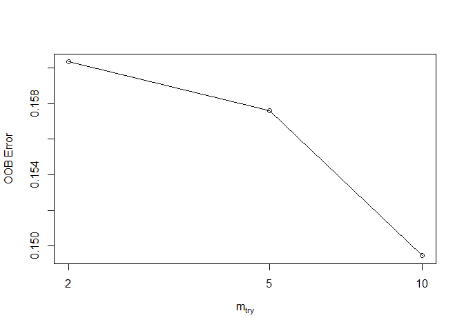

Random Forest
================
Chance Robinson
12/02/2019

# Exploratory Data Analysis

## Library Imports

``` r
library(tidyverse)
```

    ## ── Attaching packages ──────────────────────────────────────────────────────────────────────────── tidyverse 1.2.1 ──

    ## ✔ ggplot2 3.2.0     ✔ purrr   0.3.2
    ## ✔ tibble  2.1.3     ✔ dplyr   0.8.3
    ## ✔ tidyr   0.8.3     ✔ stringr 1.4.0
    ## ✔ readr   1.3.1     ✔ forcats 0.4.0

    ## ── Conflicts ─────────────────────────────────────────────────────────────────────────────── tidyverse_conflicts() ──
    ## ✖ dplyr::filter() masks stats::filter()
    ## ✖ dplyr::lag()    masks stats::lag()

``` r
# Random Forest
library(randomForest)  
```

    ## randomForest 4.6-14

    ## Type rfNews() to see new features/changes/bug fixes.

    ## 
    ## Attaching package: 'randomForest'

    ## The following object is masked from 'package:dplyr':
    ## 
    ##     combine

    ## The following object is masked from 'package:ggplot2':
    ## 
    ##     margin

``` r
library(e1071)  
# downSample
library(caret)
```

    ## Loading required package: lattice

    ## 
    ## Attaching package: 'caret'

    ## The following object is masked from 'package:purrr':
    ## 
    ##     lift

## Load the CSV Data

``` r
data <- read.csv("../../data/CaseStudy2-data.csv", stringsAsFactors=TRUE, header = TRUE)
```

``` r
head(data)
```

    ##   ID Age Attrition    BusinessTravel DailyRate             Department
    ## 1  1  32        No     Travel_Rarely       117                  Sales
    ## 2  2  40        No     Travel_Rarely      1308 Research & Development
    ## 3  3  35        No Travel_Frequently       200 Research & Development
    ## 4  4  32        No     Travel_Rarely       801                  Sales
    ## 5  5  24        No Travel_Frequently       567 Research & Development
    ## 6  6  27        No Travel_Frequently       294 Research & Development
    ##   DistanceFromHome Education   EducationField EmployeeCount EmployeeNumber
    ## 1               13         4    Life Sciences             1            859
    ## 2               14         3          Medical             1           1128
    ## 3               18         2    Life Sciences             1           1412
    ## 4                1         4        Marketing             1           2016
    ## 5                2         1 Technical Degree             1           1646
    ## 6               10         2    Life Sciences             1            733
    ##   EnvironmentSatisfaction Gender HourlyRate JobInvolvement JobLevel
    ## 1                       2   Male         73              3        2
    ## 2                       3   Male         44              2        5
    ## 3                       3   Male         60              3        3
    ## 4                       3 Female         48              3        3
    ## 5                       1 Female         32              3        1
    ## 6                       4   Male         32              3        3
    ##                  JobRole JobSatisfaction MaritalStatus MonthlyIncome
    ## 1        Sales Executive               4      Divorced          4403
    ## 2      Research Director               3        Single         19626
    ## 3 Manufacturing Director               4        Single          9362
    ## 4        Sales Executive               4       Married         10422
    ## 5     Research Scientist               4        Single          3760
    ## 6 Manufacturing Director               1      Divorced          8793
    ##   MonthlyRate NumCompaniesWorked Over18 OverTime PercentSalaryHike
    ## 1        9250                  2      Y       No                11
    ## 2       17544                  1      Y       No                14
    ## 3       19944                  2      Y       No                11
    ## 4       24032                  1      Y       No                19
    ## 5       17218                  1      Y      Yes                13
    ## 6        4809                  1      Y       No                21
    ##   PerformanceRating RelationshipSatisfaction StandardHours
    ## 1                 3                        3            80
    ## 2                 3                        1            80
    ## 3                 3                        3            80
    ## 4                 3                        3            80
    ## 5                 3                        3            80
    ## 6                 4                        3            80
    ##   StockOptionLevel TotalWorkingYears TrainingTimesLastYear WorkLifeBalance
    ## 1                1                 8                     3               2
    ## 2                0                21                     2               4
    ## 3                0                10                     2               3
    ## 4                2                14                     3               3
    ## 5                0                 6                     2               3
    ## 6                2                 9                     4               2
    ##   YearsAtCompany YearsInCurrentRole YearsSinceLastPromotion
    ## 1              5                  2                       0
    ## 2             20                  7                       4
    ## 3              2                  2                       2
    ## 4             14                 10                       5
    ## 5              6                  3                       1
    ## 6              9                  7                       1
    ##   YearsWithCurrManager
    ## 1                    3
    ## 2                    9
    ## 3                    2
    ## 4                    7
    ## 5                    3
    ## 6                    7

### Convert Integers to Strings

  - These numeric columns will be converted into strings

<!-- end list -->

``` r
data$ID <- as.character(data$ID)
data$EmployeeNumber <- as.character(data$EmployeeNumber)
data$EmployeeCount <- as.character(data$EmployeeCount)
data$StandardHours <- as.character(data$StandardHours)
data$Over18 <- as.character(data$Over18)
```

### Convert Integers to Factors

``` r
# data$JobInvolvement <- factor(data$JobInvolvement, ordered = TRUE,
#                               levels = c(1, 2, 3, 4),
#                               labels = c("Low", "Medium", "High", "Very High"))
# 
# data$JobSatisfaction <- factor(data$JobSatisfaction, ordered = TRUE,
#                               levels = c(1, 2, 3, 4),
#                               labels = c("Low", "Medium", "High", "Very High"))
# 
# data$PerformanceRating <- factor(data$PerformanceRating, ordered = TRUE,
#                               levels = c(1, 2, 3, 4),
#                               labels = c("Low", "Good", "Excellent", "Outstanding"))
# 
# data$RelationshipSatisfaction <- factor(data$RelationshipSatisfaction, ordered = TRUE,
#                               levels = c(1, 2, 3, 4),
#                               labels = c("Low", "Medium", "High", "Very High"))
# 
# data$WorkLifeBalance <- factor(data$WorkLifeBalance, ordered = TRUE,
#                               levels = c(1, 2, 3, 4),
#                               labels = c("Bad", "Better", "Good", "Best"))
# 
# ### THIS WAS NOT ACTUALLY PROVIDED ON THE WALL
# data$EnvironmentSatisfaction <- factor(data$EnvironmentSatisfaction, ordered = TRUE,
#                               levels = c(1, 2, 3, 4),
#                               labels = c("Low", "Medium", "High", "Very High"))
# 
# data$StockOptionLevel <- factor(data$StockOptionLevel, ordered = TRUE,
#                               levels = c(0, 1, 2, 3),
#                               labels = c("Zero", "One", "Two", "Three"))
# 
# data$JobLevel <- factor(data$JobLevel, ordered = TRUE,
#                               levels = c(1, 2, 3, 4, 5),
#                               labels = c("One", "Two", "Three", "Four", "Five"))
# 
# data$Education <- factor(data$Education, ordered = FALSE,
#                               levels = c(1, 2, 3, 4, 5),
#                               labels = c("One", "Two", "Three", "Four", "Five"))
```

## Prepare Dataframe

``` r
cols_to_remove <- c("ID", "EmployeeNumber", "EmployeeCount", "StandardHours", "Over18")


data.mod <- data %>%
  select(-cols_to_remove) %>%
  mutate(Attrition = factor(Attrition, labels = c("No", "Yes"))) 

summary(data.mod)
```

    ##       Age        Attrition           BusinessTravel   DailyRate     
    ##  Min.   :18.00   No :730   Non-Travel       : 94    Min.   : 103.0  
    ##  1st Qu.:30.00   Yes:140   Travel_Frequently:158    1st Qu.: 472.5  
    ##  Median :35.00             Travel_Rarely    :618    Median : 817.5  
    ##  Mean   :36.83                                      Mean   : 815.2  
    ##  3rd Qu.:43.00                                      3rd Qu.:1165.8  
    ##  Max.   :60.00                                      Max.   :1499.0  
    ##                                                                     
    ##                   Department  DistanceFromHome   Education    
    ##  Human Resources       : 35   Min.   : 1.000   Min.   :1.000  
    ##  Research & Development:562   1st Qu.: 2.000   1st Qu.:2.000  
    ##  Sales                 :273   Median : 7.000   Median :3.000  
    ##                               Mean   : 9.339   Mean   :2.901  
    ##                               3rd Qu.:14.000   3rd Qu.:4.000  
    ##                               Max.   :29.000   Max.   :5.000  
    ##                                                               
    ##           EducationField EnvironmentSatisfaction    Gender   
    ##  Human Resources : 15    Min.   :1.000           Female:354  
    ##  Life Sciences   :358    1st Qu.:2.000           Male  :516  
    ##  Marketing       :100    Median :3.000                       
    ##  Medical         :270    Mean   :2.701                       
    ##  Other           : 52    3rd Qu.:4.000                       
    ##  Technical Degree: 75    Max.   :4.000                       
    ##                                                              
    ##    HourlyRate     JobInvolvement     JobLevel    
    ##  Min.   : 30.00   Min.   :1.000   Min.   :1.000  
    ##  1st Qu.: 48.00   1st Qu.:2.000   1st Qu.:1.000  
    ##  Median : 66.00   Median :3.000   Median :2.000  
    ##  Mean   : 65.61   Mean   :2.723   Mean   :2.039  
    ##  3rd Qu.: 83.00   3rd Qu.:3.000   3rd Qu.:3.000  
    ##  Max.   :100.00   Max.   :4.000   Max.   :5.000  
    ##                                                  
    ##                       JobRole    JobSatisfaction  MaritalStatus
    ##  Sales Executive          :200   Min.   :1.000   Divorced:191  
    ##  Research Scientist       :172   1st Qu.:2.000   Married :410  
    ##  Laboratory Technician    :153   Median :3.000   Single  :269  
    ##  Manufacturing Director   : 87   Mean   :2.709                 
    ##  Healthcare Representative: 76   3rd Qu.:4.000                 
    ##  Sales Representative     : 53   Max.   :4.000                 
    ##  (Other)                  :129                                 
    ##  MonthlyIncome    MonthlyRate    NumCompaniesWorked OverTime 
    ##  Min.   : 1081   Min.   : 2094   Min.   :0.000      No :618  
    ##  1st Qu.: 2840   1st Qu.: 8092   1st Qu.:1.000      Yes:252  
    ##  Median : 4946   Median :14074   Median :2.000               
    ##  Mean   : 6390   Mean   :14326   Mean   :2.728               
    ##  3rd Qu.: 8182   3rd Qu.:20456   3rd Qu.:4.000               
    ##  Max.   :19999   Max.   :26997   Max.   :9.000               
    ##                                                              
    ##  PercentSalaryHike PerformanceRating RelationshipSatisfaction
    ##  Min.   :11.0      Min.   :3.000     Min.   :1.000           
    ##  1st Qu.:12.0      1st Qu.:3.000     1st Qu.:2.000           
    ##  Median :14.0      Median :3.000     Median :3.000           
    ##  Mean   :15.2      Mean   :3.152     Mean   :2.707           
    ##  3rd Qu.:18.0      3rd Qu.:3.000     3rd Qu.:4.000           
    ##  Max.   :25.0      Max.   :4.000     Max.   :4.000           
    ##                                                              
    ##  StockOptionLevel TotalWorkingYears TrainingTimesLastYear WorkLifeBalance
    ##  Min.   :0.0000   Min.   : 0.00     Min.   :0.000         Min.   :1.000  
    ##  1st Qu.:0.0000   1st Qu.: 6.00     1st Qu.:2.000         1st Qu.:2.000  
    ##  Median :1.0000   Median :10.00     Median :3.000         Median :3.000  
    ##  Mean   :0.7839   Mean   :11.05     Mean   :2.832         Mean   :2.782  
    ##  3rd Qu.:1.0000   3rd Qu.:15.00     3rd Qu.:3.000         3rd Qu.:3.000  
    ##  Max.   :3.0000   Max.   :40.00     Max.   :6.000         Max.   :4.000  
    ##                                                                          
    ##  YearsAtCompany   YearsInCurrentRole YearsSinceLastPromotion
    ##  Min.   : 0.000   Min.   : 0.000     Min.   : 0.000         
    ##  1st Qu.: 3.000   1st Qu.: 2.000     1st Qu.: 0.000         
    ##  Median : 5.000   Median : 3.000     Median : 1.000         
    ##  Mean   : 6.962   Mean   : 4.205     Mean   : 2.169         
    ##  3rd Qu.:10.000   3rd Qu.: 7.000     3rd Qu.: 3.000         
    ##  Max.   :40.000   Max.   :18.000     Max.   :15.000         
    ##                                                             
    ##  YearsWithCurrManager
    ##  Min.   : 0.00       
    ##  1st Qu.: 2.00       
    ##  Median : 3.00       
    ##  Mean   : 4.14       
    ##  3rd Qu.: 7.00       
    ##  Max.   :17.00       
    ## 

``` r
# str(data.mod)
```

## Random Forrest

## Train / Test Split

``` r
set.seed(1234)

split.perc = .70

train.indices = sample(1:dim(data.mod)[1],round(split.perc * dim(data.mod)[1]))

train = data.mod[train.indices,]
test = data.mod[-train.indices,]

# UPSAMPLING
# train <- upSample(train, train$Attrition, list = FALSE)
# train$Class <- NULL

library(DMwR)
```

    ## Loading required package: grid

    ## Registered S3 method overwritten by 'xts':
    ##   method     from
    ##   as.zoo.xts zoo

    ## Registered S3 method overwritten by 'quantmod':
    ##   method            from
    ##   as.zoo.data.frame zoo

``` r
train <- SMOTE(Attrition ~ ., train, perc.over = 100, perc.under=200)

head(train)
```

    ##     Age Attrition    BusinessTravel DailyRate             Department
    ## 250  41        No     Travel_Rarely      1276                  Sales
    ## 636  35        No Travel_Frequently       636 Research & Development
    ## 289  36        No Travel_Frequently      1467                  Sales
    ## 838  34        No     Travel_Rarely       258                  Sales
    ## 318  24        No     Travel_Rarely       771 Research & Development
    ## 424  18        No        Non-Travel      1124 Research & Development
    ##     DistanceFromHome Education   EducationField EnvironmentSatisfaction
    ## 250                2         5    Life Sciences                       2
    ## 636                4         4            Other                       4
    ## 289               11         2 Technical Degree                       2
    ## 838               21         4    Life Sciences                       4
    ## 318                1         2    Life Sciences                       2
    ## 424                1         3    Life Sciences                       4
    ##     Gender HourlyRate JobInvolvement JobLevel                   JobRole
    ## 250 Female         91              3        4                   Manager
    ## 636   Male         47              2        1     Laboratory Technician
    ## 289 Female         92              3        3           Sales Executive
    ## 838   Male         74              4        2           Sales Executive
    ## 318   Male         45              2        2 Healthcare Representative
    ## 424 Female         97              3        1     Laboratory Technician
    ##     JobSatisfaction MaritalStatus MonthlyIncome MonthlyRate
    ## 250               1       Married         16595        5626
    ## 636               4       Married          2376       26537
    ## 289               4       Married          9738       22952
    ## 838               4        Single          5337       19921
    ## 318               3        Single          4617       14120
    ## 424               4        Single          1611       19305
    ##     NumCompaniesWorked OverTime PercentSalaryHike PerformanceRating
    ## 250                  7       No                16                 3
    ## 636                  1       No                13                 3
    ## 289                  0       No                14                 3
    ## 838                  1       No                12                 3
    ## 318                  1       No                12                 3
    ## 424                  1       No                15                 3
    ##     RelationshipSatisfaction StockOptionLevel TotalWorkingYears
    ## 250                        2                1                22
    ## 636                        2                1                 2
    ## 289                        3                1                10
    ## 838                        4                0                10
    ## 318                        2                0                 4
    ## 424                        3                0                 0
    ##     TrainingTimesLastYear WorkLifeBalance YearsAtCompany
    ## 250                     2               3             18
    ## 636                     2               4              2
    ## 289                     6               3              9
    ## 838                     3               3             10
    ## 318                     2               2              4
    ## 424                     5               4              0
    ##     YearsInCurrentRole YearsSinceLastPromotion YearsWithCurrManager
    ## 250                 16                      11                    8
    ## 636                  2                       2                    2
    ## 289                  7                       2                    8
    ## 838                  7                       5                    7
    ## 318                  3                       1                    2
    ## 424                  0                       0                    0

``` r
# cutoff = c(0.36,1-0.36)

model.rf.train <- randomForest(Attrition ~ ., 
                               data = train, 
                               ntree = 150, 
                               mtry = 10, 
                               cutoff = c(0.55,1-0.55)
                               )

print(model.rf.train)
```

    ## 
    ## Call:
    ##  randomForest(formula = Attrition ~ ., data = train, ntree = 150,      mtry = 10, cutoff = c(0.55, 1 - 0.55)) 
    ##                Type of random forest: classification
    ##                      Number of trees: 150
    ## No. of variables tried at each split: 10
    ## 
    ##         OOB estimate of  error rate: 14.13%
    ## Confusion matrix:
    ##      No Yes class.error
    ## No  151  33   0.1793478
    ## Yes  19 165   0.1032609

``` r
p1 <- predict(model.rf.train, train, type="response")
p2 <- predict(model.rf.train, test, type="response")


plot(model.rf.train) 
```

<!-- -->

``` r
varImp(model.rf.train)
```

    ##                             Overall
    ## Age                       9.0890540
    ## BusinessTravel            1.3705516
    ## DailyRate                 7.8551889
    ## Department                1.0640864
    ## DistanceFromHome          8.9292815
    ## Education                 4.3056564
    ## EducationField            4.2239012
    ## EnvironmentSatisfaction   3.7245123
    ## Gender                    0.5300156
    ## HourlyRate                6.7244875
    ## JobInvolvement            5.9251385
    ## JobLevel                  6.8126250
    ## JobRole                  15.9546174
    ## JobSatisfaction           5.8223348
    ## MaritalStatus             1.6230747
    ## MonthlyIncome             7.9595825
    ## MonthlyRate               5.2806506
    ## NumCompaniesWorked        4.6104161
    ## OverTime                 13.8470130
    ## PercentSalaryHike         4.2710465
    ## PerformanceRating         0.6615489
    ## RelationshipSatisfaction  3.7029147
    ## StockOptionLevel         28.5685343
    ## TotalWorkingYears         5.3838001
    ## TrainingTimesLastYear     6.6222193
    ## WorkLifeBalance           3.6871380
    ## YearsAtCompany            4.8731321
    ## YearsInCurrentRole        3.1571317
    ## YearsSinceLastPromotion   4.0245629
    ## YearsWithCurrManager      2.8796603

``` r
# head(train)
```

## Random Forest Performance

### Area Under the Curve

``` r
prop.table(table(train$Attrition))
```

    ## 
    ##  No Yes 
    ## 0.5 0.5

``` r
library(pROC)
```

    ## Type 'citation("pROC")' for a citation.

    ## 
    ## Attaching package: 'pROC'

    ## The following objects are masked from 'package:stats':
    ## 
    ##     cov, smooth, var

``` r
?pROC

auc <- roc(test$Attrition, as.integer(p2))
```

    ## Setting levels: control = No, case = Yes

    ## Setting direction: controls < cases

``` r
# print(auc)

# plot(auc, ylim=c(0,1), print.thres=TRUE, main=paste('AUC of Test Set:', round(auc$auc[[1]],2)))
# abline(h=1,col='green',lwd=2)
# abline(h=0,col='red',lwd=2)

g <- ggroc(auc, alpha = 0.5, colour = "red", linetype = 2, size = 2) +
  theme_minimal() + 
  ggtitle(paste('AUC of Test Set:', round(auc$auc[[1]],2))) + 
  geom_segment(aes(x = 0, xend = 1, y = 0, yend = 1), color="darkgrey", linetype="dashed")
  


plot(g)
```

<!-- -->

### Test

``` r
confusionMatrix(data=p2,  
                reference=test$Attrition, "Yes")
```

    ## Confusion Matrix and Statistics
    ## 
    ##           Reference
    ## Prediction  No Yes
    ##        No  159  13
    ##        Yes  54  35
    ##                                           
    ##                Accuracy : 0.7433          
    ##                  95% CI : (0.6858, 0.7952)
    ##     No Information Rate : 0.8161          
    ##     P-Value [Acc > NIR] : 0.9986          
    ##                                           
    ##                   Kappa : 0.3574          
    ##                                           
    ##  Mcnemar's Test P-Value : 1.025e-06       
    ##                                           
    ##             Sensitivity : 0.7292          
    ##             Specificity : 0.7465          
    ##          Pos Pred Value : 0.3933          
    ##          Neg Pred Value : 0.9244          
    ##              Prevalence : 0.1839          
    ##          Detection Rate : 0.1341          
    ##    Detection Prevalence : 0.3410          
    ##       Balanced Accuracy : 0.7378          
    ##                                           
    ##        'Positive' Class : Yes             
    ## 

``` r
tuneRF(train[,-2], train[,2],
       stepFactor = 0.5,
       ntreeTry = 150,
       trace = TRUE,
       improve = 0.5
)
```

    ## mtry = 5  OOB error = 15.76% 
    ## Searching left ...
    ## mtry = 10    OOB error = 14.95% 
    ## 0.05172414 0.5 
    ## Searching right ...
    ## mtry = 2     OOB error = 16.03% 
    ## -0.01724138 0.5

<!-- -->

    ##        mtry  OOBError
    ## 2.OOB     2 0.1603261
    ## 5.OOB     5 0.1576087
    ## 10.OOB   10 0.1494565

``` r
# train[, 2]
```

``` r
# train <- read.csv("../../../data/pubg_solo_game_types_train_downsampled.csv", stringsAsFactors=FALSE)
# 
# test <- read.csv("../../../data/pubg_solo_game_types_test_full.csv", stringsAsFactors=FALSE)
# 
# 
# train <- train %>%
#   select(-cols_to_remove) %>%
#   mutate(top.10 = factor(top.10, labels = c("No", "Yes"))) 
# 
# 
# test <- test %>%
#   select(-cols_to_remove) %>%
#   mutate(top.10 = factor(top.10, labels = c("No", "Yes"))) 
# 
# 
# model.rf.train <- randomForest(as.factor(top.10) ~ ., data = train, ntree = 300, mtry = 5)
# 
# print(model.rf.train)
# 
# 
# p1 <- predict(model.rf.train, train)
# p2 <- predict(model.rf.train, test)
# 
# 
# print(model.rf.train)
# plot(model.rf.train) 
# varImp(model.rf.train)
# 
# 
# confusionMatrix(data=p1,  
#                 reference=train$top.10, "Yes")
# 
# 
# confusionMatrix(data=p2,  
#                 reference=test$top.10, "Yes")
```
