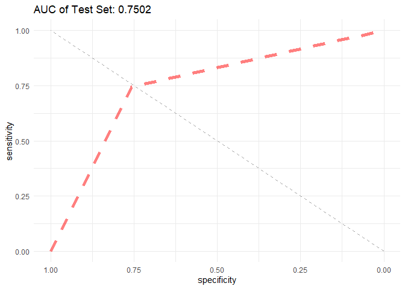

Support Vector Machines
================
Chance Robinson
12/04/2019

  - [Exploratory Data Analysis](#exploratory-data-analysis)
      - [Library Imports](#library-imports)
      - [Load the CSV Data](#load-the-csv-data)
          - [Convert Integers to Strings](#convert-integers-to-strings)
          - [Convert Integers to Factors](#convert-integers-to-factors)
      - [Prepare Dataframe](#prepare-dataframe)
      - [Support Vector Machines](#support-vector-machines)
      - [Train / Test Split](#train-test-split)
          - [Test](#test)
          - [Area Under the Curve](#area-under-the-curve)

# Exploratory Data Analysis

## Library Imports

``` r
library(tidyverse)
```

    ## -- Attaching packages ----------------------------------------------------------------------------------------------------------- tidyverse 1.2.1 --

    ## v ggplot2 3.2.1     v purrr   0.3.3
    ## v tibble  2.1.3     v dplyr   0.8.3
    ## v tidyr   1.0.0     v stringr 1.4.0
    ## v readr   1.3.1     v forcats 0.4.0

    ## -- Conflicts -------------------------------------------------------------------------------------------------------------- tidyverse_conflicts() --
    ## x dplyr::filter() masks stats::filter()
    ## x dplyr::lag()    masks stats::lag()

``` r
# Support Vector Machines
library(e1071)  
# downSample
library(caret)
```

    ## Loading required package: lattice

    ## 
    ## Attaching package: 'caret'

    ## The following object is masked from 'package:purrr':
    ## 
    ##     lift

``` r
# ROC Curves
library(ROCR)
```

    ## Loading required package: gplots

    ## 
    ## Attaching package: 'gplots'

    ## The following object is masked from 'package:stats':
    ## 
    ##     lowess

``` r
library(pROC)
```

    ## Type 'citation("pROC")' for a citation.

    ## 
    ## Attaching package: 'pROC'

    ## The following objects are masked from 'package:stats':
    ## 
    ##     cov, smooth, var

## Load the CSV Data

``` r
data <- read.csv("../../data/CaseStudy2-data.csv", stringsAsFactors=TRUE, header = TRUE)
```

``` r
head(data)
```

    ##   ID Age Attrition    BusinessTravel DailyRate             Department
    ## 1  1  32        No     Travel_Rarely       117                  Sales
    ## 2  2  40        No     Travel_Rarely      1308 Research & Development
    ## 3  3  35        No Travel_Frequently       200 Research & Development
    ## 4  4  32        No     Travel_Rarely       801                  Sales
    ## 5  5  24        No Travel_Frequently       567 Research & Development
    ## 6  6  27        No Travel_Frequently       294 Research & Development
    ##   DistanceFromHome Education   EducationField EmployeeCount EmployeeNumber
    ## 1               13         4    Life Sciences             1            859
    ## 2               14         3          Medical             1           1128
    ## 3               18         2    Life Sciences             1           1412
    ## 4                1         4        Marketing             1           2016
    ## 5                2         1 Technical Degree             1           1646
    ## 6               10         2    Life Sciences             1            733
    ##   EnvironmentSatisfaction Gender HourlyRate JobInvolvement JobLevel
    ## 1                       2   Male         73              3        2
    ## 2                       3   Male         44              2        5
    ## 3                       3   Male         60              3        3
    ## 4                       3 Female         48              3        3
    ## 5                       1 Female         32              3        1
    ## 6                       4   Male         32              3        3
    ##                  JobRole JobSatisfaction MaritalStatus MonthlyIncome
    ## 1        Sales Executive               4      Divorced          4403
    ## 2      Research Director               3        Single         19626
    ## 3 Manufacturing Director               4        Single          9362
    ## 4        Sales Executive               4       Married         10422
    ## 5     Research Scientist               4        Single          3760
    ## 6 Manufacturing Director               1      Divorced          8793
    ##   MonthlyRate NumCompaniesWorked Over18 OverTime PercentSalaryHike
    ## 1        9250                  2      Y       No                11
    ## 2       17544                  1      Y       No                14
    ## 3       19944                  2      Y       No                11
    ## 4       24032                  1      Y       No                19
    ## 5       17218                  1      Y      Yes                13
    ## 6        4809                  1      Y       No                21
    ##   PerformanceRating RelationshipSatisfaction StandardHours StockOptionLevel
    ## 1                 3                        3            80                1
    ## 2                 3                        1            80                0
    ## 3                 3                        3            80                0
    ## 4                 3                        3            80                2
    ## 5                 3                        3            80                0
    ## 6                 4                        3            80                2
    ##   TotalWorkingYears TrainingTimesLastYear WorkLifeBalance YearsAtCompany
    ## 1                 8                     3               2              5
    ## 2                21                     2               4             20
    ## 3                10                     2               3              2
    ## 4                14                     3               3             14
    ## 5                 6                     2               3              6
    ## 6                 9                     4               2              9
    ##   YearsInCurrentRole YearsSinceLastPromotion YearsWithCurrManager
    ## 1                  2                       0                    3
    ## 2                  7                       4                    9
    ## 3                  2                       2                    2
    ## 4                 10                       5                    7
    ## 5                  3                       1                    3
    ## 6                  7                       1                    7

### Convert Integers to Strings

  - These numeric columns will be converted into strings

<!-- end list -->

``` r
data$ID <- as.character(data$ID)
data$EmployeeNumber <- as.character(data$EmployeeNumber)
data$EmployeeCount <- as.character(data$EmployeeCount)
data$StandardHours <- as.character(data$StandardHours)
data$Over18 <- as.character(data$Over18)
```

### Convert Integers to Factors

``` r
data$JobInvolvement <- factor(data$JobInvolvement, ordered = TRUE,
                              levels = c(1, 2, 3, 4),
                              labels = c("Low", "Medium", "High", "Very High"))

data$JobSatisfaction <- factor(data$JobSatisfaction, ordered = TRUE,
                              levels = c(1, 2, 3, 4),
                              labels = c("Low", "Medium", "High", "Very High"))

data$PerformanceRating <- factor(data$PerformanceRating, ordered = TRUE,
                              levels = c(1, 2, 3, 4),
                              labels = c("Low", "Good", "Excellent", "Outstanding"))

data$RelationshipSatisfaction <- factor(data$RelationshipSatisfaction, ordered = TRUE,
                              levels = c(1, 2, 3, 4),
                              labels = c("Low", "Medium", "High", "Very High"))

data$WorkLifeBalance <- factor(data$WorkLifeBalance, ordered = TRUE,
                              levels = c(1, 2, 3, 4),
                              labels = c("Bad", "Better", "Good", "Best"))

### THIS WAS NOT ACTUALLY PROVIDED ON THE WALL
data$EnvironmentSatisfaction <- factor(data$EnvironmentSatisfaction, ordered = TRUE,
                              levels = c(1, 2, 3, 4),
                              labels = c("Low", "Medium", "High", "Very High"))

data$StockOptionLevel <- factor(data$StockOptionLevel, ordered = TRUE,
                              levels = c(0, 1, 2, 3),
                              labels = c("Zero", "One", "Two", "Three"))

data$JobLevel <- factor(data$JobLevel, ordered = TRUE,
                              levels = c(1, 2, 3, 4, 5),
                              labels = c("One", "Two", "Three", "Four", "Five"))

data$Education <- factor(data$Education, ordered = FALSE,
                              levels = c(1, 2, 3, 4, 5),
                              labels = c("One", "Two", "Three", "Four", "Five"))
```

## Prepare Dataframe

``` r
cols_to_remove <- c("ID", "EmployeeNumber", "EmployeeCount", "StandardHours", "Over18")


data.mod <- data %>%
  select(-cols_to_remove) %>%
  mutate(Attrition = factor(Attrition, labels = c("No", "Yes"))) 

summary(data.mod)
```

    ##       Age        Attrition           BusinessTravel   DailyRate     
    ##  Min.   :18.00   No :730   Non-Travel       : 94    Min.   : 103.0  
    ##  1st Qu.:30.00   Yes:140   Travel_Frequently:158    1st Qu.: 472.5  
    ##  Median :35.00             Travel_Rarely    :618    Median : 817.5  
    ##  Mean   :36.83                                      Mean   : 815.2  
    ##  3rd Qu.:43.00                                      3rd Qu.:1165.8  
    ##  Max.   :60.00                                      Max.   :1499.0  
    ##                                                                     
    ##                   Department  DistanceFromHome Education  
    ##  Human Resources       : 35   Min.   : 1.000   One  : 98  
    ##  Research & Development:562   1st Qu.: 2.000   Two  :182  
    ##  Sales                 :273   Median : 7.000   Three:324  
    ##                               Mean   : 9.339   Four :240  
    ##                               3rd Qu.:14.000   Five : 26  
    ##                               Max.   :29.000              
    ##                                                           
    ##           EducationField EnvironmentSatisfaction    Gender      HourlyRate    
    ##  Human Resources : 15    Low      :172           Female:354   Min.   : 30.00  
    ##  Life Sciences   :358    Medium   :178           Male  :516   1st Qu.: 48.00  
    ##  Marketing       :100    High     :258                        Median : 66.00  
    ##  Medical         :270    Very High:262                        Mean   : 65.61  
    ##  Other           : 52                                         3rd Qu.: 83.00  
    ##  Technical Degree: 75                                         Max.   :100.00  
    ##                                                                               
    ##    JobInvolvement  JobLevel                        JobRole     JobSatisfaction
    ##  Low      : 47    One  :329   Sales Executive          :200   Low      :179   
    ##  Medium   :228    Two  :312   Research Scientist       :172   Medium   :166   
    ##  High     :514    Three:132   Laboratory Technician    :153   High     :254   
    ##  Very High: 81    Four : 60   Manufacturing Director   : 87   Very High:271   
    ##                   Five : 37   Healthcare Representative: 76                   
    ##                               Sales Representative     : 53                   
    ##                               (Other)                  :129                   
    ##   MaritalStatus MonthlyIncome    MonthlyRate    NumCompaniesWorked OverTime 
    ##  Divorced:191   Min.   : 1081   Min.   : 2094   Min.   :0.000      No :618  
    ##  Married :410   1st Qu.: 2840   1st Qu.: 8092   1st Qu.:1.000      Yes:252  
    ##  Single  :269   Median : 4946   Median :14074   Median :2.000               
    ##                 Mean   : 6390   Mean   :14326   Mean   :2.728               
    ##                 3rd Qu.: 8182   3rd Qu.:20456   3rd Qu.:4.000               
    ##                 Max.   :19999   Max.   :26997   Max.   :9.000               
    ##                                                                             
    ##  PercentSalaryHike   PerformanceRating RelationshipSatisfaction
    ##  Min.   :11.0      Low        :  0     Low      :174           
    ##  1st Qu.:12.0      Good       :  0     Medium   :171           
    ##  Median :14.0      Excellent  :738     High     :261           
    ##  Mean   :15.2      Outstanding:132     Very High:264           
    ##  3rd Qu.:18.0                                                  
    ##  Max.   :25.0                                                  
    ##                                                                
    ##  StockOptionLevel TotalWorkingYears TrainingTimesLastYear WorkLifeBalance
    ##  Zero :379        Min.   : 0.00     Min.   :0.000         Bad   : 48     
    ##  One  :355        1st Qu.: 6.00     1st Qu.:2.000         Better:192     
    ##  Two  : 81        Median :10.00     Median :3.000         Good  :532     
    ##  Three: 55        Mean   :11.05     Mean   :2.832         Best  : 98     
    ##                   3rd Qu.:15.00     3rd Qu.:3.000                        
    ##                   Max.   :40.00     Max.   :6.000                        
    ##                                                                          
    ##  YearsAtCompany   YearsInCurrentRole YearsSinceLastPromotion
    ##  Min.   : 0.000   Min.   : 0.000     Min.   : 0.000         
    ##  1st Qu.: 3.000   1st Qu.: 2.000     1st Qu.: 0.000         
    ##  Median : 5.000   Median : 3.000     Median : 1.000         
    ##  Mean   : 6.962   Mean   : 4.205     Mean   : 2.169         
    ##  3rd Qu.:10.000   3rd Qu.: 7.000     3rd Qu.: 3.000         
    ##  Max.   :40.000   Max.   :18.000     Max.   :15.000         
    ##                                                             
    ##  YearsWithCurrManager
    ##  Min.   : 0.00       
    ##  1st Qu.: 2.00       
    ##  Median : 3.00       
    ##  Mean   : 4.14       
    ##  3rd Qu.: 7.00       
    ##  Max.   :17.00       
    ## 

``` r
# str(data.mod)
```

## Support Vector Machines

## Train / Test Split

``` r
set.seed(1234)

sample.data <- sample_frac(data.mod, 1)

split.perc = .70

train.indices = sample(1:dim(sample.data)[1],round(split.perc * dim(sample.data)[1]))

train = sample.data[train.indices,]
test = sample.data[-train.indices,]

# train <- upSample(train, as.factor(train$Attrition), list = FALSE)
# train$Class <- NULL

library(DMwR)
```

    ## Loading required package: grid

    ## Registered S3 method overwritten by 'xts':
    ##   method     from
    ##   as.zoo.xts zoo

    ## Registered S3 method overwritten by 'quantmod':
    ##   method            from
    ##   as.zoo.data.frame zoo

``` r
train <- SMOTE(Attrition ~ ., train, perc.over = 100, perc.under=200)
```

    ## Warning in if (class(data[, col]) %in% c("factor", "character")) {: the
    ## condition has length > 1 and only the first element will be used
    
    ## Warning in if (class(data[, col]) %in% c("factor", "character")) {: the
    ## condition has length > 1 and only the first element will be used
    
    ## Warning in if (class(data[, col]) %in% c("factor", "character")) {: the
    ## condition has length > 1 and only the first element will be used
    
    ## Warning in if (class(data[, col]) %in% c("factor", "character")) {: the
    ## condition has length > 1 and only the first element will be used
    
    ## Warning in if (class(data[, col]) %in% c("factor", "character")) {: the
    ## condition has length > 1 and only the first element will be used
    
    ## Warning in if (class(data[, col]) %in% c("factor", "character")) {: the
    ## condition has length > 1 and only the first element will be used
    
    ## Warning in if (class(data[, col]) %in% c("factor", "character")) {: the
    ## condition has length > 1 and only the first element will be used
    
    ## Warning in if (class(data[, col]) %in% c("factor", "character")) {: the
    ## condition has length > 1 and only the first element will be used

    ## Warning in `[<-.factor`(`*tmp*`, ri, value = c(1, 1, 4, 3.09159897244535, :
    ## invalid factor level, NA generated
    
    ## Warning in `[<-.factor`(`*tmp*`, ri, value = c(1, 1, 4, 3.09159897244535, :
    ## invalid factor level, NA generated
    
    ## Warning in `[<-.factor`(`*tmp*`, ri, value = c(1, 1, 4, 3.09159897244535, :
    ## invalid factor level, NA generated
    
    ## Warning in `[<-.factor`(`*tmp*`, ri, value = c(1, 1, 4, 3.09159897244535, :
    ## invalid factor level, NA generated
    
    ## Warning in `[<-.factor`(`*tmp*`, ri, value = c(1, 1, 4, 3.09159897244535, :
    ## invalid factor level, NA generated
    
    ## Warning in `[<-.factor`(`*tmp*`, ri, value = c(1, 1, 4, 3.09159897244535, :
    ## invalid factor level, NA generated
    
    ## Warning in `[<-.factor`(`*tmp*`, ri, value = c(1, 1, 4, 3.09159897244535, :
    ## invalid factor level, NA generated
    
    ## Warning in `[<-.factor`(`*tmp*`, ri, value = c(1, 1, 4, 3.09159897244535, :
    ## invalid factor level, NA generated

``` r
sum <- sum(table(test$Attrition))
wts <- table(test$Attrition) / sum

wts
```

    ## 
    ##        No       Yes 
    ## 0.8505747 0.1494253

``` r
svm.model <- svm(Attrition ~ ., 
           data = train,
           cost = 4,
           # gamma = 1,
           class.weights= c("No" = 0.4, "Yes" = 1),
           scale=TRUE
           # kernel = "sigmoid"
           )


# ?svm

summary(svm.model)
```

    ## 
    ## Call:
    ## svm(formula = Attrition ~ ., data = train, cost = 4, class.weights = c(No = 0.4, 
    ##     Yes = 1), scale = TRUE)
    ## 
    ## 
    ## Parameters:
    ##    SVM-Type:  C-classification 
    ##  SVM-Kernel:  radial 
    ##        cost:  4 
    ## 
    ## Number of Support Vectors:  221
    ## 
    ##  ( 146 75 )
    ## 
    ## 
    ## Number of Classes:  2 
    ## 
    ## Levels: 
    ##  No Yes

``` r
# obj <- tune.svm(Attrition~., data = train, gamma = 2^(-1:1), cost = 2^(2:4))

# 
# ?tune
```

``` r
prd <- predict(svm.model, test)
```

### Test

``` r
confusionMatrix(data=prd,  
                reference=test$Attrition, "Yes")
```

    ## Confusion Matrix and Statistics
    ## 
    ##           Reference
    ## Prediction  No Yes
    ##        No  168  10
    ##        Yes  54  29
    ##                                          
    ##                Accuracy : 0.7548         
    ##                  95% CI : (0.698, 0.8057)
    ##     No Information Rate : 0.8506         
    ##     P-Value [Acc > NIR] : 1              
    ##                                          
    ##                   Kappa : 0.3415         
    ##                                          
    ##  Mcnemar's Test P-Value : 7.658e-08      
    ##                                          
    ##             Sensitivity : 0.7436         
    ##             Specificity : 0.7568         
    ##          Pos Pred Value : 0.3494         
    ##          Neg Pred Value : 0.9438         
    ##              Prevalence : 0.1494         
    ##          Detection Rate : 0.1111         
    ##    Detection Prevalence : 0.3180         
    ##       Balanced Accuracy : 0.7502         
    ##                                          
    ##        'Positive' Class : Yes            
    ## 

### Area Under the Curve

``` r
# ?pROC

auc <- roc(as.integer(test$Attrition), as.integer(prd))
```

    ## Setting levels: control = 1, case = 2

    ## Setting direction: controls < cases

``` r
g <- ggroc(auc, alpha = 0.5, colour = "red", linetype = 2, size = 2) +
  theme_minimal() + 
  ggtitle(paste('AUC of Test Set:', round(auc$auc[[1]],4))) + 
  geom_segment(aes(x = 0, xend = 1, y = 0, yend = 1), color="darkgrey", linetype="dashed")
  

plot(g)
```

<!-- -->
