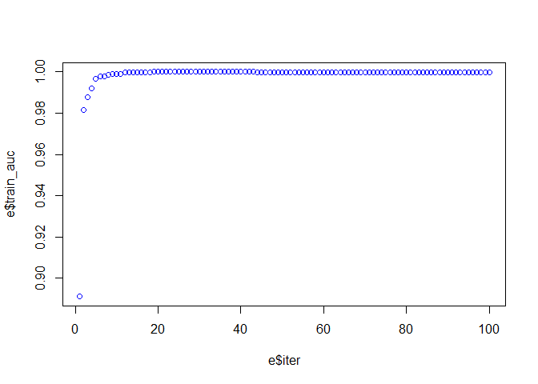
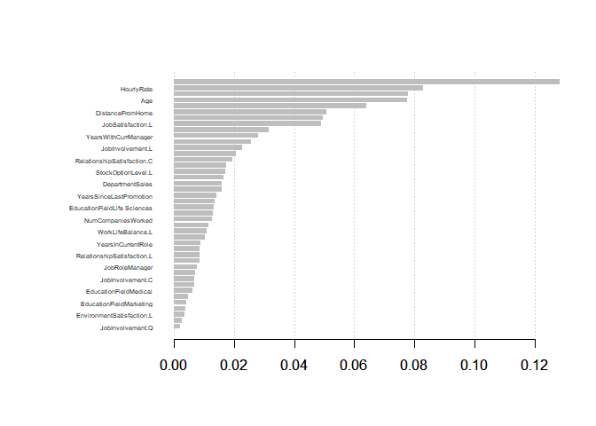
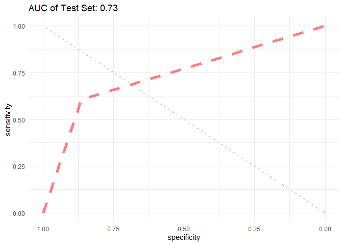

Random Forest
================
Chance Robinson
12/02/2019

  - [Exploratory Data Analysis](#exploratory-data-analysis)
      - [Library Imports](#library-imports)
      - [Load the CSV Data](#load-the-csv-data)
          - [Convert Integers to Strings](#convert-integers-to-strings)
          - [Convert Integers to Factors](#convert-integers-to-factors)
      - [Prepare Dataframe](#prepare-dataframe)
      - [XGBoost](#xgboost)
      - [Train / Test Split](#train-test-split)
      - [Predict](#predict)
          - [Test](#test)
      - [XGBoost Performance](#xgboost-performance)
          - [Area Under the Curve](#area-under-the-curve)

# Exploratory Data Analysis

## Library Imports

``` r
library(tidyverse)
```

    ## -- Attaching packages ----------------------------------------------------------------------------------------------------------- tidyverse 1.2.1 --

    ## v ggplot2 3.2.1     v purrr   0.3.3
    ## v tibble  2.1.3     v dplyr   0.8.3
    ## v tidyr   1.0.0     v stringr 1.4.0
    ## v readr   1.3.1     v forcats 0.4.0

    ## -- Conflicts -------------------------------------------------------------------------------------------------------------- tidyverse_conflicts() --
    ## x dplyr::filter() masks stats::filter()
    ## x dplyr::lag()    masks stats::lag()

``` r
# Gradient Boosing
library(xgboost)  
```

    ## 
    ## Attaching package: 'xgboost'

    ## The following object is masked from 'package:dplyr':
    ## 
    ##     slice

``` r
library(magrittr)
```

    ## 
    ## Attaching package: 'magrittr'

    ## The following object is masked from 'package:purrr':
    ## 
    ##     set_names

    ## The following object is masked from 'package:tidyr':
    ## 
    ##     extract

``` r
library(Matrix)
```

    ## 
    ## Attaching package: 'Matrix'

    ## The following objects are masked from 'package:tidyr':
    ## 
    ##     expand, pack, unpack

``` r
# downSample
library(caret)
```

    ## Loading required package: lattice

    ## 
    ## Attaching package: 'caret'

    ## The following object is masked from 'package:purrr':
    ## 
    ##     lift

``` r
# ROC Curves
library(ROCR)
```

    ## Loading required package: gplots

    ## 
    ## Attaching package: 'gplots'

    ## The following object is masked from 'package:stats':
    ## 
    ##     lowess

``` r
library(pROC)
```

    ## Type 'citation("pROC")' for a citation.

    ## 
    ## Attaching package: 'pROC'

    ## The following objects are masked from 'package:stats':
    ## 
    ##     cov, smooth, var

## Load the CSV Data

``` r
data <- read.csv("../../data/CaseStudy2-data.csv", stringsAsFactors=TRUE, header = TRUE)
```

``` r
head(data)
```

    ##   ID Age Attrition    BusinessTravel DailyRate             Department
    ## 1  1  32        No     Travel_Rarely       117                  Sales
    ## 2  2  40        No     Travel_Rarely      1308 Research & Development
    ## 3  3  35        No Travel_Frequently       200 Research & Development
    ## 4  4  32        No     Travel_Rarely       801                  Sales
    ## 5  5  24        No Travel_Frequently       567 Research & Development
    ## 6  6  27        No Travel_Frequently       294 Research & Development
    ##   DistanceFromHome Education   EducationField EmployeeCount EmployeeNumber
    ## 1               13         4    Life Sciences             1            859
    ## 2               14         3          Medical             1           1128
    ## 3               18         2    Life Sciences             1           1412
    ## 4                1         4        Marketing             1           2016
    ## 5                2         1 Technical Degree             1           1646
    ## 6               10         2    Life Sciences             1            733
    ##   EnvironmentSatisfaction Gender HourlyRate JobInvolvement JobLevel
    ## 1                       2   Male         73              3        2
    ## 2                       3   Male         44              2        5
    ## 3                       3   Male         60              3        3
    ## 4                       3 Female         48              3        3
    ## 5                       1 Female         32              3        1
    ## 6                       4   Male         32              3        3
    ##                  JobRole JobSatisfaction MaritalStatus MonthlyIncome
    ## 1        Sales Executive               4      Divorced          4403
    ## 2      Research Director               3        Single         19626
    ## 3 Manufacturing Director               4        Single          9362
    ## 4        Sales Executive               4       Married         10422
    ## 5     Research Scientist               4        Single          3760
    ## 6 Manufacturing Director               1      Divorced          8793
    ##   MonthlyRate NumCompaniesWorked Over18 OverTime PercentSalaryHike
    ## 1        9250                  2      Y       No                11
    ## 2       17544                  1      Y       No                14
    ## 3       19944                  2      Y       No                11
    ## 4       24032                  1      Y       No                19
    ## 5       17218                  1      Y      Yes                13
    ## 6        4809                  1      Y       No                21
    ##   PerformanceRating RelationshipSatisfaction StandardHours StockOptionLevel
    ## 1                 3                        3            80                1
    ## 2                 3                        1            80                0
    ## 3                 3                        3            80                0
    ## 4                 3                        3            80                2
    ## 5                 3                        3            80                0
    ## 6                 4                        3            80                2
    ##   TotalWorkingYears TrainingTimesLastYear WorkLifeBalance YearsAtCompany
    ## 1                 8                     3               2              5
    ## 2                21                     2               4             20
    ## 3                10                     2               3              2
    ## 4                14                     3               3             14
    ## 5                 6                     2               3              6
    ## 6                 9                     4               2              9
    ##   YearsInCurrentRole YearsSinceLastPromotion YearsWithCurrManager
    ## 1                  2                       0                    3
    ## 2                  7                       4                    9
    ## 3                  2                       2                    2
    ## 4                 10                       5                    7
    ## 5                  3                       1                    3
    ## 6                  7                       1                    7

### Convert Integers to Strings

  - These numeric columns will be converted into strings

<!-- end list -->

``` r
data$ID <- as.character(data$ID)
data$EmployeeNumber <- as.character(data$EmployeeNumber)
data$EmployeeCount <- as.character(data$EmployeeCount)
data$StandardHours <- as.character(data$StandardHours)
data$Over18 <- as.character(data$Over18)
```

### Convert Integers to Factors

``` r
data$JobInvolvement <- factor(data$JobInvolvement, ordered = TRUE,
                              levels = c(1, 2, 3, 4),
                              labels = c("Low", "Medium", "High", "Very High"))

data$JobSatisfaction <- factor(data$JobSatisfaction, ordered = TRUE,
                              levels = c(1, 2, 3, 4),
                              labels = c("Low", "Medium", "High", "Very High"))

data$PerformanceRating <- factor(data$PerformanceRating, ordered = TRUE,
                              levels = c(1, 2, 3, 4),
                              labels = c("Low", "Good", "Excellent", "Outstanding"))

data$RelationshipSatisfaction <- factor(data$RelationshipSatisfaction, ordered = TRUE,
                              levels = c(1, 2, 3, 4),
                              labels = c("Low", "Medium", "High", "Very High"))

data$WorkLifeBalance <- factor(data$WorkLifeBalance, ordered = TRUE,
                              levels = c(1, 2, 3, 4),
                              labels = c("Bad", "Better", "Good", "Best"))

### THIS WAS NOT ACTUALLY PROVIDED ON THE WALL
data$EnvironmentSatisfaction <- factor(data$EnvironmentSatisfaction, ordered = TRUE,
                              levels = c(1, 2, 3, 4),
                              labels = c("Low", "Medium", "High", "Very High"))

data$StockOptionLevel <- factor(data$StockOptionLevel, ordered = TRUE,
                              levels = c(0, 1, 2, 3),
                              labels = c("Zero", "One", "Two", "Three"))

data$JobLevel <- factor(data$JobLevel, ordered = TRUE,
                              levels = c(1, 2, 3, 4, 5),
                              labels = c("One", "Two", "Three", "Four", "Five"))

data$Education <- factor(data$Education, ordered = FALSE,
                              levels = c(1, 2, 3, 4, 5),
                              labels = c("One", "Two", "Three", "Four", "Five"))
```

## Prepare Dataframe

``` r
cols_to_remove <- c("ID", "EmployeeNumber", "EmployeeCount", "StandardHours", "Over18")


data.mod <- data %>%
  select(-cols_to_remove) %>%
   mutate(Attrition = ifelse(Attrition == "No",0,1)) %>%
   mutate(Attrition = factor(Attrition, labels = c("0", "1"))) 

summary(data.mod)
```

    ##       Age        Attrition           BusinessTravel   DailyRate     
    ##  Min.   :18.00   0:730     Non-Travel       : 94    Min.   : 103.0  
    ##  1st Qu.:30.00   1:140     Travel_Frequently:158    1st Qu.: 472.5  
    ##  Median :35.00             Travel_Rarely    :618    Median : 817.5  
    ##  Mean   :36.83                                      Mean   : 815.2  
    ##  3rd Qu.:43.00                                      3rd Qu.:1165.8  
    ##  Max.   :60.00                                      Max.   :1499.0  
    ##                                                                     
    ##                   Department  DistanceFromHome Education  
    ##  Human Resources       : 35   Min.   : 1.000   One  : 98  
    ##  Research & Development:562   1st Qu.: 2.000   Two  :182  
    ##  Sales                 :273   Median : 7.000   Three:324  
    ##                               Mean   : 9.339   Four :240  
    ##                               3rd Qu.:14.000   Five : 26  
    ##                               Max.   :29.000              
    ##                                                           
    ##           EducationField EnvironmentSatisfaction    Gender      HourlyRate    
    ##  Human Resources : 15    Low      :172           Female:354   Min.   : 30.00  
    ##  Life Sciences   :358    Medium   :178           Male  :516   1st Qu.: 48.00  
    ##  Marketing       :100    High     :258                        Median : 66.00  
    ##  Medical         :270    Very High:262                        Mean   : 65.61  
    ##  Other           : 52                                         3rd Qu.: 83.00  
    ##  Technical Degree: 75                                         Max.   :100.00  
    ##                                                                               
    ##    JobInvolvement  JobLevel                        JobRole     JobSatisfaction
    ##  Low      : 47    One  :329   Sales Executive          :200   Low      :179   
    ##  Medium   :228    Two  :312   Research Scientist       :172   Medium   :166   
    ##  High     :514    Three:132   Laboratory Technician    :153   High     :254   
    ##  Very High: 81    Four : 60   Manufacturing Director   : 87   Very High:271   
    ##                   Five : 37   Healthcare Representative: 76                   
    ##                               Sales Representative     : 53                   
    ##                               (Other)                  :129                   
    ##   MaritalStatus MonthlyIncome    MonthlyRate    NumCompaniesWorked OverTime 
    ##  Divorced:191   Min.   : 1081   Min.   : 2094   Min.   :0.000      No :618  
    ##  Married :410   1st Qu.: 2840   1st Qu.: 8092   1st Qu.:1.000      Yes:252  
    ##  Single  :269   Median : 4946   Median :14074   Median :2.000               
    ##                 Mean   : 6390   Mean   :14326   Mean   :2.728               
    ##                 3rd Qu.: 8182   3rd Qu.:20456   3rd Qu.:4.000               
    ##                 Max.   :19999   Max.   :26997   Max.   :9.000               
    ##                                                                             
    ##  PercentSalaryHike   PerformanceRating RelationshipSatisfaction
    ##  Min.   :11.0      Low        :  0     Low      :174           
    ##  1st Qu.:12.0      Good       :  0     Medium   :171           
    ##  Median :14.0      Excellent  :738     High     :261           
    ##  Mean   :15.2      Outstanding:132     Very High:264           
    ##  3rd Qu.:18.0                                                  
    ##  Max.   :25.0                                                  
    ##                                                                
    ##  StockOptionLevel TotalWorkingYears TrainingTimesLastYear WorkLifeBalance
    ##  Zero :379        Min.   : 0.00     Min.   :0.000         Bad   : 48     
    ##  One  :355        1st Qu.: 6.00     1st Qu.:2.000         Better:192     
    ##  Two  : 81        Median :10.00     Median :3.000         Good  :532     
    ##  Three: 55        Mean   :11.05     Mean   :2.832         Best  : 98     
    ##                   3rd Qu.:15.00     3rd Qu.:3.000                        
    ##                   Max.   :40.00     Max.   :6.000                        
    ##                                                                          
    ##  YearsAtCompany   YearsInCurrentRole YearsSinceLastPromotion
    ##  Min.   : 0.000   Min.   : 0.000     Min.   : 0.000         
    ##  1st Qu.: 3.000   1st Qu.: 2.000     1st Qu.: 0.000         
    ##  Median : 5.000   Median : 3.000     Median : 1.000         
    ##  Mean   : 6.962   Mean   : 4.205     Mean   : 2.169         
    ##  3rd Qu.:10.000   3rd Qu.: 7.000     3rd Qu.: 3.000         
    ##  Max.   :40.000   Max.   :18.000     Max.   :15.000         
    ##                                                             
    ##  YearsWithCurrManager
    ##  Min.   : 0.00       
    ##  1st Qu.: 2.00       
    ##  Median : 3.00       
    ##  Mean   : 4.14       
    ##  3rd Qu.: 7.00       
    ##  Max.   :17.00       
    ## 

``` r
# str(data.mod)
```

## XGBoost

## Train / Test Split

``` r
set.seed(1234)

split.perc = .70

train.indices = sample(1:dim(data.mod)[1],round(split.perc * dim(data.mod)[1]))

train = data.mod[train.indices,]
test = data.mod[-train.indices,]

# UPSAMPLING
train <- upSample(train, train$Attrition, list = FALSE)
train$Class <- NULL

# library(DMwR)
# train <- SMOTE(Attrition ~ ., train, perc.over = 100, perc.under=200)

head(train)
```

    ##   Age Attrition    BusinessTravel DailyRate             Department
    ## 1  31         0     Travel_Rarely       691                  Sales
    ## 2  39         0     Travel_Rarely      1132 Research & Development
    ## 3  27         0     Travel_Rarely      1377 Research & Development
    ## 4  34         0     Travel_Rarely       182 Research & Development
    ## 5  44         0 Travel_Frequently      1193 Research & Development
    ## 6  37         0        Non-Travel      1040 Research & Development
    ##   DistanceFromHome Education EducationField EnvironmentSatisfaction Gender
    ## 1                7     Three      Marketing               Very High   Male
    ## 2                1     Three        Medical                    High   Male
    ## 3               11       One  Life Sciences                  Medium   Male
    ## 4                1      Four  Life Sciences                  Medium Female
    ## 5                2       One        Medical                  Medium   Male
    ## 6                2       Two  Life Sciences                    High   Male
    ##   HourlyRate JobInvolvement JobLevel                   JobRole JobSatisfaction
    ## 1         73           High      Two           Sales Executive       Very High
    ## 2         48      Very High    Three Healthcare Representative       Very High
    ## 3         91           High      One     Laboratory Technician             Low
    ## 4         72      Very High      One        Research Scientist       Very High
    ## 5         86           High    Three    Manufacturing Director            High
    ## 6        100         Medium      Two Healthcare Representative       Very High
    ##   MaritalStatus MonthlyIncome MonthlyRate NumCompaniesWorked OverTime
    ## 1      Divorced          7547        7143                  4       No
    ## 2      Divorced          9613       10942                  0       No
    ## 3       Married          2099        7679                  0       No
    ## 4        Single          3280       13551                  2       No
    ## 5        Single         10209       19719                  5      Yes
    ## 6      Divorced          5163       15850                  5       No
    ##   PercentSalaryHike PerformanceRating RelationshipSatisfaction StockOptionLevel
    ## 1                12         Excellent                Very High            Three
    ## 2                17         Excellent                      Low            Three
    ## 3                14         Excellent                   Medium             Zero
    ## 4                16         Excellent                     High             Zero
    ## 5                18         Excellent                   Medium             Zero
    ## 6                14         Excellent                Very High              One
    ##   TotalWorkingYears TrainingTimesLastYear WorkLifeBalance YearsAtCompany
    ## 1                13                     3            Good              7
    ## 2                19                     5          Better             18
    ## 3                 6                     3            Best              5
    ## 4                10                     2            Good              4
    ## 5                16                     2          Better              2
    ## 6                17                     2            Best              1
    ##   YearsInCurrentRole YearsSinceLastPromotion YearsWithCurrManager
    ## 1                  7                       1                    7
    ## 2                 10                       3                    7
    ## 3                  0                       1                    4
    ## 4                  2                       1                    3
    ## 5                  2                       2                    2
    ## 6                  0                       0                    0

``` r
trainm <- sparse.model.matrix(Attrition ~ ., data = train)
# trainm
train_label <- train[, "Attrition"]
train_label <- as.numeric(train_label)-1


train_matrix <- xgb.DMatrix(data = as.matrix(trainm), label = train_label)

# ?xgb.DMatrix
testm <- sparse.model.matrix(Attrition ~ ., data = test)
# trainm
test_label <- test[, "Attrition"]
test_label <- as.numeric(test_label)-1

# train_label
test_matrix <- xgb.DMatrix(data = as.matrix(testm), label = test_label)
```

``` r
nc <- length(unique(train_label))
xgb_params <- list("objective" = "binary:logistic",
                  "eval_metric" = "auc")

watchlist <- list(train = train_matrix, test = test_matrix)
```

``` r
bst_model <- xgb.train(params = xgb_params,
                       data = train_matrix,
                       nrounds = 100,
                       watchlist = watchlist,
                       scale_pos_weight = 6,
                       eta = 1,
                       max.depth = 16,
                       gamma = 6,
                       colsample_bytree = .9,
                       subsample = 0.7,
                       missing = NA,
                       seed = 1234
                       )
```

    ## [1]  train-auc:0.891064  test-auc:0.658108 
    ## [2]  train-auc:0.981634  test-auc:0.734057 
    ## [3]  train-auc:0.987873  test-auc:0.729411 
    ## [4]  train-auc:0.992222  test-auc:0.742958 
    ## [5]  train-auc:0.996532  test-auc:0.768046 
    ## [6]  train-auc:0.997937  test-auc:0.756211 
    ## [7]  train-auc:0.997937  test-auc:0.756211 
    ## [8]  train-auc:0.998500  test-auc:0.757238 
    ## [9]  train-auc:0.998975  test-auc:0.761933 
    ## [10] train-auc:0.999087  test-auc:0.764965 
    ## [11] train-auc:0.998904  test-auc:0.768290 
    ## [12] train-auc:0.999622  test-auc:0.768241 
    ## [13] train-auc:0.999622  test-auc:0.768241 
    ## [14] train-auc:0.999622  test-auc:0.768241 
    ## [15] train-auc:0.999738  test-auc:0.782668 
    ## [16] train-auc:0.999738  test-auc:0.782668 
    ## [17] train-auc:0.999738  test-auc:0.782668 
    ## [18] train-auc:0.999738  test-auc:0.782668 
    ## [19] train-auc:1.000000  test-auc:0.774257 
    ## [20] train-auc:1.000000  test-auc:0.774257 
    ## [21] train-auc:1.000000  test-auc:0.774257 
    ## [22] train-auc:1.000000  test-auc:0.771714 
    ## [23] train-auc:1.000000  test-auc:0.771714 
    ## [24] train-auc:1.000000  test-auc:0.771714 
    ## [25] train-auc:1.000000  test-auc:0.771714 
    ## [26] train-auc:1.000000  test-auc:0.771714 
    ## [27] train-auc:1.000000  test-auc:0.771714 
    ## [28] train-auc:1.000000  test-auc:0.771714 
    ## [29] train-auc:1.000000  test-auc:0.771714 
    ## [30] train-auc:1.000000  test-auc:0.771714 
    ## [31] train-auc:1.000000  test-auc:0.771714 
    ## [32] train-auc:1.000000  test-auc:0.771714 
    ## [33] train-auc:1.000000  test-auc:0.771714 
    ## [34] train-auc:1.000000  test-auc:0.771714 
    ## [35] train-auc:1.000000  test-auc:0.771714 
    ## [36] train-auc:1.000000  test-auc:0.771714 
    ## [37] train-auc:1.000000  test-auc:0.771714 
    ## [38] train-auc:1.000000  test-auc:0.771714 
    ## [39] train-auc:1.000000  test-auc:0.771714 
    ## [40] train-auc:1.000000  test-auc:0.771714 
    ## [41] train-auc:1.000000  test-auc:0.771714 
    ## [42] train-auc:1.000000  test-auc:0.771714 
    ## [43] train-auc:1.000000  test-auc:0.771714 
    ## [44] train-auc:0.999978  test-auc:0.787950 
    ## [45] train-auc:0.999978  test-auc:0.787950 
    ## [46] train-auc:0.999978  test-auc:0.787950 
    ## [47] train-auc:0.999978  test-auc:0.787950 
    ## [48] train-auc:0.999978  test-auc:0.787950 
    ## [49] train-auc:0.999978  test-auc:0.787950 
    ## [50] train-auc:0.999978  test-auc:0.787950 
    ## [51] train-auc:0.999978  test-auc:0.787950 
    ## [52] train-auc:0.999978  test-auc:0.787950 
    ## [53] train-auc:0.999978  test-auc:0.787950 
    ## [54] train-auc:0.999978  test-auc:0.787950 
    ## [55] train-auc:0.999978  test-auc:0.787950 
    ## [56] train-auc:0.999978  test-auc:0.787950 
    ## [57] train-auc:0.999978  test-auc:0.787950 
    ## [58] train-auc:0.999978  test-auc:0.787950 
    ## [59] train-auc:0.999978  test-auc:0.787950 
    ## [60] train-auc:0.999978  test-auc:0.787950 
    ## [61] train-auc:0.999978  test-auc:0.787950 
    ## [62] train-auc:0.999978  test-auc:0.787950 
    ## [63] train-auc:0.999978  test-auc:0.787950 
    ## [64] train-auc:0.999978  test-auc:0.787950 
    ## [65] train-auc:0.999978  test-auc:0.787950 
    ## [66] train-auc:0.999978  test-auc:0.787950 
    ## [67] train-auc:0.999978  test-auc:0.787950 
    ## [68] train-auc:0.999978  test-auc:0.787950 
    ## [69] train-auc:0.999978  test-auc:0.787950 
    ## [70] train-auc:0.999978  test-auc:0.787950 
    ## [71] train-auc:0.999978  test-auc:0.787950 
    ## [72] train-auc:0.999978  test-auc:0.787950 
    ## [73] train-auc:0.999978  test-auc:0.787950 
    ## [74] train-auc:0.999978  test-auc:0.787950 
    ## [75] train-auc:0.999978  test-auc:0.787950 
    ## [76] train-auc:0.999978  test-auc:0.787950 
    ## [77] train-auc:0.999978  test-auc:0.787950 
    ## [78] train-auc:0.999978  test-auc:0.787950 
    ## [79] train-auc:0.999978  test-auc:0.787950 
    ## [80] train-auc:0.999978  test-auc:0.787950 
    ## [81] train-auc:0.999978  test-auc:0.787950 
    ## [82] train-auc:0.999978  test-auc:0.787950 
    ## [83] train-auc:0.999978  test-auc:0.787950 
    ## [84] train-auc:0.999978  test-auc:0.787950 
    ## [85] train-auc:0.999978  test-auc:0.787950 
    ## [86] train-auc:0.999978  test-auc:0.787950 
    ## [87] train-auc:0.999978  test-auc:0.787950 
    ## [88] train-auc:0.999978  test-auc:0.787950 
    ## [89] train-auc:0.999978  test-auc:0.787950 
    ## [90] train-auc:0.999978  test-auc:0.787950 
    ## [91] train-auc:0.999978  test-auc:0.787950 
    ## [92] train-auc:0.999978  test-auc:0.787950 
    ## [93] train-auc:0.999978  test-auc:0.787950 
    ## [94] train-auc:0.999978  test-auc:0.787950 
    ## [95] train-auc:0.999978  test-auc:0.787950 
    ## [96] train-auc:0.999978  test-auc:0.787950 
    ## [97] train-auc:0.999978  test-auc:0.787950 
    ## [98] train-auc:0.999978  test-auc:0.787950 
    ## [99] train-auc:0.999978  test-auc:0.787950 
    ## [100]    train-auc:0.999978  test-auc:0.787950

``` r
# bst_model <- xgboost(data = train_matrix, label = train_label, nround = 50, objective = "binary:logistic", eval_metric = "auc")
# print(bst_model)

prd <- predict(bst_model, test_matrix)
head(prd)
```

    ## [1] 0.003669009 0.692257702 0.002683775 0.638579309 0.569633901 0.215158492

``` r
e <- data.frame(bst_model$evaluation_log)
head(e)
```

    ##   iter train_auc test_auc
    ## 1    1  0.891064 0.658108
    ## 2    2  0.981634 0.734057
    ## 3    3  0.987873 0.729411
    ## 4    4  0.992222 0.742958
    ## 5    5  0.996532 0.768046
    ## 6    6  0.997937 0.756211

``` r
plot(e$iter, e$train_auc, col = "blue")
lines(e$iter, e$test_auc, col = "red")
```

<!-- -->

``` r
max(e$test_auc)
```

    ## [1] 0.78795

``` r
e[e$test_auc ==  0.78795, ]
```

    ##     iter train_auc test_auc
    ## 44    44  0.999978  0.78795
    ## 45    45  0.999978  0.78795
    ## 46    46  0.999978  0.78795
    ## 47    47  0.999978  0.78795
    ## 48    48  0.999978  0.78795
    ## 49    49  0.999978  0.78795
    ## 50    50  0.999978  0.78795
    ## 51    51  0.999978  0.78795
    ## 52    52  0.999978  0.78795
    ## 53    53  0.999978  0.78795
    ## 54    54  0.999978  0.78795
    ## 55    55  0.999978  0.78795
    ## 56    56  0.999978  0.78795
    ## 57    57  0.999978  0.78795
    ## 58    58  0.999978  0.78795
    ## 59    59  0.999978  0.78795
    ## 60    60  0.999978  0.78795
    ## 61    61  0.999978  0.78795
    ## 62    62  0.999978  0.78795
    ## 63    63  0.999978  0.78795
    ## 64    64  0.999978  0.78795
    ## 65    65  0.999978  0.78795
    ## 66    66  0.999978  0.78795
    ## 67    67  0.999978  0.78795
    ## 68    68  0.999978  0.78795
    ## 69    69  0.999978  0.78795
    ## 70    70  0.999978  0.78795
    ## 71    71  0.999978  0.78795
    ## 72    72  0.999978  0.78795
    ## 73    73  0.999978  0.78795
    ## 74    74  0.999978  0.78795
    ## 75    75  0.999978  0.78795
    ## 76    76  0.999978  0.78795
    ## 77    77  0.999978  0.78795
    ## 78    78  0.999978  0.78795
    ## 79    79  0.999978  0.78795
    ## 80    80  0.999978  0.78795
    ## 81    81  0.999978  0.78795
    ## 82    82  0.999978  0.78795
    ## 83    83  0.999978  0.78795
    ## 84    84  0.999978  0.78795
    ## 85    85  0.999978  0.78795
    ## 86    86  0.999978  0.78795
    ## 87    87  0.999978  0.78795
    ## 88    88  0.999978  0.78795
    ## 89    89  0.999978  0.78795
    ## 90    90  0.999978  0.78795
    ## 91    91  0.999978  0.78795
    ## 92    92  0.999978  0.78795
    ## 93    93  0.999978  0.78795
    ## 94    94  0.999978  0.78795
    ## 95    95  0.999978  0.78795
    ## 96    96  0.999978  0.78795
    ## 97    97  0.999978  0.78795
    ## 98    98  0.999978  0.78795
    ## 99    99  0.999978  0.78795
    ## 100  100  0.999978  0.78795

``` r
# # Feature importance
imp <- xgb.importance(colnames(train_matrix), model = bst_model)
# print(imp)
xgb.plot.importance(imp)
```

<!-- -->

## Predict

``` r
p <- predict(bst_model, newdata = test_matrix)


# pred <- matrix(p, nrow = 1, ncol = length(p) ) %>%
#   t() %>%
#   data.frame() %>%
#   mutate(label = test_label, max_prob = max.col(., "last")-1)
```

### Test

``` r
p <- as.factor(ifelse(p > 0.5, "1", "0"))
head(p)
```

    ## [1] 0 1 0 1 1 0
    ## Levels: 0 1

``` r
confusionMatrix(data=as.factor(p),  
                reference=as.factor(test_label), "1")
```

    ## Confusion Matrix and Statistics
    ## 
    ##           Reference
    ## Prediction   0   1
    ##          0 184  19
    ##          1  29  29
    ##                                           
    ##                Accuracy : 0.8161          
    ##                  95% CI : (0.7637, 0.8612)
    ##     No Information Rate : 0.8161          
    ##     P-Value [Acc > NIR] : 0.5385          
    ##                                           
    ##                   Kappa : 0.4331          
    ##                                           
    ##  Mcnemar's Test P-Value : 0.1939          
    ##                                           
    ##             Sensitivity : 0.6042          
    ##             Specificity : 0.8638          
    ##          Pos Pred Value : 0.5000          
    ##          Neg Pred Value : 0.9064          
    ##              Prevalence : 0.1839          
    ##          Detection Rate : 0.1111          
    ##    Detection Prevalence : 0.2222          
    ##       Balanced Accuracy : 0.7340          
    ##                                           
    ##        'Positive' Class : 1               
    ## 

## XGBoost Performance

### Area Under the Curve

``` r
prop.table(table(train$Attrition))
```

    ## 
    ##   0   1 
    ## 0.5 0.5

``` r
library(pROC)

# ?pROC

auc <- roc(test$Attrition, as.integer(p))
```

    ## Setting levels: control = 0, case = 1

    ## Setting direction: controls < cases

``` r
g <- ggroc(auc, alpha = 0.5, colour = "red", linetype = 2, size = 2) +
  theme_minimal() + 
  ggtitle(paste('AUC of Test Set:', round(auc$auc[[1]],2))) + 
  geom_segment(aes(x = 0, xend = 1, y = 0, yend = 1), color="darkgrey", linetype="dashed")
  

plot(g)
```

<!-- -->
