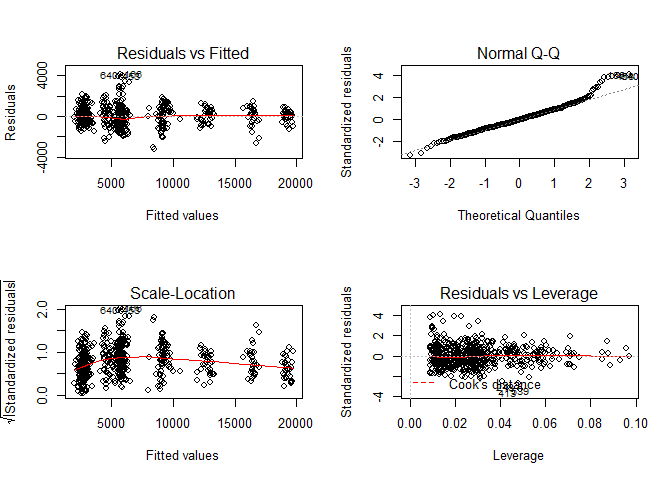
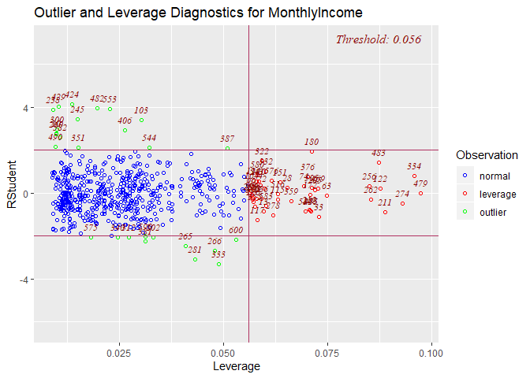

Linear Regression
================
Chance Robinson
12/04/2019

  - [Exploratory Data Analysis](#exploratory-data-analysis)
      - [Library Imports](#library-imports)
      - [Load the CSV Data](#load-the-csv-data)
          - [Convert Integers to Strings](#convert-integers-to-strings)
          - [Convert Integers to Factors](#convert-integers-to-factors)
      - [Prepare Dataframe](#prepare-dataframe)
          - [Linear Regression](#linear-regression)
      - [Train / Test Split](#train-test-split)
          - [Test](#test)
          - [Outliers](#outliers)
          - [Performance Metrics](#performance-metrics)

# Exploratory Data Analysis

## Library Imports

``` r
library(tidyverse)
```

    ## -- Attaching packages ----------------------------------------------------------------------------------------------------------- tidyverse 1.2.1 --

    ## v ggplot2 3.2.1     v purrr   0.3.3
    ## v tibble  2.1.3     v dplyr   0.8.3
    ## v tidyr   1.0.0     v stringr 1.4.0
    ## v readr   1.3.1     v forcats 0.4.0

    ## -- Conflicts -------------------------------------------------------------------------------------------------------------- tidyverse_conflicts() --
    ## x dplyr::filter() masks stats::filter()
    ## x dplyr::lag()    masks stats::lag()

``` r
# cross validation
library(caret)
```

    ## Loading required package: lattice

    ## 
    ## Attaching package: 'caret'

    ## The following object is masked from 'package:purrr':
    ## 
    ##     lift

``` r
# outlier and leverage plots
library(olsrr)
```

    ## 
    ## Attaching package: 'olsrr'

    ## The following object is masked from 'package:datasets':
    ## 
    ##     rivers

## Load the CSV Data

``` r
data <- read.csv("../../data/CaseStudy2-data.csv", stringsAsFactors=TRUE, header = TRUE)
```

``` r
head(data)
```

    ##   ID Age Attrition    BusinessTravel DailyRate             Department
    ## 1  1  32        No     Travel_Rarely       117                  Sales
    ## 2  2  40        No     Travel_Rarely      1308 Research & Development
    ## 3  3  35        No Travel_Frequently       200 Research & Development
    ## 4  4  32        No     Travel_Rarely       801                  Sales
    ## 5  5  24        No Travel_Frequently       567 Research & Development
    ## 6  6  27        No Travel_Frequently       294 Research & Development
    ##   DistanceFromHome Education   EducationField EmployeeCount EmployeeNumber
    ## 1               13         4    Life Sciences             1            859
    ## 2               14         3          Medical             1           1128
    ## 3               18         2    Life Sciences             1           1412
    ## 4                1         4        Marketing             1           2016
    ## 5                2         1 Technical Degree             1           1646
    ## 6               10         2    Life Sciences             1            733
    ##   EnvironmentSatisfaction Gender HourlyRate JobInvolvement JobLevel
    ## 1                       2   Male         73              3        2
    ## 2                       3   Male         44              2        5
    ## 3                       3   Male         60              3        3
    ## 4                       3 Female         48              3        3
    ## 5                       1 Female         32              3        1
    ## 6                       4   Male         32              3        3
    ##                  JobRole JobSatisfaction MaritalStatus MonthlyIncome
    ## 1        Sales Executive               4      Divorced          4403
    ## 2      Research Director               3        Single         19626
    ## 3 Manufacturing Director               4        Single          9362
    ## 4        Sales Executive               4       Married         10422
    ## 5     Research Scientist               4        Single          3760
    ## 6 Manufacturing Director               1      Divorced          8793
    ##   MonthlyRate NumCompaniesWorked Over18 OverTime PercentSalaryHike
    ## 1        9250                  2      Y       No                11
    ## 2       17544                  1      Y       No                14
    ## 3       19944                  2      Y       No                11
    ## 4       24032                  1      Y       No                19
    ## 5       17218                  1      Y      Yes                13
    ## 6        4809                  1      Y       No                21
    ##   PerformanceRating RelationshipSatisfaction StandardHours StockOptionLevel
    ## 1                 3                        3            80                1
    ## 2                 3                        1            80                0
    ## 3                 3                        3            80                0
    ## 4                 3                        3            80                2
    ## 5                 3                        3            80                0
    ## 6                 4                        3            80                2
    ##   TotalWorkingYears TrainingTimesLastYear WorkLifeBalance YearsAtCompany
    ## 1                 8                     3               2              5
    ## 2                21                     2               4             20
    ## 3                10                     2               3              2
    ## 4                14                     3               3             14
    ## 5                 6                     2               3              6
    ## 6                 9                     4               2              9
    ##   YearsInCurrentRole YearsSinceLastPromotion YearsWithCurrManager
    ## 1                  2                       0                    3
    ## 2                  7                       4                    9
    ## 3                  2                       2                    2
    ## 4                 10                       5                    7
    ## 5                  3                       1                    3
    ## 6                  7                       1                    7

### Convert Integers to Strings

  - These numeric columns will be converted into strings

<!-- end list -->

``` r
data$ID <- as.character(data$ID)
data$EmployeeNumber <- as.character(data$EmployeeNumber)
data$EmployeeCount <- as.character(data$EmployeeCount)
data$StandardHours <- as.character(data$StandardHours)
data$Over18 <- as.character(data$Over18)
```

### Convert Integers to Factors

``` r
data$JobInvolvement <- factor(data$JobInvolvement, ordered = TRUE,
                              levels = c(1, 2, 3, 4),
                              labels = c("Low", "Medium", "High", "Very High"))

data$JobSatisfaction <- factor(data$JobSatisfaction, ordered = TRUE,
                              levels = c(1, 2, 3, 4),
                              labels = c("Low", "Medium", "High", "Very High"))

data$PerformanceRating <- factor(data$PerformanceRating, ordered = TRUE,
                              levels = c(1, 2, 3, 4),
                              labels = c("Low", "Good", "Excellent", "Outstanding"))

data$RelationshipSatisfaction <- factor(data$RelationshipSatisfaction, ordered = TRUE,
                              levels = c(1, 2, 3, 4),
                              labels = c("Low", "Medium", "High", "Very High"))

data$WorkLifeBalance <- factor(data$WorkLifeBalance, ordered = TRUE,
                              levels = c(1, 2, 3, 4),
                              labels = c("Bad", "Better", "Good", "Best"))

### THIS WAS NOT ACTUALLY PROVIDED ON THE WALL
data$EnvironmentSatisfaction <- factor(data$EnvironmentSatisfaction, ordered = TRUE,
                              levels = c(1, 2, 3, 4),
                              labels = c("Low", "Medium", "High", "Very High"))

data$StockOptionLevel <- factor(data$StockOptionLevel, ordered = TRUE,
                              levels = c(0, 1, 2, 3),
                              labels = c("Zero", "One", "Two", "Three"))

data$JobLevel <- factor(data$JobLevel, ordered = TRUE,
                              levels = c(1, 2, 3, 4, 5),
                              labels = c("One", "Two", "Three", "Four", "Five"))

data$Education <- factor(data$Education, ordered = FALSE,
                              levels = c(1, 2, 3, 4, 5),
                              labels = c("One", "Two", "Three", "Four", "Five"))
```

## Prepare Dataframe

``` r
cols_to_remove <- c("ID", "EmployeeNumber", "EmployeeCount", "StandardHours", "Over18")


data.mod <- data %>%
  select(-cols_to_remove) %>%
  mutate(Attrition = factor(Attrition, labels = c("No", "Yes"))) %>%
  filter(!row_number() %in% c(753L, 376L, 350L)) # remove outliers

summary(data.mod)
```

    ##       Age        Attrition           BusinessTravel   DailyRate     
    ##  Min.   :18.00   No :727   Non-Travel       : 94    Min.   : 103.0  
    ##  1st Qu.:30.00   Yes:140   Travel_Frequently:156    1st Qu.: 474.0  
    ##  Median :35.00             Travel_Rarely    :617    Median : 817.0  
    ##  Mean   :36.78                                      Mean   : 815.3  
    ##  3rd Qu.:43.00                                      3rd Qu.:1164.5  
    ##  Max.   :60.00                                      Max.   :1499.0  
    ##                                                                     
    ##                   Department  DistanceFromHome Education  
    ##  Human Resources       : 35   Min.   : 1.000   One  : 98  
    ##  Research & Development:559   1st Qu.: 2.000   Two  :182  
    ##  Sales                 :273   Median : 7.000   Three:323  
    ##                               Mean   : 9.313   Four :240  
    ##                               3rd Qu.:14.000   Five : 24  
    ##                               Max.   :29.000              
    ##                                                           
    ##           EducationField EnvironmentSatisfaction    Gender      HourlyRate   
    ##  Human Resources : 15    Low      :172           Female:354   Min.   : 30.0  
    ##  Life Sciences   :358    Medium   :177           Male  :513   1st Qu.: 48.0  
    ##  Marketing       :100    High     :256                        Median : 66.0  
    ##  Medical         :267    Very High:262                        Mean   : 65.6  
    ##  Other           : 52                                         3rd Qu.: 83.0  
    ##  Technical Degree: 75                                         Max.   :100.0  
    ##                                                                              
    ##    JobInvolvement  JobLevel                        JobRole     JobSatisfaction
    ##  Low      : 46    One  :329   Sales Executive          :200   Low      :179   
    ##  Medium   :228    Two  :312   Research Scientist       :172   Medium   :166   
    ##  High     :512    Three:132   Laboratory Technician    :153   High     :253   
    ##  Very High: 81    Four : 57   Manufacturing Director   : 87   Very High:269   
    ##                   Five : 37   Healthcare Representative: 74                   
    ##                               Sales Representative     : 53                   
    ##                               (Other)                  :128                   
    ##   MaritalStatus MonthlyIncome    MonthlyRate    NumCompaniesWorked OverTime 
    ##  Divorced:191   Min.   : 1081   Min.   : 2094   Min.   :0.000      No :617  
    ##  Married :408   1st Qu.: 2836   1st Qu.: 8052   1st Qu.:1.000      Yes:250  
    ##  Single  :268   Median : 4936   Median :14039   Median :2.000               
    ##                 Mean   : 6370   Mean   :14300   Mean   :2.725               
    ##                 3rd Qu.: 8070   3rd Qu.:20442   3rd Qu.:4.000               
    ##                 Max.   :19999   Max.   :26997   Max.   :9.000               
    ##                                                                             
    ##  PercentSalaryHike   PerformanceRating RelationshipSatisfaction
    ##  Min.   :11.00     Low        :  0     Low      :174           
    ##  1st Qu.:12.00     Good       :  0     Medium   :171           
    ##  Median :14.00     Excellent  :735     High     :259           
    ##  Mean   :15.21     Outstanding:132     Very High:263           
    ##  3rd Qu.:18.00                                                 
    ##  Max.   :25.00                                                 
    ##                                                                
    ##  StockOptionLevel TotalWorkingYears TrainingTimesLastYear WorkLifeBalance
    ##  Zero :377        Min.   : 0.00     Min.   :0.000         Bad   : 48     
    ##  One  :354        1st Qu.: 6.00     1st Qu.:2.000         Better:191     
    ##  Two  : 81        Median :10.00     Median :3.000         Good  :530     
    ##  Three: 55        Mean   :10.98     Mean   :2.835         Best  : 98     
    ##                   3rd Qu.:15.00     3rd Qu.:3.000                        
    ##                   Max.   :40.00     Max.   :6.000                        
    ##                                                                          
    ##  YearsAtCompany   YearsInCurrentRole YearsSinceLastPromotion
    ##  Min.   : 0.000   Min.   : 0.000     Min.   : 0.000         
    ##  1st Qu.: 3.000   1st Qu.: 2.000     1st Qu.: 0.000         
    ##  Median : 5.000   Median : 3.000     Median : 1.000         
    ##  Mean   : 6.903   Mean   : 4.195     Mean   : 2.146         
    ##  3rd Qu.:10.000   3rd Qu.: 7.000     3rd Qu.: 3.000         
    ##  Max.   :40.000   Max.   :18.000     Max.   :15.000         
    ##                                                             
    ##  YearsWithCurrManager
    ##  Min.   : 0.000      
    ##  1st Qu.: 2.000      
    ##  Median : 3.000      
    ##  Mean   : 4.128      
    ##  3rd Qu.: 7.000      
    ##  Max.   :17.000      
    ## 

``` r
# str(data.mod)
```

### Linear Regression

## Train / Test Split

``` r
set.seed(1234)

sample.data <- sample_frac(data.mod, 1)

split.perc = .70

train.indices = sample(1:dim(sample.data)[1],round(split.perc * dim(sample.data)[1]))

train = sample.data[train.indices,]
test = sample.data[-train.indices,]
```

``` r
## Outliers
# data[753, ]
# data[376, ]
# data[350, ]

lm.model.full <- lm(MonthlyIncome~., data = train)
summary(lm.model.full)
```

    ## 
    ## Call:
    ## lm(formula = MonthlyIncome ~ ., data = train)
    ## 
    ## Residuals:
    ##     Min      1Q  Median      3Q     Max 
    ## -3162.5  -615.0   -25.5   544.9  4190.6 
    ## 
    ## Coefficients:
    ##                                    Estimate Std. Error t value Pr(>|t|)    
    ## (Intercept)                       7.946e+03  7.763e+02  10.236  < 2e-16 ***
    ## Age                              -2.283e-01  6.749e+00  -0.034  0.97302    
    ## AttritionYes                      1.515e+01  1.382e+02   0.110  0.91275    
    ## BusinessTravelTravel_Frequently   2.175e+02  1.698e+02   1.281  0.20084    
    ## BusinessTravelTravel_Rarely       3.584e+02  1.430e+02   2.506  0.01250 *  
    ## DailyRate                         1.849e-01  1.087e-01   1.700  0.08963 .  
    ## DepartmentResearch & Development  3.143e+02  5.240e+02   0.600  0.54892    
    ## DepartmentSales                  -2.105e+02  5.475e+02  -0.384  0.70078    
    ## DistanceFromHome                 -5.546e-01  5.513e+00  -0.101  0.91990    
    ## EducationTwo                      3.292e+01  1.653e+02   0.199  0.84222    
    ## EducationThree                   -4.323e+01  1.503e+02  -0.288  0.77380    
    ## EducationFour                     1.818e+02  1.601e+02   1.135  0.25672    
    ## EducationFive                    -1.478e+02  3.182e+02  -0.464  0.64258    
    ## EducationFieldLife Sciences       2.660e+02  4.632e+02   0.574  0.56599    
    ## EducationFieldMarketing           1.991e+02  4.877e+02   0.408  0.68319    
    ## EducationFieldMedical             2.209e+02  4.640e+02   0.476  0.63420    
    ## EducationFieldOther              -8.420e+01  4.965e+02  -0.170  0.86540    
    ## EducationFieldTechnical Degree    9.837e+01  4.789e+02   0.205  0.83732    
    ## EnvironmentSatisfaction.L        -4.889e+01  8.850e+01  -0.552  0.58090    
    ## EnvironmentSatisfaction.Q        -8.423e+00  8.879e+01  -0.095  0.92446    
    ## EnvironmentSatisfaction.C         4.332e+01  8.949e+01   0.484  0.62854    
    ## GenderMale                        1.902e+01  8.903e+01   0.214  0.83094    
    ## HourlyRate                       -2.036e+00  2.199e+00  -0.926  0.35487    
    ## JobInvolvement.L                 -3.700e+01  1.620e+02  -0.228  0.81939    
    ## JobInvolvement.Q                  1.181e+02  1.326e+02   0.891  0.37357    
    ## JobInvolvement.C                  3.946e+00  8.599e+01   0.046  0.96341    
    ## JobLevel.L                        9.046e+03  3.293e+02  27.472  < 2e-16 ***
    ## JobLevel.Q                        5.953e+02  1.760e+02   3.382  0.00077 ***
    ## JobLevel.C                       -7.524e+02  1.473e+02  -5.108 4.52e-07 ***
    ## JobLevel^4                        7.629e+01  1.273e+02   0.599  0.54938    
    ## JobRoleHuman Resources           -6.317e+02  5.961e+02  -1.060  0.28978    
    ## JobRoleLaboratory Technician     -1.433e+03  2.240e+02  -6.397 3.41e-10 ***
    ## JobRoleManager                    3.400e+03  3.432e+02   9.907  < 2e-16 ***
    ## JobRoleManufacturing Director    -1.181e+02  2.039e+02  -0.579  0.56275    
    ## JobRoleResearch Director          3.263e+03  2.764e+02  11.803  < 2e-16 ***
    ## JobRoleResearch Scientist        -1.170e+03  2.311e+02  -5.063 5.66e-07 ***
    ## JobRoleSales Executive            3.796e+02  4.167e+02   0.911  0.36277    
    ## JobRoleSales Representative      -8.617e+02  4.763e+02  -1.809  0.07098 .  
    ## JobSatisfaction.L                 3.967e+01  9.074e+01   0.437  0.66216    
    ## JobSatisfaction.Q                -3.657e+01  9.017e+01  -0.406  0.68519    
    ## JobSatisfaction.C                -1.296e+01  8.863e+01  -0.146  0.88382    
    ## MaritalStatusMarried              1.987e+02  1.220e+02   1.629  0.10393    
    ## MaritalStatusSingle               3.347e+02  1.870e+02   1.790  0.07407 .  
    ## MonthlyRate                      -3.743e-03  6.204e-03  -0.603  0.54662    
    ## NumCompaniesWorked                2.644e+01  1.968e+01   1.343  0.17968    
    ## OverTimeYes                       4.533e+01  1.022e+02   0.444  0.65744    
    ## PercentSalaryHike                -8.950e+00  1.905e+01  -0.470  0.63866    
    ## PerformanceRating.L               3.803e+00  1.385e+02   0.027  0.97810    
    ## RelationshipSatisfaction.L       -3.688e+01  9.013e+01  -0.409  0.68253    
    ## RelationshipSatisfaction.Q        2.006e+01  9.126e+01   0.220  0.82610    
    ## RelationshipSatisfaction.C        9.831e+01  8.757e+01   1.123  0.26209    
    ## StockOptionLevel.L                9.949e+01  1.638e+02   0.607  0.54390    
    ## StockOptionLevel.Q               -2.354e+02  1.400e+02  -1.681  0.09326 .  
    ## StockOptionLevel.C               -7.123e+01  1.228e+02  -0.580  0.56216    
    ## TotalWorkingYears                 4.027e+01  1.366e+01   2.949  0.00333 ** 
    ## TrainingTimesLastYear             5.208e+01  3.529e+01   1.476  0.14056    
    ## WorkLifeBalance.L                 5.049e+01  1.521e+02   0.332  0.74005    
    ## WorkLifeBalance.Q                -1.156e+02  1.240e+02  -0.932  0.35153    
    ## WorkLifeBalance.C                -1.408e+01  8.736e+01  -0.161  0.87199    
    ## YearsAtCompany                    2.105e+00  1.660e+01   0.127  0.89914    
    ## YearsInCurrentRole                8.455e+00  2.012e+01   0.420  0.67451    
    ## YearsSinceLastPromotion           2.481e+01  1.935e+01   1.282  0.20042    
    ## YearsWithCurrManager             -1.769e+01  1.973e+01  -0.897  0.37016    
    ## ---
    ## Signif. codes:  0 '***' 0.001 '**' 0.01 '*' 0.05 '.' 0.1 ' ' 1
    ## 
    ## Residual standard error: 1030 on 544 degrees of freedom
    ## Multiple R-squared:  0.9567, Adjusted R-squared:  0.9518 
    ## F-statistic: 193.9 on 62 and 544 DF,  p-value: < 2.2e-16

``` r
lm.model.reduced <- lm(MonthlyIncome~BusinessTravel+DailyRate+JobLevel+JobRole+TotalWorkingYears, data = train)
summary(lm.model.reduced)
```

    ## 
    ## Call:
    ## lm(formula = MonthlyIncome ~ BusinessTravel + DailyRate + JobLevel + 
    ##     JobRole + TotalWorkingYears, data = train)
    ## 
    ## Residuals:
    ##     Min      1Q  Median      3Q     Max 
    ## -3239.5  -660.0   -53.8   578.9  4102.5 
    ## 
    ## Coefficients:
    ##                                   Estimate Std. Error t value Pr(>|t|)    
    ## (Intercept)                      8487.5162   277.6992  30.564  < 2e-16 ***
    ## BusinessTravelTravel_Frequently   231.6010   161.7454   1.432 0.152706    
    ## BusinessTravelTravel_Rarely       360.7165   136.1821   2.649 0.008295 ** 
    ## DailyRate                           0.1517     0.1029   1.473 0.141258    
    ## JobLevel.L                       9039.2931   307.0800  29.436  < 2e-16 ***
    ## JobLevel.Q                        583.7690   159.0654   3.670 0.000265 ***
    ## JobLevel.C                       -761.6744   134.1662  -5.677 2.15e-08 ***
    ## JobLevel^4                         67.7816   119.4982   0.567 0.570781    
    ## JobRoleHuman Resources          -1134.1843   320.1521  -3.543 0.000427 ***
    ## JobRoleLaboratory Technician    -1390.4939   210.9280  -6.592 9.62e-11 ***
    ## JobRoleManager                   3145.8423   284.8850  11.042  < 2e-16 ***
    ## JobRoleManufacturing Director    -114.4014   192.3727  -0.595 0.552281    
    ## JobRoleResearch Director         3206.4263   252.4223  12.703  < 2e-16 ***
    ## JobRoleResearch Scientist       -1142.7033   219.3259  -5.210 2.61e-07 ***
    ## JobRoleSales Executive            -90.5150   164.9326  -0.549 0.583350    
    ## JobRoleSales Representative     -1326.0996   267.0809  -4.965 9.00e-07 ***
    ## TotalWorkingYears                  49.7851     9.6402   5.164 3.30e-07 ***
    ## ---
    ## Signif. codes:  0 '***' 0.001 '**' 0.01 '*' 0.05 '.' 0.1 ' ' 1
    ## 
    ## Residual standard error: 1014 on 590 degrees of freedom
    ## Multiple R-squared:  0.9544, Adjusted R-squared:  0.9532 
    ## F-statistic: 772.1 on 16 and 590 DF,  p-value: < 2.2e-16

``` r
par(mfrow=c(2,2))
plot(lm.model.reduced)
```

<!-- -->

### Test

``` r
ols_plot_resid_lev(lm.model.reduced)
```

<!-- -->

### Outliers

``` r
# Outliers
data[c(753, 376, 350), ]
```

    ##      ID Age Attrition    BusinessTravel DailyRate             Department
    ## 753 753  50        No Travel_Frequently      1234 Research & Development
    ## 376 376  50        No Travel_Frequently       333 Research & Development
    ## 350 350  56        No     Travel_Rarely       832 Research & Development
    ##     DistanceFromHome Education EducationField EmployeeCount EmployeeNumber
    ## 753               20      Five        Medical             1           1606
    ## 376               22      Five        Medical             1           1539
    ## 350                9     Three        Medical             1            762
    ##     EnvironmentSatisfaction Gender HourlyRate JobInvolvement JobLevel
    ## 753                  Medium   Male         41           High     Four
    ## 376                    High   Male         88            Low     Four
    ## 350                    High   Male         81           High     Four
    ##                       JobRole JobSatisfaction MaritalStatus MonthlyIncome
    ## 753 Healthcare Representative            High       Married         11245
    ## 376         Research Director       Very High        Single         14411
    ## 350 Healthcare Representative       Very High       Married         11103
    ##     MonthlyRate NumCompaniesWorked Over18 OverTime PercentSalaryHike
    ## 753       20689                  2      Y      Yes                15
    ## 376       24450                  1      Y      Yes                13
    ## 350       20420                  7      Y       No                11
    ##     PerformanceRating RelationshipSatisfaction StandardHours StockOptionLevel
    ## 753         Excellent                     High            80              One
    ## 376         Excellent                Very High            80             Zero
    ## 350         Excellent                     High            80             Zero
    ##     TotalWorkingYears TrainingTimesLastYear WorkLifeBalance YearsAtCompany
    ## 753                32                     3            Good             30
    ## 376                32                     2            Good             32
    ## 350                30                     1          Better             10
    ##     YearsInCurrentRole YearsSinceLastPromotion YearsWithCurrManager
    ## 753                  8                      12                   13
    ## 376                  6                      13                    9
    ## 350                  7                       1                    1

### Performance Metrics

``` r
## cross validate the full model
# Set up k-fold cross-validation
train.control <- trainControl(method = "cv", number = 10)


model.full.formula <- MonthlyIncome ~ .
model.reduced.formula <- MonthlyIncome ~ BusinessTravel+DailyRate+JobLevel+JobRole+TotalWorkingYears


# # Train the full model
# model.full.cv <- train(model.full.formula, 
#                     data = data.mod,
#                     method = 'lm',
#                     trControl = train.control)
# # print model summary
# model.full.cv
# 
# 
# ## cross validate the reduced model
# # Set up k-fold cross-validation
# train.control <- trainControl(method = "cv", number = 10)
# # Train the model
# model.reduced.cv <- train(model.reduced.formula, 
#                     data = data.mod,
#                     method = 'lm',
#                     trControl = train.control)
# 
# # print model summary
# model.reduced.cv


train.model.reduced.cv <- train(model.reduced.formula, 
                    data = train,
                    method = 'lm',
                    trControl = train.control)

# print model summary
train.model.reduced.cv
```

    ## Linear Regression 
    ## 
    ## 607 samples
    ##   5 predictor
    ## 
    ## No pre-processing
    ## Resampling: Cross-Validated (10 fold) 
    ## Summary of sample sizes: 545, 547, 547, 547, 546, 546, ... 
    ## Resampling results:
    ## 
    ##   RMSE      Rsquared   MAE     
    ##   1023.318  0.9480504  784.6031
    ## 
    ## Tuning parameter 'intercept' was held constant at a value of TRUE

``` r
# Train the model
test.model.reduced.cv <- train(model.reduced.formula, 
                    data = test,
                    method = 'lm',
                    trControl = train.control)

# print model summary
test.model.reduced.cv
```

    ## Linear Regression 
    ## 
    ## 260 samples
    ##   5 predictor
    ## 
    ## No pre-processing
    ## Resampling: Cross-Validated (10 fold) 
    ## Summary of sample sizes: 233, 234, 235, 235, 234, 234, ... 
    ## Resampling results:
    ## 
    ##   RMSE      Rsquared   MAE     
    ##   968.4481  0.9451278  753.2718
    ## 
    ## Tuning parameter 'intercept' was held constant at a value of TRUE
